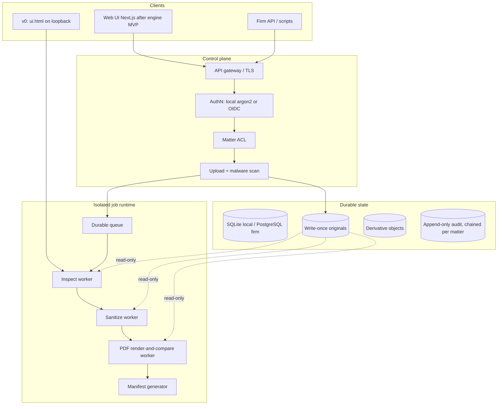
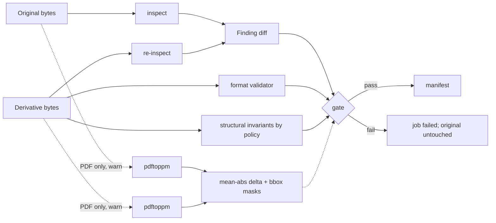

# CounselClear: Defensible Document Sanitization and Safe Sharing

| Field | Value |
| --- | --- |
| **Document** | Architecture and product design |
| **Author** | TBD (operator: transaction / tax counsel; outside GC) |
| **Date** | 2026-08-21 |
| **Revised** | 2026-08-21 |
| **Status** | Draft |
| **Audience** | Senior engineers, security, and the lawyer-operator taking this from a local prototype to a firm/product offering |
| **Prototype** | `/Users/naderalsheikh/watermarks-remover` (fork of [guillaumemeyer/watermarks-remover](https://github.com/guillaumemeyer/watermarks-remover), MIT) |
| **Working name** | CounselClear |

---

## Overview

Lawyers routinely leak privilege, identity, and work-product through file metadata, comments, tracked changes, hidden sheets, speaker notes, embedded objects, GPS EXIF, C2PA credentials, and invisible Unicode. The existing local prototype — a loopback HTTP service at `127.0.0.1:8765` (`service/scripts/server.py`) with format-aware inspect/clean in `format_dispatch.py`, `container_meta.py`, `image_meta.py`, and `text_unicode.py` — already proves that lossless metadata sanitation is tractable without a cloud model. It is not yet a defensible legal product: it overwrites conceptually, returns unstructured finding strings, has no matter ACL, no immutable original, no chain of custody, and is marketed in its upstream form as a watermark remover.

CounselClear is a **document-sanitization and safe-sharing platform** that identifies hidden information, **preserves the original immutably**, produces a **separate clean derivative** under an explicit policy, **verifies** that the derivative is actually clean and that body legal language did not change, and **documents every action** as a hash-chained audit record. Watermark removal (visible overlays, C2PA, statistical text, pixel-domain marks) is a gated, high-risk add-on — never the product spine, never a completeness claim, and never the default legal engine.

The inspect/clean core stays. The product grows around it: policy, custody, isolation, verification, and audit. Single-operator local use and later firm multi-tenant use share the same engine contract so the legal-document pipeline is not rewritten at the first paying client.

---

## Background & Motivation

### Why this change is needed

Outside general counsel and transaction/tax practices live on documents that must leave the laptop: client-facing drafts, deal-room uploads, production sets, tax filings, and opposing-counsel productions. The failure modes are well known:

- Word `dc:creator` / `cp:lastModifiedBy` and Excel named-author properties identifying the lawyer or firm.
- Tracked changes, comments, and speaker notes that contain privilege or negotiation strategy.
- Hidden sheets, hidden slides, white-on-white / `w:vanish` text, and customXml parts that survive “Print to PDF.”
- PDF incremental updates that leave prior `/Info`, annotations, and form values recoverable after a naïve metadata strip.
- EXIF GPS on site-visit photos; C2PA / Content Credentials that bind a draft to a generator.
- Zero-width Unicode and bidi overrides that alter copy-paste, search, or (in adversarial settings) the apparent meaning of a clause.

A general-purpose “make provenance disappear” tool is the wrong product for this operator. It is legally and reputationally dangerous, and it is technically indefensible for statistical and pixel watermarks. A **hygiene + custody** product is both more valuable to a firm and safer to sell. That is also the wedge against Document Inspector and DMS-native scrubbers, which already strip comments and revisions but do not keep a WORM original, a policy-versioned action list, or a verified hash-chained bundle.

### Current state of the prototype

The fork is a stdlib Python service (Python 3.10+) with optional system tools. Relevant surface:

| Layer | Module | Role today |
| --- | --- | --- |
| HTTP | `service/scripts/server.py` | `ThreadingHTTPServer` on loopback `:8765`. Endpoints: `GET /`, `/health`, `/capabilities`, `/openapi.json`; `POST /inspect`, `/detect`, `/clean` and `/batch` variants. Optional `WATERMARKS_SERVER_API_KEY`. UI: `service/scripts/ui.html` (`<h1>Watermarks remover</h1>`; Clean button label is **“Clean (lossless)”**; `setFile` posts `{ detect: true }`). |
| Router | `format_dispatch.py` | **Single** extension/magic table: `classify` / `classify_bytes` → `text` \| `image` \| `container` \| `av` \| `unknown`. Unknown is never auto-cleaned (`clean_file` exit 2; `/clean` 400). `inspect_file.py`, `clean_file.py`, and `server.py` duplicate *orchestration* (temp files, option plumbing, JSON wrapping), not the classifier. |
| Text Layer A | `text_unicode.py` | `inspect_text` / `clean_text`. Invisible Unicode, bidi, tag chars, spaces; conservative preservation of load-bearing invisibles (emoji ZWJ, script joiners, flag tags). |
| Office/PDF/HTML | `container_meta.py` | `inspect_container` / `clean_container`. DOCX/XLSX/PPTX: `docProps/*`, `customXml/`, embedded media, Layer A on `w:t` / `<t>` / `a:t` **in every matching part under `word/` / `xl/` / `ppt/`** (comments, headers, footers, notes slides included — not classified as such). PDF: `exiftool -all=` then `qpdf --linearize` (`_pdf_structural_rewrite`); three degraded modes if tools are missing (see PDF section). Zip-bomb cap: `container_meta.MAX_ZIP_DECOMPRESSED_BYTES` = 128 MiB. `_is_docx_meta_part` is only `docProps/` + `customXml/`. |
| Images | `image_meta.py` | PNG/JPEG/WebP/AVIF/HEIC/BMP/GIF/TIFF C2PA/EXIF/XMP-oriented strip. `inspect_jpeg` scans APP segments for AI/C2PA hints only — **JPEG GPS (EXIF IFD 0x8825 / tag 34853) is not a first-class finding.** GPS IFD 34853 is parsed on TIFF. Optional CtrlRegen / MarkDiffusion / SynthID — **not default legal engine**. |
| Meaning lock | `rewrite_text.py` | Separate CLI, **not** on `/clean`. Default `--strength preserve` (`legal` aliases `preserve`). `meaning_lock_violations` locks length 0.85–1.20, numbers, modals, section cites, quoted phrases. If every preserve candidate fails the lock, `rewrite()` **returns the original text** (`mode: "unchanged"`) — it does not abort the caller. Strength `code` exists and is **not** in `MEANING_CHANGING_STRENGTHS`. |
| Hardening | `common.py` | `MAX_INPUT_BYTES` default 256 MiB; `looks_binary` / `guard_binary`; `safe_write_*`; `subprocess_preexec_fn` RLIMIT_AS 4 GiB / RLIMIT_FSIZE 2 GiB; `safe_arg`. Zip budget is **not** here. |
| Tests | `tests/` | 42 test modules, ~575 `test_*` functions. Treat `tests/test_pdf_structural_rewrite.py`, `tests/test_ooxml_xlsx_pptx.py`, `tests/test_security_hardening.py`, `tests/test_rewrite_text.py`, `tests/test_http_server.py`, `tests/test_format_dispatch.py` as engine regression. |
| Optional heavy | `Dockerfile.ctrlregen`, `Dockerfile.markllm`, `Dockerfile.synthid`, `Dockerfile.markdiffusion` | Separate images. Upstream licenses are **not** MIT. `compose.yaml` keeps them on `harness` / `heavy` profiles. |

The UI lede already tells the operator the right story: *“Clean strips hidden Unicode and metadata only — it does not rewrite legal language.”* That sentence is the product, not a footnote.

HTML and Markdown are **`container`** in `CONTAINER_EXTS`, not `text`. Finding `format` must come from `detect_container_format`, not from `classify_bytes` kind.

`detect_container_format` sniffs zip members: presence of `word/document.xml` returns `"docx"` regardless of `.docm`. Same for `xl/workbook.xml` → `"xlsx"` and `.xlsm`. v1 must not inherit that coercion (see format refuse list).

### Pain points the prototype does not solve

1. **No original is kept.** `/clean` returns base64 of the derivative and discards the source (`_clean_payload`). CLI `--in-place` writes a `.bak` then overwrites (`clean_file.py`). For evidence and privilege this is inverted: the original must be immutable and the derivative optional.
2. **Findings are strings, not a review object.** `ContainerInspectReport.findings: list[str]` and `ImageInspectReport.findings: list[str]` cannot drive a policy UI or an audit that names *category / location / field / whether visible content changes*.
3. **Office/PDF legal artifacts are not first-class findings, but Layer A already mutates their text.** `_is_docx_meta_part` only treats `docProps/` and `customXml/`. Comments, tracked changes, hidden text, headers/footers as a class, hidden sheets, external links, speaker notes, hidden slides, named ranges, PDF `/Annots`, `/JS`, `/EmbeddedFiles`, AcroForms, incremental-update residue, digital signatures, and macros are **not first-class findings**. However `_scrub_ooxml_zip` already runs `_scrub_docx_text` on **every** `word/*.xml` (including `word/comments.xml`, `word/header*.xml`, `word/footer*.xml`, `word/footnotes.xml`) and `_scrub_pptx_text` on `ppt/notesSlides/`. A “lossless” clean today can change comment-pane / header / note Unicode without listing those artifacts. v1 inspectors must classify those Layer A hits under the correct part (`embedded_content` vs body `invisible_text`) and policies must decide whether Layer A runs on non-body parts.
4. **No chain of custody.** No SHA-256 of source or output, no processor version pin, no operator identity, no policy id.
5. **No isolation suitable for hostile files.** The service writes request bytes into a temp dir in-process. Docker core image is unprivileged and read-only (`service/Dockerfile`, uid 10001), which is the right *shape*, but there is no per-job microVM, no malware scan, no network-off worker.
6. **Layer B / pixel backends can exfiltrate.** `rewrite_text.py` default-denies non-loopback endpoints (`_check_remote`) and refuses redirects (`_NoRedirect`). That is correct and must remain. The product must go further: **no silent cloud LLM**.
7. **No visual proof of “nothing visible changed.”** Residual C2PA is flagged (`still_has_c2pa`). There is no render-and-compare.
8. **Positioning risk.** `ui.html` title is “Watermarks remover.”
9. **Signed files and macros are invisible.** `qpdf --linearize` and OOXML zip rebuild invalidate PDF certification/approval signatures and OOXML XML-DSig. `.docm` / `.xlsm` / `.pptm` can be sniffed as docx/xlsx/pptx and cleaned while leaving `word/vbaProject.bin`.
10. **JPEG GPS is not inspected as GPS.** Sharing-path `exiftool -all=` will drop it; `privacy_only` + today’s `keep_non_ai_metadata` would **keep GPS**.

---

## Goals & Non-Goals

### Goals (v1 engine / metadata-hygiene MVP)

- Ship a **local or customer-controlled** sanitization workflow for **PDF, DOCX, XLSX, PPTX, PNG, JPEG, WebP, TXT, Markdown, HTML** only.
- **Inspect before mutate.** Structured findings with recommended action, severity, and whether removal changes visible content.
- **Never overwrite the original.** Store it write-once with SHA-256. Emit a separate derivative. Product CLI has **no** `--in-place`.
- **Policy, not a generic “Clean” button.** Four named default policies (`external_sharing`, `privacy_only`, `production`, `evidence_preservation`) plus optional org/matter overlays with the same subtype keys.
- **Verify the derivative:** re-inspect, format-validate, hash; PDF page-raster compare as **warn-only** until the gate is flipped. Office visual compare is **not** a v1 gate.
- **Human + machine audit record** (manifest JSON + HTML report). Bundle default = derivative + reports, not the original.
- Keep the existing engine modules as the processing core; grow product concerns around them.
- Any enabled text rewrite uses `preserve`/`legal` only. Locks that exist today (modals, numbers, section cites, quoted phrases, length band) must hold; **unquoted defined terms are not locked** unless the operator supplies a term list. Product rewrite failure **fails the job** (new behavior; the current CLI returns the original unchanged).

### Non-goals (v1)

- Guaranteed removal of statistical or pixel-domain watermarks.
- Visible watermark inpainting as a default capability.
- Cloud-hosted LLM rewrite.
- Shipping CtrlRegen / noai-watermark, reverse-SynthID, MarkLLM, or MarkDiffusion as the default legal engine.
- Full e-discovery platform, DMS replacement, or email ingestion.
- Cleaning **legacy CFBF** (`.doc` / `.xls` / `.ppt`), **macro-enabled OOXML** (`.docm` / `.xlsm` / `.pptm` / `.dotm` / `.xltm`), **AV**, **ODT**, **EPUB**, **SVG**, **AVIF/HEIC/BMP/GIF/TIFF**, **encrypted/password PDFs**, or **encrypted OOXML** (`EncryptedPackage` / `EncryptionInfo`). Inspect may report `unsupported`; clean refuses.
- Silently breaking digital signatures and still labeling the output “clean.”
- Flattening or clearing PDF AcroForm field values by default (tax/closing binders).
- Office (DOCX/XLSX/PPTX) visual-compare as a hard gate.
- Indexing document contents for search.
- Multi-region active-active.
- Next.js, OIDC, CMK, Object Lock — those are product-shell / production, not the engine MVP.

---

## Proposed Design

### Positioning spine

> A defensible document-sanitization and safe-sharing platform that identifies hidden information, preserves originals, creates controlled clean derivatives, and documents every change.

Do not market as a watermark remover. The MIT upstream is a **technical starting point**. It is not the product.

### Hidden-information taxonomy

The engine classifies findings into these categories. Policy maps **category + subtype** → action; a single `embedded_content → strip` cell is not implementable.

| Category id | Examples | v1 handling (see subtype table) |
| --- | --- | --- |
| `file_metadata` | Author, company, EXIF GPS, creator software, PDF `/Info` | Strip or replace per policy; GPS is always strip on sharing **and** privacy_only |
| `embedded_content` | Comments, notes, hidden structure, embeddings, customXml, PDF annots/attachments/forms | **Subtype-specific** (comments strip on sharing; headers/footers and hidden sheets **flag-only** in v1) |
| `revision_history` | Word tracked changes; PDF incremental updates | Sharing: **Accept All** for Word markup; **rebuild** for PDF incrementals |
| `digital_signature` | PDF `/Sig`, OOXML XML-DSig, signed `/Perms` | **Refuse derivative** unless operator attests that breaking the signature is intended |
| `active_content` | VBA/`vbaProject.bin`, PDF `/JS` `/OpenAction` `/AA` | Macros: unsupported, refuse clean. PDF JS: strip on sharing/production |
| `visual_watermark` | “Draft,” firm branding overlays | **Gated.** Not v1 default |
| `provenance_metadata` | C2PA, XMP content credentials | Strip only under sharing/production (authorized). **`privacy_only` keeps C2PA** |
| `invisible_text` | Zero-width Unicode, bidi, font-color-hidden / `w:vanish` / white-on-white | Sanitize with reviewer-facing diff; non-body parts follow the part’s policy |
| `statistical_watermark` | Token-sampling / pixel statistical signals | Off by default; never a completeness claim |

### v1 format matrix

| Input | `classify_bytes` kind today | Product inspect | Product clean |
| --- | --- | --- | --- |
| `.pdf` (unencrypted) | container | yes | yes, iff `exiftool` **and** qpdf structural rewrite succeed |
| `.docx` / `.xlsx` / `.pptx` | container | yes | yes, if no signature and no VBA |
| `.txt` | text | yes | yes (Layer A) |
| `.md` / `.html` / `.htm` | **container** | yes | yes (existing `inspect_markdown` / `inspect_html` + Layer A) |
| `.png` / `.jpeg` / `.jpg` / `.webp` | image | yes | yes (metadata; GPS-aware) |
| `.docm` `.xlsm` `.pptm` `.dotm` `.xltm` | container (sniffed as docx/xlsx/pptx) | **unsupported-macro-office** | **refuse** |
| Any zip containing `vbaProject.bin` / `_vba_project.bin` / `word/macros/` | container | `active_content` finding | **refuse** |
| `.doc` `.xls` `.ppt` (CFBF) | unknown / binary | `unsupported-legacy-office` | refuse |
| Encrypted / password PDF | container | `unsupported-encrypted-pdf` | refuse |
| Encrypted OOXML (`EncryptedPackage` / `EncryptionInfo` in the zip; often no `word/document.xml`) | unknown or container | `unsupported-encrypted-office` | refuse (do not parse) |
| AV, ODT, EPUB, SVG, AVIF, HEIC, BMP, GIF, TIFF | av / container / image | `unsupported-v1-format` (inspect-as-unsupported) | refuse |
| Unknown | unknown | report unknown | refuse |

`detect_container_format` must gain an extension-and-member check **before** the `word/document.xml` sniff: `.docm` never returns `"docx"`. Finding `format` is the `detect_container_format` / `detect_format` string, not the kind.

### Engine vs product shell (the growth invariant)

```
┌──────────────────────────────────────────────────────────────────────────┐
│ Product shell (evolves: local → single-tenant → multi-tenant)            │
│ AuthN/Z, matters, policies, object store, queue, audit, UI, integrations │
├──────────────────────────────────────────────────────────────────────────┤
│ Stable processing contract  (library, no HTTP, no DB, no network)        │
│   inspect_bytes(data, name, caps) -> InspectResult                       │
│   plan_actions(result, policy, decisions) -> ActionPlan                  │
│   apply_actions(data, plan) -> (bytes, list[ActionRecord])               │
│   verify_derivative(original, derivative, plan) -> VerifyResult          │
│   emit_manifest(...) -> Manifest                                         │
├──────────────────────────────────────────────────────────────────────────┤
│ Existing engine (in-place evolution of service/scripts/)                 │
│   format_dispatch.classify_bytes                                         │
│   text_unicode.inspect_text / clean_text                                 │
│   container_meta.inspect_container / clean_container                     │
│   image_meta.inspect_image / clean_image                                 │
│   rewrite_text.meaning_lock_*   (gated; never default for legal files)   │
│   common.MAX_INPUT_BYTES, looks_binary, safe_write_*                     │
│   container_meta.MAX_ZIP_DECOMPRESSED_BYTES                              │
└──────────────────────────────────────────────────────────────────────────┘
```

PR 1 extracts today’s orchestration as `inspect_bytes` / `clean_bytes` (byte-identical to CLI). PR 11 (`plan_actions` / `apply_actions`) **replaces** generic `clean_bytes` on the product path. Prototype `server.py` `/clean` may keep calling `clean_bytes` until the product API takes over.

CLI `--in-place` remains in the *prototype* scripts for backward compatibility of existing tests; the **product CLI and product API omit it**. No env gate.

### Target architecture



**Stack:**

- **Frontend:** v0 keeps `ui.html`. Next.js is product-shell (after engine MVP).
- **Control plane:** FastAPI for `/v1`. Stdlib `server.py` stays as a prototype adapter.
- **Workers (production):** one short-lived container per job, non-root, no egress, pinned `service/Dockerfile` (uid 10001, `exiftool`, `qpdf`, `c2patool` 0.27.15). Engine MVP may still parse in-process on loopback.
- **Store:** local encrypted volume with application-level write-once (MVP) → S3-compatible + Object Lock (production).
- **DB:** SQLite (local) or Postgres (firm), same Alembic models; JSON column is JSONB on Postgres and JSON on SQLite.
- **Search:** filename + matter + hash + tags. No content index.

### Key workflow

```mermaid
sequenceDiagram
  actor U as Operator
  participant API as Control plane
  participant Store as Original store
  participant W as Isolated worker
  participant D as Derivative store
  participant A as Audit log

  U->>API: Upload source (matter_id, filename)
  API->>API: Size/page/archive caps; optional malware scan
  API->>Store: PUT original write-once, SHA-256
  API->>W: Job inspect (read-only original)
  W-->>API: Structured findings JSON
  API-->>U: Findings report
  U->>API: Select policy + per-finding decisions + attestations
  API->>W: Job sanitize (never writes original)
  W->>D: PUT derivative
  W->>W: Re-inspect + format check
  W->>W: PDF raster compare (warn)
  W-->>API: VerifyResult + hashes
  API->>A: Append audit (per-matter hash chain)
  API-->>U: Bundle: derivative, report, manifest (original opt-in)
```

1. **Upload / ingest.** Multipart, streamed to object storage. Prototype `MAX_BODY_BYTES` exists because `/clean` inlines the file.
2. **Store original write-once.** Key layout (local and S3, one scheme):

   `{root}/{org}/matters/{matter}/docs/{doc}/original`

   Local MVP: create with `O_EXCL`, then `chmod 0444`; application refuses overwrite/delete except via retention. POSIX is **not** S3 Object Lock; Object Lock is production-only.
3. **Hash original (SHA-256 only in v1).** No blake3 in the engine (would add a non-stdlib dependency). Control plane may add a faster hash later without putting it on the engine contract. Store `bytes`, `mime`, `kind` from `classify_bytes`, `format` from `detect_*`.
4. **Inspect before mutate.** `inspect_bytes` including legal inspectors, signatures, macros, JPEG GPS.
5. **Findings report.** Schema below.
6. **Policy + decisions.** See `plan_actions` missing-decision rules: omitted `approve` ⇒ `keep` (recorded); omitted signature attestation on a `digital_signature` finding ⇒ the job cannot start.
7. **Separate derivative.** `apply_actions` never points `dest` at the original key.
8. **Re-inspect** the resulting bytes. PDF sharing/production **hard-fail** unless clean mode is `{exiftool, structural_rewrite: true}`. Scan post-qpdf bytes, not the pre-rewrite buffer.
9. **Audit / manifest** via `emit_manifest`.
10. **Download bundle.** Default: derivative + `report.html` + `report.json` + `manifest.json`. Original is **not** in the zip unless `download_original` ACL and `include_original=true`.

### Where the prototype fits, file by file

**Keep and evolve:**

- `format_dispatch.py` — single classifier. Do not add a second extension table. Product **refuse list** is applied *after* classify, using extension + members.
- `text_unicode.py` — Layer A + reviewer-facing Unicode diff (`CharHit.samples` offsets).
- `container_meta.py` — keep zip-budget, qpdf path, entity-aware `_decode_xml_entities`, quote-tolerant `_prune_dangling_relationships` (`Target` single or double quotes, #130). Extend inspectors; **do not** claim comment/revision removal is “already how `_scrub_ooxml_zip` works.”
- `image_meta.py` — lossless strip. Add JPEG GPS (APP1 Exif IFD 0x8825). Pixel backends stay out of the legal image.
- `common.py` — caps, binary guard, safe writes, rlimits, `classify_finding_confidence`.
- `rewrite_text.py` — **gated, not in `/clean`.** Prototype lock-fail returns original (`mode: "unchanged"`, `tests/test_rewrite_text.py`). **Product behavior is new:** if a job has rewrite enabled and no candidate passes the lock, `apply_actions` fails the job; original untouched. Product refuses strength `code`.
- `server.py` — prototype adapter until `/v1` exists.

**Do not ship as default legal engine:** CtrlRegen, MarkDiffusion, SynthID scorer, MarkLLM, KGW/Gumbel as “this file is now unmarked.”

**Reuse with caution:** `audit_lib.py` (folder scan, not custody). `extract_ooxml_plaintext` is stylometry-only.

### Structured findings

Canonical Finding (JSON Schema lives in `engine/schemas/finding.schema.json`; fields below are the contract):

```json
{
  "finding_id": "f_9c2e",
  "category": "file_metadata",
  "subtype": "authoring_props",
  "format": "docx",
  "location": {
    "part": "docProps/core.xml",
    "xpath_or_field": "dc:creator",
    "page": null,
    "sheet": null,
    "slide": null,
    "offset": null,
    "bbox": null,
    "pane": "body"
  },
  "field": "dc:creator",
  "value_redacted": "present (12 chars)",
  "action_recommended": "strip",
  "action_allowed_by_policy": ["strip", "replace", "keep"],
  "content_visible": false,
  "risk_level": "high",
  "confidence": "confirmed",
  "removal_changes_visible_content": false,
  "requires_approval": false,
  "requires_attestation": false,
  "notes": "Authoring identity; maps to current DOCX_SCRUB_FIELDS"
}
```

Enums:

- `risk_level`: `critical` | `high` | `medium` | `low` | `info`
- `confidence`: `confirmed` | `probable` | `informational` | `likely_false_positive` (`common.CONFIDENCE_LEVELS`)
- `action`: `keep` | `strip` | `replace` | `rebuild` | `sanitize` | `refuse` | `accept_all` | `flag`
- `pane`: `body` | `comment` | `note` | `header` | `footer` | `footnote` | `markup` | `hidden` | `metadata` | `other`
- `location.bbox`: optional `[x0, y0, x1, y1]` in PDF page space (PDF-only v1). Produced by the cleaner/inspector when it knows a page rect (e.g. `/Annots` rect). Null for Office in v1.

Adapter mapping:

| Existing / new signal | Category | subtype | `content_visible` | `pane` |
| --- | --- | --- | --- | --- |
| `DOCX_SCRUB_FIELDS` | `file_metadata` | `authoring_props` | false | metadata |
| JPEG/TIFF GPS IFD 34853 | `file_metadata` | `jpeg_gps` | false | metadata |
| `customXml/` | `embedded_content` | `custom_xml` | false | metadata |
| `has_c2pa` | `provenance_metadata` | `c2pa` | false | metadata |
| Layer A in `word/document.xml` / `xl/sharedStrings` / `ppt/slides/` | `invisible_text` | `layer_a_body` | false except `space`/`confusable` | body |
| Layer A in comments/headers/footers/notes | `invisible_text` | `layer_a_non_body` | **true** (comment pane / header / notes page) | comment/header/footer/note |
| `word/comments.xml`, `commentsExtended.xml`, `commentsIds.xml`, `commentsExtensible.xml`, `people.xml`; `w:commentRangeStart` | `embedded_content` | `comments_and_notes` | true | comment |
| `w:ins` / `w:del` / `w:moveFrom` / `w:moveTo` | `revision_history` | `tracked_changes` | true if markup shown | markup |
| `w:vanish`, `w:highlight`, `w:color="FFFFFF"` | `embedded_content` | `hidden_text` | false until revealed | hidden |
| `word/header*.xml`, `footer*.xml` | `embedded_content` | `headers_footers` | true | header/footer |
| `sheetState`, hidden rows/cols, hidden slides | `embedded_content` | `hidden_structure` | false until unhidden | hidden |
| `word/embeddings/`, OLE | `embedded_content` | `embeddings_ole` | varies | other |
| DOCX/XLSX external rels / `xl/externalLinks/` | `embedded_content` | `external_links` | false | metadata |
| PDF `/JS` `/OpenAction` `/AA` | `active_content` | `pdf_js_actions` | false | other |
| PDF `/AcroForm` values | `embedded_content` | `pdf_acroform` | true (form fields) | body |
| PDF `/Annots` | `embedded_content` | `pdf_annots` | often true | comment |
| PDF `/EmbeddedFiles` | `embedded_content` | `pdf_attachments` | false | other |
| PDF `/Sig`, OOXML signatures | `digital_signature` | `cms_or_xml_dsig` | false | other |
| `vbaProject.bin` | `active_content` | `macros_vba` | false | other |
| Stylometry `score >= 0.65` | informational only | — | n/a | — |

Keep `findings: list[str]` as a derived view so current tests pass.

### Policies

A `Policy` is versioned JSON: global flags + `subtypes[subtype] = ActionSpec`.

```json
{
  "id": "external_sharing",
  "version": 1,
  "allow_text_rewrite": false,
  "pdf_requires_exiftool_and_qpdf": true,
  "metadata_replacement": { "dc:creator": "", "Company": "" },
  "defined_terms": [],
  "subtypes": {
    "authoring_props": "strip",
    "jpeg_gps": "strip",
    "comments_and_notes": "strip",
    "headers_footers": "flag",
    "hidden_structure": "flag",
    "hidden_text": "flag",
    "embeddings_ole": "strip",
    "custom_xml": "strip",
    "external_links": "strip",
    "pdf_js_actions": "strip",
    "pdf_acroform": "flag",
    "pdf_attachments": "strip",
    "pdf_annots": "strip",
    "tracked_changes": "accept_all",
    "pdf_incremental": "rebuild",
    "c2pa": "strip",
    "layer_a_body": "sanitize",
    "layer_a_non_body": "keep",
    "cms_or_xml_dsig": "refuse",
    "macros_vba": "refuse",
    "visual_watermark": "refuse",
    "statistical_watermark": "refuse"
  }
}
```

`flag` = inspect finding only; do not mutate that artifact; job may still succeed. `refuse` = do not emit a derivative labeled clean (inspect-only) unless a typed attestation is on the job.

**Layer A composition (single rule, not a fifth action enum):** Layer A runs on a package part only when that part’s subtype action on the plan is `strip` or `accept_all`. It never runs under `privacy_only` on non-body parts. Consequence for v1 sharing: `headers_footers` / footnotes are `flag`/`keep` ⇒ **no Layer A** there (privilege legends and page numbers stay byte-identical except Accept All markup resolution below). Comments/notes are `strip` ⇒ Layer A is a no-op because the part is dropped. Body Layer A (`layer_a_body`) still runs.

**Accept All vs kept parts:** `tracked_changes: accept_all` **does** walk header, footer, and footnote XML: unwrap/drop revision wrappers inside those parts, but **does not delete the part**. The two subtypes do not fight.

**`plan_actions` when the POST omits a Decision or attestation:**

| Policy cell | Request omitted | Result |
| --- | --- | --- |
| `approve` | no `Decision` for that finding/subtype | treat as **`keep`**, record `action: keep`, `reason: no_decision` on the plan; do **not** infer strip |
| `refuse` (`cms_or_xml_dsig`) | no `signature_break_attestation` | **`plan_actions` raises**; job cannot start |
| `refuse` (`macros_vba`) | n/a (unsupported format) | already refused at inspect/classify |
| `flag` / `keep` / `strip` / `accept_all` / `sanitize` | n/a | apply the policy default |

`ActionPlan.signature_attestation` is a bool (attestation present). The typed checkbox text lives on the **job row**, not on the plan.

**Overlays:** org and matter `PUT .../policies` are the same schema as the four defaults (`id` may be `custom` or a matter-scoped name). Unknown subtype keys are rejected. Overlay may not weaken `macros_vba` or `cms_or_xml_dsig` to `strip`/`sanitize` without a signature-break attestation on the *job*; policy JSON that sets those to `strip` is a 400 at save time.

Frozen v1 defaults (four named policies; overlays optional):

| Subtype | external_sharing | privacy_only | production | evidence_preservation |
| --- | --- | --- | --- | --- |
| `authoring_props` | strip (empty, or `metadata_replacement`) | strip **listed PII fields only** (below) | strip | keep |
| `jpeg_gps` | strip | **strip** (GPS-only path; not `strip_all_metadata`) | strip | keep |
| `comments_and_notes` | strip | keep | approve | keep |
| `headers_footers` | **flag** | keep | flag | keep |
| `hidden_structure` | **flag** | keep | approve | keep |
| `hidden_text` | **flag** | keep | approve | keep |
| `embeddings_ole` | strip | keep | approve | keep |
| `custom_xml` | strip | keep | strip | keep |
| `external_links` | strip | keep | approve | keep |
| `pdf_js_actions` | strip | keep | strip | keep |
| `pdf_acroform` | **flag** | keep | approve | keep |
| `pdf_attachments` | strip | keep | approve | keep |
| `pdf_annots` | strip | keep | approve | keep |
| `tracked_changes` | **accept_all** | keep | approve | keep |
| `pdf_incremental` | rebuild | keep | rebuild | keep |
| `c2pa` | strip (authorized) | **keep** | strip if authorized | keep |
| `layer_a_body` | sanitize | sanitize | sanitize | keep |
| `layer_a_non_body` | **keep** (composition: Layer A only if that part’s action is `strip`/`accept_all`) | **keep** | approve | keep |
| `cms_or_xml_dsig` | refuse unless attest | keep | refuse unless attest | keep |
| `macros_vba` | refuse | refuse | refuse | inspect-only |

`privacy_only` `authoring_props` field list (only these, plus GPS via `jpeg_gps`): `dc:creator`, `cp:lastModifiedBy`, `Company`, `Manager`, PDF `/Author`. Leave `Application`, `AppVersion`, `dc:title`, `dc:subject`, `cp:keywords`, `cp:category`, `dc:description` unless a value matches a PII regex (email, phone, or a configured staff-name list). Prototype `DOCX_SCRUB_FIELDS` is **wider** than this list; `privacy_only` must not reuse it wholesale.

`privacy_only` is the no-visible-body-change path. Enforcement in v1 is **not** a pixel metric: re-inspect + body unicode/plaintext diff + **strict** structural invariants (page count, image dimensions, visible sheet/slide count must match). Sharing/production do **not** fail on page-count drift when the plan contains `accept_all` (see Verification). Pixel compare is warn-only and PDF-only.

`evidence_preservation` never calls `apply_actions`.

`replace` requires `metadata_replacement` on the policy (string map). Default replacements are empty strings, not the firm name.

### Format-specific v1 handling

#### PDF

Today: `inspect_pdf` = `_blob_hits(_pdf_structured_blob)` + XMP + `c2patool`. `_pdf_structured_blob` strips stream payloads to avoid false `AIGC` hits. `clean_pdf` has **three** outcomes:

| Tools present | `meta["mode"]` | Residue |
| --- | --- | --- |
| exiftool + qpdf success | `exiftool`, `structural_rewrite: true` | intended clean path |
| exiftool, qpdf missing or non-0/3 | `exiftool`, `structural_rewrite: false` | incremental `/Info` recoverable |
| no exiftool, XMP packets found | `stdlib-xmp`, `degraded: True` | offsets may break |
| no exiftool, no XMP | `copy`, `degraded: True` | **copied as-is** |

Sharing/production **hard-fail** unless mode is `exiftool` **and** `structural_rewrite is true`. Missing qpdf **or** missing exiftool is a failed job, not a warning. (`service/Dockerfile` already installs both; a worker without them is not a legal engine.)

**Post-qpdf `/Info` (required; otherwise PR 13 re-inspect fails):** prototype order is `exiftool -all=` then `qpdf --linearize`. qpdf writes a **new** `/Producer` (and often `/Creator`) into a fresh Info dict. Do **not** run `exiftool -all=` again after qpdf (that re-introduces incremental updates). After a successful linearize:

1. Run a second **non-incremental** Info pass with qpdf only, e.g. `qpdf --linearize --set-info=Author= --set-info=Creator= --set-info=Title= --set-info=Subject= --set-info=Keywords=` on the already-rewritten file (exact flags pinned in PR 5 against the image’s qpdf version). Goal: drop identity keys without an exiftool incremental xref.
2. Re-inspect **allowlists** `/Producer` whose value is a prefix/version match of `ProcessorInfo.tools["qpdf"]` (the sanitizer identifying itself). Fail the job on residual `/Author`, `/Creator` (unless `metadata_replacement` set that key), company-class identity, or the **original** producer/creator substring.
3. Fixture (PR 5 + PR 13): derivative bytes do not contain the original `/Producer` payload; no `dc:creator`-class identity; if `/Producer` remains it is only the qpdf stamp. Document that a qpdf producer string is **allowed**; a leftover author is not.

v1 inspectors (new, `pdf_legal.py` or `container_meta.py`):

- `/EmbeddedFiles`, `/FileAttachment` → `pdf_attachments`
- `/Annots` (with `Rect` → `location.bbox` when present) → `pdf_annots`
- `/AcroForm` field values → `pdf_acroform` (**flag** on sharing; clear only with approval; **never flatten** unless asked)
- `/JS`, `/JavaScript`, `/OpenAction`, `/AA` → `pdf_js_actions` (strip on sharing/production; never execute)
- `/Sig` / signature dictionaries → `digital_signature` (refuse derivative unless attestation)
- Incremental residue: count `startxref` / `%%EOF` on **`_pdf_structured_blob`**, not raw bytes (raw count false-positives inside streams). After qpdf, re-scan structured blob; `qpdf --check`; fixture greps original `/Producer` (or `/Info` payload) out of derivative bytes.

#### DOCX

Today: drop `customXml/`, drop `docProps/custom.xml`, empty `DOCX_SCRUB_FIELDS`, Layer A on every `word/*.xml` `w:t`. Tracked-change accept/reject is **not** implemented.

v1 artifacts:

| Artifact | Parts / XML | Subtype | Sharing |
| --- | --- | --- | --- |
| Comments | `word/comments.xml`, `commentsExtended.xml`, `commentsIds.xml`, `commentsExtensible.xml`, `people.xml`, commentRange* | `comments_and_notes` | strip |
| Tracked changes | `w:ins`, `w:del`, `w:moveFrom`, `w:moveTo`, `w:rPrChange`, `w:pPrChange`, `w:sectPrChange`, `w:tblPrChange` | `tracked_changes` | **Accept All** |
| Hidden text | `w:vanish`, `w:highlight`, `w:color` white | `hidden_text` | flag |
| Headers/footers | `word/header*.xml`, `footer*.xml` | `headers_footers` | flag (do not auto-strip) |
| Footnotes/endnotes | `word/footnotes.xml`, `endnotes.xml` | inspect; Layer A as non-body | keep unless custom |
| Embeddings | `word/embeddings/`, OLE | `embeddings_ole` | strip |
| Hyperlinks / external rels | `TargetMode="External"` | `external_links` | strip |
| Signatures | `origin.sigs`, XML-DSig parts | `cms_or_xml_dsig` | refuse |
| VBA | `word/vbaProject.bin`, `word/macros/` | `macros_vba` | refuse (unsupported format) |

**Accept All algorithm (new; not `_scrub_ooxml_zip`):** XML-aware walk with **stdlib `xml.etree`** (keep the core Dockerfile dependency-free; add lxml only if a fixture proves `etree` insufficient). Apply to **every document part that contains revision markup**, including kept `word/header*.xml` / `footer*.xml` / `footnotes.xml` / `endnotes.xml` (resolve markup; do not delete those parts):

1. Unwrap `w:ins` and `w:moveTo`: keep children in place, drop the wrapper.
2. Drop `w:del` and `w:moveFrom` subtrees entirely (deleted text gone).
3. Drop `w:rPrChange` / `w:pPrChange` / `w:sectPrChange` / `w:tblPrChange`: keep current properties, discard previous.
4. Drop leftover `w:delText`.
5. Prune `[Content_Types].xml` overrides and `.rels` with the **same quote-tolerant** matchers as `_prune_dangling_relationships` / `_target_attr` (single or double quotes). Do not copy the customXml-only double-quote `PartName="..."` regex.

This **is content-altering relative to “show markup”** and **is the displayed-final-text path** Word’s Accept All uses. It is the only default. **Reject All** (keep `w:del`, drop `w:ins`) is never a default; production may offer it as an explicit per-finding action. `privacy_only` / `evidence_preservation` leave markup.

After Accept All, require body unicode/plaintext diff (insertions that were already in the body should remain; deleted text should disappear) and PDF-raster warn if the operator later exports to PDF. Do not claim zip rebuild equals revision accept.

#### XLSX

- Hidden / very-hidden sheets, hidden rows/cols → `hidden_structure`, **flag-only** on sharing (do not auto-unhide).
- Comments: `xl/comments*`, `xl/threadedComments/`, `xl/persons/` → strip on sharing.
- Defined names pointing at hidden ranges → flag.
- `xl/externalLinks/` → strip on sharing.
- VBA (`xl/vbaProject.bin`) → refuse.

#### PPTX

- Speaker notes `ppt/notesSlides/` → strip on sharing (`comments_and_notes`).
- Hidden slides (`p:sld` show attr) → `hidden_structure`, **flag-only** (do not delete).
- Comments: `ppt/comments/` **and** modern `ppt/commentAuthors.xml`, threaded comment parts → strip on sharing.
- VBA → refuse.

#### Images (PNG / JPEG / WebP)

Sharing: `strip_all_metadata=True` (today’s path, drops GPS via rebuild + `exiftool -all=`).

`privacy_only`: **do not** use `keep_non_ai_metadata` (that keeps JPEG GPS). GPS-only path: inspect APP1 Exif IFD GPS (0x8825) / TIFF tag 34853 as findings; strip with **`exiftool -gps:all=`** (already in the worker image) rather than hand-editing JPEG offsets. Leave non-PII metadata. C2PA stays. Re-inspect must show GPS gone and non-GPS EXIF still present.

No `remove_pixel`.

#### TXT / Markdown / HTML

Layer A + existing frontmatter/generator scrub. `format` is `markdown` / `html` from `detect_container_format`.

### Verification workers

A derivative is not “clean” because `clean_pdf` returned.

1. **Re-inspect** `inspect_bytes` on the derivative. Targeted subtypes that were `strip` / `accept_all` / `rebuild` / `sanitize` must be gone, **except** the qpdf `/Producer` allowlist (PDF section). New identity findings fail the job.
2. **Format validator:** `qpdf --check`; OOXML zip + Content_Types; image magic + dimensions.
3. **Structural invariants (policy-scoped):**
   - `privacy_only` / `evidence_preservation` (if a derivative were ever produced): page count, visible sheet/slide count, and image width/height **must match**. Drift fails the job.
   - Sharing/production: visible sheet/slide counts and image dimensions must match. **Page-count delta is expected** when the plan contains `accept_all` (or PDF annot/comment strip that the operator should treat as pagination-changing). Record `page_count_original`, `page_count_derivative`, `page_count_delta_expected: true` on `VerifyResult`; do **not** fail the job on page-count drift alone. Unicode/plaintext diff remains the Accept All oracle.
4. **PDF render-and-compare (warn-only in v1):** rasterize with `pdftoppm` or pdfium at 150 dpi. Metric: mean absolute per-channel pixel delta after a 1px box blur (anti-aliasing), computed per page, **ignoring** `location.bbox` masks from annots/form rects the plan stripped. Threshold: page fails warn if mean abs delta > 3/255 on >0.5% of unmasked pixels. Cap: first 10 pages + last 5 + up to 15 uniformly sampled (`Caps.max_verify_pages`, default 30). Store **on-demand JPEG/WebP thumbnails**, not durable full-page PNG. `ff.visual_compare_gate` stays **off** until bbox masks and the threshold are calibrated; even then, **Office visual compare is deferred** (LibreOffice ≠ Word layout, missing firm fonts would fail any `delta = 0` rule on real DOCX).
5. **Unicode / plaintext diff** of body extraction. Under `privacy_only` and sharing-without-Accept-All, only Layer A body codepoints should change. After Accept All, the diff must match the accept-all expectation (deletions gone, insertions kept).
6. **Hashes** of original, derivative, report, processor image digest.

`privacy_only` **does not** wait on pixel compare.



### Local → firm

| Profile | Control plane | Store | Queue | Engine |
| --- | --- | --- | --- | --- |
| **Prototype (now)** | `server.py`, loopback, optional bearer | none | none | current modules |
| **Engine MVP (this small-team cut)** | library + `ui.html` + custody dir | write-once local files + SQLite optional | in-process | same library |
| **Product MVP (single tenant)** | FastAPI, local argon2 user | encrypted volume | in-process or Redis | same library |
| **Production** | FastAPI + OIDC, matter ACL, CMK | S3 + Object Lock + Postgres | per-job microVM | **same library**, digest on every job |
| **Advanced** | DMS, e-discovery, desktop agent | residency, legal hold | GPU sidecar if watermark gate | same core |

Library fixtures that pass on a laptop must pass in the worker image.

### Meaning lock (legal operative language)

Layer B is **off** unless `allow_text_rewrite=true` (no v1 default policy sets this) **and** the org flag is on **and** the worker image actually contains a loopback backend.

If enabled:

1. Strength `preserve` only (`legal` alias). Product **refuses** `paraphrase`, `humanize`, `backtranslate`, `structural`, and **`code`**.
2. Candidate must pass `meaning_lock_violations` (length, `_NUMBER_RE`, `_MODAL_RE`, `_SECTION_RE`, `_QUOTED_RE`). Optional `policy.defined_terms`: each term’s occurrence count must match (operator-supplied; not inferred from `w:rStyle`).
3. **New product behavior:** if no candidate passes, `apply_actions` raises / returns job failure. Do **not** write a derivative. This is **not** what `rewrite()` does today (`mode: "unchanged"` returns original text to the CLI caller).
4. Remote endpoints remain default-deny. No product flag enables remote LLM. `/inspect` `{ detect: true }` is not the UI default.

---

## API / Interface Changes

### Prototype adapter (unchanged paths)

```
POST /inspect   { file: b64, name, detect? }   # detect default false in product UI
POST /clean     { file: b64, name, options }
POST /detect    { file: b64, name }
```

No `policy_id` on this surface (410 pointing at `/v1` if sent).

### Product API (`/v1`)

Auth: local profile = session cookie after verifying an argon2id hash stored in a `0600` file (`{data_root}/auth/local.hash`) on loopback only. Firm = OIDC + bearer service accounts.

**Every job route is matter-scoped.** UUID opacity is not an ACL.

```
POST   /v1/matters
GET    /v1/matters/{id}

POST   /v1/matters/{id}/documents
GET    /v1/matters/{id}/documents/{doc_id}

POST   /v1/matters/{id}/documents/{doc_id}/inspect-jobs
POST   /v1/matters/{id}/documents/{doc_id}/sanitize-jobs
       body: { policy_id, finding_decisions?: [...], reason,
               signature_break_attestation?: { typed: true, text: "..." } }

GET    /v1/matters/{id}/jobs/{job_id}
GET    /v1/matters/{id}/jobs/{job_id}/manifest
GET    /v1/matters/{id}/jobs/{job_id}/bundle
       # default zip: derivative + reports + manifest
       # include_original=true requires perm download_original; audited

GET    /v1/orgs/{id}/policies
PUT    /v1/orgs/{id}/policies/{policy_id}
GET    /v1/matters/{id}/policies
PUT    /v1/matters/{id}/policies/{policy_id}    # overlay; same collection shape

# 403 unless org.watermark_tools_enabled and cryptographic attestation
POST   /v1/matters/{id}/documents/{doc_id}/watermark-jobs
```

Sharing “I am authorized to sanitize this copy” is a **typed checkbox** stored on the job (`attestation_kind: checkbox`). Watermark jobs require a **signed** payload (`attestation_kind: signed`). Do not reuse one field for both.

### Library contract (`engine/api.py`)

JSON Schema files: `finding.schema.json`, `policy.schema.json`, `action_plan.schema.json`, `verify_result.schema.json`, `manifest.schema.json`.

```python
@dataclass(frozen=True)
class Caps:
    max_input_bytes: int = 256 << 20          # common.MAX_INPUT_BYTES
    max_zip_decompressed_bytes: int = 128 << 20  # container_meta
    max_archive_depth: int = 2
    inspect_timeout_s: int = 120
    apply_timeout_s: int = 180
    verify_timeout_s: int = 300
    max_verify_pages: int = 30

@dataclass(frozen=True)
class ProcessorInfo:
    git_sha: str
    image_digest: str | None
    tools: dict[str, str]  # from capabilities() version probes

@dataclass(frozen=True)
class InspectResult:
    kind: Literal["text", "image", "container", "av", "unknown"]
    format: str                 # detect_container_format / detect_format
    findings: list[Finding]
    processor: ProcessorInfo
    source_sha256: str
    unsupported_reason: str | None = None

@dataclass(frozen=True)
class Decision:
    finding_id: str
    action: Literal["keep","strip","replace","rebuild","sanitize","refuse","accept_all","flag"]
    replacement: str | None = None

@dataclass(frozen=True)
class PlannedAction:
    finding_id: str | None  # None for policy-wide actions (e.g. accept_all on all revision parts)
    subtype: str
    action: Literal["keep","strip","replace","rebuild","sanitize","refuse","accept_all","flag"]
    replacement: str | None = None
    reason: str | None = None  # e.g. "no_decision"

@dataclass(frozen=True)
class ActionPlan:
    policy_id: str
    policy_version: int
    source_sha256: str
    actions: list[PlannedAction]
    require_exiftool_qpdf: bool
    signature_attestation: bool  # True iff job row carries signature_break_attestation; text stays on the job

@dataclass(frozen=True)
class ActionRecord:
    finding_id: str
    subtype: str
    action: str
    content_visible: bool
    bytes_or_count_delta: int | None = None

@dataclass(frozen=True)
class VerifyResult:
    reinspect_clean: bool
    residual_finding_ids: list[str]
    format_ok: bool
    structural_ok: bool
    page_count_original: int | None
    page_count_derivative: int | None
    page_count_delta_expected: bool
    visual_status: Literal["skipped","warn","pass","fail"]
    visual_unexpected_pages: list[int]
    unicode_diff_summary: dict
    pdf_clean_mode: dict | None  # {mode, structural_rewrite}
    allowlisted_processor_info_keys: list[str]  # e.g. ["/Producer=qpdf 11.x"]

def inspect_bytes(data: bytes, name: str, caps: Caps) -> InspectResult: ...
def plan_actions(result: InspectResult, policy: Policy, decisions: list[Decision]) -> ActionPlan: ...
def apply_actions(data: bytes, plan: ActionPlan) -> tuple[bytes, list[ActionRecord]]: ...
def verify_derivative(original: bytes, derivative: bytes, plan: ActionPlan, caps: Caps) -> VerifyResult: ...
def emit_manifest(*, result, plan, records, verify, processor, operator_id, matter_id) -> dict: ...

# Internal, PR 1 only — today’s CLI behavior:
def clean_bytes(data: bytes, name: str, options: dict) -> tuple[bytes, dict]: ...
```

`apply_actions` does not take a policy object; the plan is the frozen intent. **First instruction:** SHA-256 `data` and raise `SourceMismatch` if it differs from `plan.source_sha256`. Do not apply a plan to the wrong bytes.

### CLI exit-code compatibility

| Entry | 0 | 1 | 2 | 3 |
| --- | --- | --- | --- | --- |
| `inspect_file.py` | no findings, **or unknown format** (today: unknown is exit 0) | findings / C2PA / Layer A | not a file, oversize | — |
| `clean_file.py` | wrote output, no residual C2PA/AI | residual `still_has_c2pa` / `still_has_ai_metadata` | usage, unknown format, binary-as-text | — |
| `inspect_text.py` / `clean_text.py` | as today | as today | binary refused | — |
| audit CLIs | clean | findings | usage | `EXIT_PARTIAL` |

Product CLI (`counselclear`) uses a different matrix (unknown/unsupported = 2 on both inspect and clean) and **must not** change the prototype scripts’ codes. Wrappers keep `inspect_file.main` / `clean_file.main` behavior so `make test` stays the engine net.

---

## Data Model Changes

### Relational

```
orgs(id, name, residency_region, cmk_arn, watermark_tools_enabled, created_at)
users(id, org_id, email, role)
matters(id, org_id, name, client_ref, status, retention_class)
matter_acl(matter_id, user_id, perm)
  -- read | upload | inspect | sanitize | download_original | admin
policies(id, org_id, matter_id nullable, body json/jsonb, version)
documents(id, matter_id, filename, mime, bytes, kind, format,
          original_sha256, original_object_key, created_by, created_at)
jobs(id, matter_id, document_id, type, policy_id, policy_version, status,
     processor_digest, error_code, attestation_kind, created_by, ...)
findings(id, job_id, payload json/jsonb)
derivatives(id, job_id, object_key, sha256, bytes, verify_status)
audit_events(id, matter_id, actor_id, action, payload json/jsonb,
             prev_hash, row_hash, at)
```

`documents.filename` is stored for the UI. Logs emit **extension only**, not the basename.

Alembic: `sa.JSON().with_variant(JSONB(), "postgresql")`.

**Audit hash chain is per `matter_id`**, not per org. Postgres: `SELECT ... FOR UPDATE` on `matter_audit_head`. SQLite (local profile): **serialized writers** — `BEGIN IMMEDIATE` on the connection that appends the event (SQLite has no `FOR UPDATE`). One writer at a time per DB file is enough for the single-operator profile. `row_hash = sha256(prev_hash || canonical_json(payload_without_secrets))`.

### Object keys (one layout)

```
{root}/{org}/matters/{matter}/docs/{doc}/original
{root}/{org}/matters/{matter}/docs/{doc}/jobs/{job}/derivative
{root}/{org}/matters/{matter}/docs/{doc}/jobs/{job}/report.json
{root}/{org}/matters/{matter}/docs/{doc}/jobs/{job}/preview/{page}.jpg
```

`{root}` is a local directory or `s3://{bucket}`. Production original: Object Lock. Local: `O_EXCL` + 0444 + app refuse-overwrite.

### Manifest

```json
{
  "manifest_version": 1,
  "product": "counselclear",
  "original": { "filename": "SPA_v3.docx", "sha256": "...", "bytes": 182331 },
  "derivative": { "filename": "SPA_v3.external.docx", "sha256": "...", "bytes": 176002 },
  "policy": { "id": "external_sharing", "version": 4 },
  "operator": { "id": "user_…", "email_hash": "sha256:…" },
  "matter": { "id": "…", "label_redacted": true },
  "processor": { "image_digest": "sha256:…", "git_sha": "…", "tools": {} },
  "actions": [],
  "verification": {},
  "timestamps": {},
  "attestation_kind": "checkbox"
}
```

Downloaded manifests **omit `matters.name`** (often a client code name). Operators who need the name already have matter ACL in the UI.

### Support bundles (metadata-only)

Allowlisted: job ids, hashes, formats, finding categories/subtypes, processor digest, error codes, timings, policy id/version, tool versions from `capabilities()`. Forbidden: file bytes, extracted text, author values, GPS coordinates, matter names, filenames beyond extension, API keys.

### Migration

No production data. `--in-place` is **absent** from the product CLI (not env-gated). Prototype scripts may keep it for tests.

---

## Alternatives Considered

### 1. Ship the prototype unchanged as a “legal watermark remover”

Fastest. Wrong liability, no custody, Office legal artifacts not first-class, degraded PDF copy-as-is. **Rejected.**

### 2. Rewrite the engine in Go / a commercial PDF SDK

Throws away a working stdlib engine, zip-bomb guards, qpdf tests, OOXML entity-decode, and **42 test modules (~575 tests)**. **Rejected for v1.**

### 3. SaaS-only with cloud LLM “smart redaction”

Fatal for privilege. **Rejected as default.**

### 4. Embed inside iManage / NetDocuments as the v1 surface

Blocks on vendor partnership; still needs engine, policy, audit. **Deferred to Advanced.** Standalone + API first.

### 5. Match Microsoft Document Inspector / Workshare Protect / DocsCorp cleanse / DMS-native scrub / Adobe redaction — without custody

**Approach:** Implement the same “Inspect Document” checklist (comments, revisions, hidden text, properties, headers, XML, ink) and stop there. Firms already own these tools.

**Trade-offs:** Faster feature-complete comments/revisions; zero differentiation. Those products typically overwrite or emit a copy **without** a WORM original, a SHA-256 pair, a versioned policy, per-finding attestations, re-inspect, or a hash-chained manifest a GC can attach to a production log. CounselClear’s wedge is **defensibility**: prove what was found, what was authorized, what changed, and that the original still exists. We should *align semantics* with Document Inspector where it helps (Accept All, comments, hidden slides flagged) rather than inventing a rival checklist — and we should not be a DMS plugin in v1.

**Rejected as the whole product; adopted as a semantics source for Office artifacts.**

### Chosen

Python engine library + (later) FastAPI shell + isolated workers + policy + write-once originals. Optional watermark tools out of band.

---

## Security & Privacy Considerations

Privilege is the threat model. Treat every uploaded file as hostile *and* confidential.

| Threat | Severity | Mitigation |
| --- | --- | --- |
| Parser exploit | Critical | Per-job unprivileged worker (production); rlimits; `MAX_ZIP_DECOMPRESSED_BYTES` 128 MiB in `container_meta`; `MAX_INPUT_BYTES` 256 MiB; optional gVisor (`COUNSELCLEAR_WORKER_RUNTIME=runsc`, PR 21) |
| Privilege in logs / support | Critical | Categories only; support-bundle allowlist above; `log_message` stays request-line only |
| Silent cloud LLM | Critical | No outbound model; Detect not implicit; rewrite URL from env only |
| Overwrite of evidence | Critical | Write-once original; no product `--in-place`; `evidence_preservation` cannot apply |
| Incremental PDF sold as clean | High | Hard-fail unless exiftool **and** qpdf rewrite; structured-blob EOF count; `/Producer` fixture |
| Dirty PDF copied as-is (no exiftool) | High | Same hard-fail; `mode == copy` is not a sharing success |
| Signed file rewrite | High | `digital_signature` → refuse unless attestation; do not label “clean” |
| Macro packages sniffed as docx | High | Extension + `vbaProject.bin` refuse; ClamAV is **defense-in-depth**, not the macro control |
| Zip/XML bombs, nested OLE | High | Existing `ZipBudgetExceeded`; archive-depth cap; time budget |
| Path traversal | High | `_safe_name` / `_tmp_path`; UUID object keys |
| Cross-matter access | High | Matter-nested job URLs + ACL on every GET |
| Insider original export | Medium | `download_original` perm; default bundle without original; audit |
| License contamination | High | Legal compose profile = core image only |
| Marketing overclaim | High | `guarantees: []`; no unmarked / human-written copy |

### Auth and tenancy

- Local: bind `127.0.0.1`; single argon2id hash in `0600` file; session cookie `HttpOnly`, `SameSite=Strict`. Optional “no password” only if bind is loopback **and** a config flag `local_open=true` (default false once FastAPI exists). Prototype `WATERMARKS_SERVER_API_KEY` remains for `server.py`.
- Firm: OIDC — **implemented (PR 21, 2026-08-23)**, see below; auditors see manifests/findings, not originals, unless granted.
- CMK in production; local uses OS keychain or a 0600 volume key. **Not yet implemented** — production custody objects are filesystem + optional S3, with no customer-managed-key wrapping yet.

### Malware

ClamAV (or equivalent) on upload: quarantine on hit, never parse. **Not** a substitute for the macro/signature refuse list. Many VBA project files will not be “malware.”

---

## Observability

### Logging

JSON: `ts`, `level`, `org_id`, `matter_id`, `job_id`, `document_id`, `event`, `duration_ms`, `processor_digest`, file **extension**. Never basename, author fields, GPS, extracted text, keys.

### Metrics

- `jobs_total{type,status,format,policy}`
- `job_duration_seconds{type,format}`
- `verify_fail_total{reason}` — `residual_finding`, `visual_delta`, `qpdf_missing`, `exiftool_missing`, `degraded_copy`, `format_invalid`, `signed_refused`, `macro_refused`
- `upload_reject_total{reason}`
- `queue_depth`, `worker_kill_total`

**SLOs:** engine/product MVP publishes an **inspect** SLO only: p95 < 5 s for ≤20 MB PDF/DOCX on the byte scanners. Sanitize p95 < 15 s is a *target* after qpdf+rebuild, not a gate. Verify has **no** p95 SLO until PDF-only raster is calibrated; 100-page 150 dpi LibreOffice renders will miss 45 s. Alert on `qpdf_missing` / `exiftool_missing` / `degraded_copy` under sharing/production immediately.

### Alerting

`qpdf_missing` or `exiftool_missing` on sharing/production; worker OOM/timeout; audit `row_hash` discontinuity per matter; any worker egress.

---

## Rollout Plan

**Team:** 1–2 engineers plus the lawyer-operator for fixtures and policy review.

**Metadata-hygiene MVP (engine, in-tree, PRs 1–13):** library, structured findings, legal PDF/Office inspectors, format refuse, signatures/macros, GPS, policies, write-once custody, re-inspect, `ui.html` rebrand. **Excludes:** Next.js, OIDC, CMK, Object Lock, visual-compare *gate*, watermark tools, malware scanner (stub ok), isolated microVMs.

### Phase 0 — Prototype (exists)

Rebrand copy; stop implicit `detect: true`. Operator packaging is already the v1 path: LaunchAgent `com.naderalsheikh.watermarks-remover` + `make serve` + browser at `http://127.0.0.1:8765/`.

### Phase 1 — Engine MVP (PRs 1–13)

Library + findings + legal inspectors + policies + custody + re-inspect. CLI is the test harness (`make test`).

#### Engine MVP implementation status (PRs 1–13 — complete)

All thirteen PRs are implemented and gated by the full suite (`775` tests). Actual landing points, including honest deviations from the outlines above:

| PR | Landed in |
| --- | --- |
| 1 engine contract | `engine_api.py` (`inspect_bytes`, `clean_bytes`, exit codes) |
| 2 rebrand | `server.py`, `ui.html` (CounselClear; no implicit detect) |
| 3 findings schema | `findings.py`, `schemas/finding.schema.json`, JPEG/TIFF GPS detection |
| 4 refuse list | `container_meta.container_clean_refusal` (macros, signatures, encrypted OOXML) |
| 5 PDF legal | `pdf_legal.py`, second `qpdf --remove-info` pass, producer allowlist |
| 6 DOCX legal | comments, Accept All via stdlib ET, embeddings, quote-tolerant Content_Types prune |
| 7 XLSX legal | hidden sheets flag-only, external links, named ranges, persons part |
| 8 PPTX legal | notes/comments strip, hidden slides flag-only |
| 9 reviewer diff | `text_unicode.diff_entries`, `ooxml_review_diff`, non-body Layer A switch (`layer_a_scope`) |
| 10 corpus | `tests/fixtures/legal/` generator + golden inspect snapshots + sharing-clean invariants |
| 11 policy engine | `policies.py`: four frozen policies, decision/attestation gating, `apply_actions` composition, privacy field list + PII regex |
| 12 custody | `custody.py` write-once (O_EXCL + 0444), `emit_manifest`, `clean_to_bundle` |
| 13 verification | `verify.py` (`verify_derivative`): targeted-subtype re-inspect gate, format sniffing, policy-scoped structural invariants, privacy body-diff; wired into `clean_to_bundle` before any write |

Deviations worth knowing:

- `verify_derivative` lives in its own module (spec sketch said `engine_api.verify_derivative`); `clean_to_bundle` runs plan → apply → **verify** → write-once, so a failed gate leaves the bundle untouched.
- Format validation is magic-byte + zip-integrity + `[Content_Types].xml` presence + header-parsed image dimensions — **plus `qpdf --check` for every PDF derivative** (`verify._qpdf_check`: exit 0/3 passes, 2 fails, degrades to magic-byte-only when qpdf is absent so a bare host doesn't fail every job). PDF render-and-compare also landed (PR 14, below) but stays warn-only and flag-off.
- Unimplemented PDF content strips (JS actions, annots, attachments, AcroForm fields) raise `PolicyError` instead of shipping a silently partial derivative.
- Product bundling has no `--in-place`; prototype `clean_file.py` keeps it for legacy tests, per the migration rule above.


### Phase 2 — Product MVP (PRs 15–18)

FastAPI, local auth, matter ACL, workers, malware, bundle download. Visual compare warn (PR 14) may land in parallel but stays flag-off — **it has landed (2026-08-23), still flag-off**; see the PR 14 status note.

#### Hardening pass (2026-08-22) — single-operator production-readiness

PRs 15–18 landed with a real gap: the isolated-worker design's own trust boundary was broken by its implementation. Found by review, fixed same day, before any real matter used this:

- **Critical — worker had a live DB session and the whole data root was mounted into its container.** A compromised parser (the exact threat model per-job isolation exists for) could read or corrupt every matter's files and the audit hash chain directly, in both `subprocess` and `docker` mode. Fixed: the worker (`app/worker.py`) is now a pure function over two explicit paths (`--input`, `--output-dir`) with **zero database imports**; it reports its outcome by writing `output_dir/result.json`, never by writing the `Job` row itself. `app/runner.py` (trusted parent, still has full DB access) stages a fresh `{data_root}/matters/{matter}/jobs/{job}/` directory containing only a copy of the one document being processed, and in `docker` mode mounts *only that directory* — not `cfg.data_root`, never the sqlite file. `sync_job` is now the sole writer of job status, reading `result.json` back; the old crash-backstop behavior is what runs when that file is absent (worker crashed/timed out before reporting). Regression: `tests/test_worker_isolation.py::test_docker_mount_is_scoped_to_one_job_not_the_whole_data_root`.
- **HTTP-layer upload size cap.** `main.py`'s upload route did `await file.read()` with no limit — a regression versus the prototype `server.py`'s `MAX_BODY_BYTES` check, and the engine's own `Caps.max_input_bytes` only applied later, inside the worker, after the whole body was already buffered. Fixed: `_read_capped` reads in 1 MiB chunks and raises 413 once the running total passes `common.MAX_INPUT_BYTES`, checked at call time (not a bound default) so it doesn't silently drift from the engine's own cap.
- **Alembic was dead code.** `migrate.py` called `Base.metadata.create_all()` — fine for a brand-new table, silently unable to `ALTER` an existing one, so a future schema change would never actually reach a data root that already existed. Fixed: `migrate.py` now drives real `alembic.command.upgrade(cfg, "head")` against the existing `alembic/` migration chain; `alembic` moved from dev-only into `requirements-app.txt` so the shipped image actually has it.
- **ClamAV never installed in the image it's supposed to run in.** `app/malware.py`'s real scan path silently no-op'd to archive-depth-only in every deployment, because `Dockerfile.counselclear` never installed `clamscan`. Fixed: image now installs `clamav`/`clamav-freshclam` and seeds a virus-definition snapshot at build time (`freshclam`) — still needs a real update mechanism (cron/sidecar) before that snapshot goes stale; this is a floor, not a finished answer.
- **Zero operational visibility.** No logging existed anywhere in `service/app/`, so an operator running outside `docker compose` (unisolated `subprocess` worker mode) or without ClamAV installed had no way to notice short of reading source. Fixed: a startup log line states the resolved `worker_mode` and warns explicitly when jobs are not isolated or when `clamscan` isn't on `PATH`. Also added: unauthenticated `GET /health`; `COUNSELCLEAR_DISABLE_DOCS=1` to turn off unauthenticated `/docs`+`/openapi.json` for any deployment reachable beyond loopback; the session cookie's `secure` flag now reflects the request's actual scheme instead of being silently absent.
- Closed named test gaps: cross-matter document/job access (`test_acl_audit.py`), a genuine (non-mocked) `subprocess.TimeoutExpired` through the real runner path (`test_worker_isolation.py`), oversized upload at the HTTP layer (`test_app.py`).

Deliberately **not** done in this pass (flagged, not silently deferred): defaulting `COUNSELCLEAR_WORKER_MODE` to `docker` — compose's `legal` profile defaulted it that way at the time this was written (`compose.yaml`), and flipping the bare-Python default would just break local dev/tests for no isolation gain, since a bare `docker run` of this image has no `docker` CLI or host socket access to actually execute docker-mode jobs anyway. Wiring up docker-outside-of-docker (installing the docker CLI + mounting `/var/run/docker.sock` into `cc-api`) is a distinct architecture decision — it trades "isolate the worker" for "give the long-lived API container host-root-equivalent socket access" — and deserves its own explicit sign-off rather than riding in as part of a bug-fix pass.

**Resolved — DooD rejected (operator decision, 2026-08-23):** docker-outside-of-docker was not implemented. `compose.yaml`'s `legal` profile default changed from `docker` to `subprocess` — the containerized `cc-api` never had a docker CLI/socket to begin with, so the old default was silently non-functional (every job would have failed trying to exec a missing `docker` binary). Real per-job docker/gVisor container isolation now requires running `cc-api` as a native host process instead of the containerized compose service, so it reaches the host's own Docker daemon without any socket-mounting trade-off; see `docs/COUNSELCLEAR_PRODUCTION.md` §3. A privilege-separated launcher (a minimal daemon that owns the docker socket and exposes a narrow job-launch RPC, never the raw socket, to containerized `cc-api` replicas) would recover both properties at once but is unscoped future work, not implemented here.

#### Production-readiness pass (2026-08-23) — single-tenant hardening

- **Orphaned-job sweep on boot.** With in-request job execution, a crash mid-job left the Job row `"running"` forever (its worker died with the old API process; `sync_job` would never run). `create_app` now sweeps queued/running rows to `failed` ("interrupted by an application restart") at startup, before the app can serve.
- **SQLite durability pragmas.** WAL journal mode (readers no longer block behind a writer's `BEGIN IMMEDIATE`), `busy_timeout=5000` (concurrent commits wait instead of failing instantly with "database is locked"), and `foreign_keys=ON` (the declared matters→documents→jobs graph is now actually enforced; SQLite leaves FKs off by default).
- **Login brute-force throttle.** Sliding-window per-peer-address failure counter (`COUNSELCLEAR_LOGIN_MAX_FAILURES/WINDOW_S/LOCKOUT_S`, defaults 5/300/300); once tripped, even correct passwords get 429 + Retry-After until lockout expiry. Keyed by socket peer, never X-Forwarded-For (spoofable).
- **Logout + session revocation.** `POST /v1/auth/logout` clears the cookie; `POST /v1/auth/revoke-sessions` rotates the cookie secret so every outstanding HMAC token dies server-side instantly (the honest revocation story for stateless tokens).
- **Deep health + compose healthcheck.** `/health` now executes `SELECT 1` against the DB (503 when unavailable); `cc-api` in compose gained a `healthcheck:` hitting it, so orchestrators can see a wedged instance.
- **Fail-closed API docs.** `/docs`, `/redoc`, `/openapi.json` now exist only with `COUNSELCLEAR_ENABLE_DOCS=1` (they carry no auth check; the old disable-only flag still wins if both are set). Compose leaves them off.
- **Structured JSON logging + request IDs.** Every request logs one JSON line (`event`, `request_id`, method, path, status, duration_ms, client) via the app logger; responses carry `X-Request-ID` for correlation. Startup posture lines use the same funnel. `COUNSELCLEAR_ACCESS_LOG=0` silences per-request lines. Filenames/basenames are still never logged (path has no query string).
- **Live ClamAV definitions.** A `cc-freshclam` sidecar (legal profile) refreshes a shared `clamav-db` volume every 6 h; `cc-api` mounts it read-only and scans with `COUNSELCLEAR_CLAMAV_DB_DIR=/clamav-defs` instead of the build-time seed that goes stale the day the image was built.
- **Incomplete-bundle guard.** A truncated worker output (no `derivative/` tree) now answers `GET .../bundle` with 409 instead of an unhandled 500.
- **CI audits the shipped dependencies.** pip-audit now covers `service/requirements-app.txt` (FastAPI/uvicorn/SQLAlchemy/argon2/alembic/python-multipart) — previously only dev deps and the synthid scorer were audited, so the actual runtime pins were never scanned.
- **Alembic no longer hijacks logging.** `alembic/env.py` dropped `fileConfig()` (which replaced the host process's root handlers on every boot, silently breaking pytest's caplog and any structured logging config); alembic records now propagate through normal root-logger config.

### Phase 3 — Production (PR 21)

Postgres, OIDC, gVisor, CMK, residency, Object Lock. **Partially landed (2026-08-23):** Postgres backend and OIDC SSO are implemented and tested (see PR 21 below); gVisor worker isolation is wired (`COUNSELCLEAR_WORKER_RUNTIME=runsc`) and documented in `docs/COUNSELCLEAR_PRODUCTION.md`. CMK, region residency, and S3 Object Lock remain undone — production custody storage is still filesystem/plain-S3 with no key-wrapping or retention lock.

### Phase 4 — Advanced

DMS, e-discovery, desktop agent, watermark gate (PR 20). **Signed Mac app** (if ever) lives here — not v1.

### Feature flags

```
ff.visual_compare_gate      default off; PDF-only even when on
                            (env: COUNSELCLEAR_VISUAL_COMPARE, verify_render.feature_enabled)
ff.watermark_tools          default off
ff.layer_b_rewrite          default off
ff.include_original_in_zip  default off (ACL-gated)
```

qpdf/exiftool requiredness is **policy data** (`pdf_requires_exiftool_and_qpdf`), not a feature flag. Comment-strip is policy subtype `comments_and_notes`, not `ff.office_comments_strip`.

### Rollback

Pin worker digest; policies versioned; originals untouched.

### Load sketch

- Operators: 1–20 concurrent.
- Typical file 0.5–20 MB; cap 256 MB.
- Matter batch 50–500 overnight.
- Storage: ~2× ingested bytes (original + derivative). Previews are on-demand JPEG/WebP, capped pages, not durable 150 dpi PNG (those can exceed the PDF).
- Workers: 2–4 CPU, 4 GB RAM.

---

## Open Questions

1. **Office renderer (later).** PDF v1 uses `pdftoppm` / pdfium. LibreOffice vs commercial rasterizer vs Word automation for a future Office visual gate — decide before ever flipping Office compare. Missing firm fonts will dominate false positives.
2. **Outside-counsel ethical wall.** Matter-level groups before any multi-client SaaS; single org is enough for the operator’s practice.
3. **Insurance / engagement-letter language** for an external offering.

**Resolved — packaging (operator decision, 2026-08-21):** v1 is LaunchAgent + `make serve` + browser on localhost (`http://127.0.0.1:8765/`). Existing plist label: `com.naderalsheikh.watermarks-remover`. Do not block on a signed Mac app; that is Phase 4 only.

Resolved and promoted to Key Decisions: header/footer default (flag); hidden sheets/rows (flag); `privacy_only` does not drop C2PA; `metadata_replacement` defaults empty; tracked-change Accept All; signed-file refuse; local packaging = LaunchAgent + loopback UI.

---

## Key Decisions

1. **Product is sanitization + custody, not watermark removal.** Upstream watermarks-remover is a library, not the brand.

2. **Stable engine contract; product shell grows around it.** One surface: `inspect_bytes` → `plan_actions(result, policy, decisions)` → `apply_actions` → `verify_derivative` → `emit_manifest`. PR 1 may wrap today’s `clean_*` as internal `clean_bytes`; product path stops using generic clean once policies exist.

3. **Originals are write-once; derivatives are separate objects.** Product CLI/API have **no** `--in-place`. SHA-256 only in v1. Local WORM is `O_EXCL` + 0444 + app refuse; Object Lock is production-only. One object-key layout (Data Model).

4. **Inspect is mandatory and structured before any mutate.** Finding schema includes `subtype`, `pane`, optional `bbox`.

5. **Four named default policies plus optional overlays, with frozen subtypes.** Comments/notes/external links/OLE/customXml **strip** on sharing. Headers/footers, hidden sheets/slides/rows, hidden-text, AcroForm **flag-only** in v1. `privacy_only` keeps C2PA. `evidence_preservation` is inspect-only. Overlays use the same keys; they cannot weaken `macros_vba` / `cms_or_xml_dsig` to `strip` at save time. Missing `approve` Decision ⇒ `keep`.

6. **PDF sharing/production requires `exiftool` and a successful qpdf structural rewrite.** Missing either, or `mode in {copy, stdlib-xmp}`, is a hard fail. Count `%%EOF` on `_pdf_structured_blob` (or qpdf JSON), not raw bytes. After linearize, clear identity Info keys **without** a second exiftool pass; re-inspect **allowlists** a qpdf `/Producer` stamp and still fails on author/company.

7. **Legal Office/PDF artifacts are first-class findings.** Layer A on a part runs only when that part’s plan action is `strip` or `accept_all`, and never on non-body parts under `privacy_only`. Sharing JSON stores `layer_a_non_body: keep`; composition supplies Layer A when comments are stripped.

8. **Tracked changes: Accept All is the only sharing default.** Promote `w:ins`/`w:moveTo` children; drop `w:del`/`w:moveFrom` subtrees; prune property-change wrappers. Runs **inside kept headers/footers/footnotes** without deleting those parts. Never Reject All unless the operator picks it. `privacy_only` / `evidence_preservation` leave markup. Stdlib `xml.etree`. This is new XML work, not `_scrub_ooxml_zip`. Page-count drift after Accept All is expected on sharing (KD 13).

9. **Signed files: refuse a “clean” derivative unless the operator attests that breaking the signature is intended.** Macro-enabled packages and `vbaProject.bin` are unsupported (never coerced from `.docm` → docx).

10. **Layer B and pixel tools are gated, off, out of the legal image.** Product rewrite lock-failure **fails the job** (new). Prototype CLI still returns original unchanged. Unquoted defined terms are **not** locked unless `policy.defined_terms` is set. Product refuses strength `code`.

11. **No silent cloud LLM; default deploy is local or customer-controlled.**

12. **Workers are isolated and version-pinned in production.** Engine MVP may still parse in-process on loopback.

13. **Verification is part of “clean.”** v1 hard gate = re-inspect + format + **policy-scoped** structural checks (`privacy_only` requires page-count match; sharing with `accept_all` records page-count delta and does not fail on it). PDF raster is warn-only; Office visual compare is deferred. `privacy_only` is enforced with unicode/plaintext + structure, not pixels.

14. **Do not index document contents.** Filenames live in the DB, not in logs (extension only).

15. **UI/reports must not claim unmarked / human-written / no-AI-left.**

16. **`privacy_only` may not drop C2PA.** Provenance removal is sharing/production only, with authorization.

17. **`metadata_replacement` is a policy string map; default empty `dc:creator` / `Company`, not a firm stamp.**

18. **GPS is a first-class finding.** `privacy_only` strips GPS with `exiftool -gps:all=` (not `strip_all_metadata`). `privacy_only` authoring PII is only `dc:creator`, `cp:lastModifiedBy`, `Company`, `Manager`, PDF `/Author`.

19. **Local operator packaging is LaunchAgent + loopback UI.** v1 ships as the existing LaunchAgent `com.naderalsheikh.watermarks-remover` (bind `127.0.0.1:8765`) plus `make serve` and the browser UI at `/`. No signed Mac app in v1 (Phase 4). Privilege stays on-box; no extra installer surface.

---

## Risks

| Risk | Severity | Mitigation |
| --- | --- | --- |
| Accidental drop of a signature block, defined term, or price | Critical | Accept All only when policy says; headers/footers and hidden structure flag-only; unicode/plaintext diff; `privacy_only` skips non-body Layer A |
| “Clean” PDF with recoverable incremental objects or copy-as-is | High | Hard-fail unless exiftool+qpdf rewrite; structured-blob EOF; `/Producer` fixture |
| Sharing wipe of tax AcroForms | High | AcroForm is flag-only; never flatten unless asked |
| Signed-file rewrite invalidates execution copies | Critical | Refuse unless attestation |
| `.docm` cleaned as docx, VBA remains | Critical | Refuse list + member scan; AV is not the control |
| Layer A silently edits comment/header text under privacy_only | High | Skip non-body Layer A unless that part is being stripped |
| Visual compare false positives | Medium | PDF-only, warn, bbox masks, no Office gate, no `privacy_only` pixel rule |
| Privilege in logs | Critical | Redaction + support-bundle allowlist |
| Regex OOXML vs real XML | Medium | XML-aware path for comments/revisions; quote-tolerant prune for every dropped part |
| Operator uses prototype `--in-place` on evidence | High | Product CLI omits it; docs |
| Scope creep to “remove every watermark” | High | Non-goals; gated 403 |

---

## References

- Prototype: `/Users/naderalsheikh/watermarks-remover`
  - HTTP: `service/scripts/server.py` (`_inspect_payload`, `_clean_payload`)
  - UI: `service/scripts/ui.html` (title, “Clean (lossless)”, `{ detect: true }` on select)
  - Dispatch: `service/scripts/format_dispatch.py`
  - Unicode: `service/scripts/text_unicode.py`
  - Containers: `service/scripts/container_meta.py` (`MAX_ZIP_DECOMPRESSED_BYTES`, `clean_pdf` modes, `_pdf_structural_rewrite`, `_pdf_structured_blob`, `_scrub_ooxml_zip`, `_is_docx_meta_part`, `_prune_dangling_relationships` quote-tolerant Target)
  - Images: `service/scripts/image_meta.py` (`inspect_jpeg` APP-only; TIFF tag 34853)
  - Meaning lock: `service/scripts/rewrite_text.py` (`meaning_lock_violations`, `mode: "unchanged"`, strength `code`)
  - Caps: `service/scripts/common.py` (`MAX_INPUT_BYTES`, rlimits — not zip budget)
  - Core image: `service/Dockerfile`, `compose.yaml`
- Tests: 65 modules (incl. `tests/test_postgres_support.py`, `tests/test_oidc.py`, `tests/test_prod_hardening.py`, `tests/test_worker_isolation.py`); especially `tests/test_pdf_structural_rewrite.py`, `tests/test_ooxml_xlsx_pptx.py`, `tests/test_security_hardening.py`, `tests/test_rewrite_text.py` (`test_preserve_returns_original_when_lock_fails`, `test_parser_default_strength_is_preserve`)
- Upstream idea (partially superseded): `docs/plans/ideas/deployment-docker-cli-api.md` — keep Phase 0 extraction; do **not** adopt “all capabilities in v1”
- Ethics: `skills/remove-ai-marks/references/ethics.md`
- Production deployment: `docs/COUNSELCLEAR_PRODUCTION.md` — topology, digest pinning, gVisor worker sandboxing, managed Postgres, OIDC setup, S3 Object Lock + CMK + residency guidance, operations checklist
- Semantics source (not a vendor dependency): Microsoft Word Inspect Document / Accept All; Workshare Protect; DocsCorp cleanse
- Tools: [qpdf](https://qpdf.sourceforge.io/), [exiftool](https://exiftool.org/), [c2patool](https://github.com/contentauth/c2pa-rs)

---

## PR Plan

Engine PRs (1–13) are the **small-team metadata-hygiene MVP**, independently mergeable, in-tree, `make test` green. Product-shell PRs (15–21) may live in a sibling tree that depends on the engine package. **Cut line: after PR 13 the operator has inspect/policy/custody/re-inspect without Next.js, OIDC, CMK, or a visual gate.**

PR 14 (PDF raster warn) is optional-parallel after 13 and is **not** required to call the engine MVP done. **Status: landed (2026-08-23)** — see the PR 14 section below.

### PR 1 — Extract a pure engine library without behavior change

- **Files/components:** `service/scripts/engine_api.py`; wrappers in `inspect_file.py`, `clean_file.py`, `server.py`; tests
- **Depends on:** none
- **Changes:** `inspect_bytes` / internal `clean_bytes` calling existing `classify_bytes` + inspect/clean helpers. Orchestration only; do not replace `format_dispatch`. CLI argv stays in mains. Byte-identical outputs. Types for `Caps` / `ProcessorInfo` land as stubs.

### PR 2 — Rebrand local UI and disable implicit detector calls

- **Files/components:** `service/scripts/ui.html`; `server.py` OpenAPI title
- **Depends on:** none (parallel with PR 1)
- **Changes:** Title/lede: sanitization and safe sharing. **Keep the Clean button label “Clean (lossless)”** (current file). Stop posting `{ detect: true }` on select. UI remains **localhost** (`http://127.0.0.1:8765/`, served by `server.py` under LaunchAgent `com.naderalsheikh.watermarks-remover`). **No Mac-app PR in v1.**

### PR 3 — Structured Finding schema + adapter + JPEG GPS

- **Files/components:** `engine/schemas/finding.schema.json`; `service/scripts/findings.py`; `image_meta.inspect_jpeg` GPS IFD 0x8825; tests
- **Depends on:** PR 1
- **Changes:** Canonical Finding (`category`, `subtype`, `pane`, `location`, `risk_level`, `confidence`). Map current reports; classify existing Layer A hits by part (`layer_a_body` vs `layer_a_non_body`). GPS finding. Keep `findings: list[str]` derived view.

### PR 4 — v1 format refuse list, signatures, macros

- **Files/components:** `format_dispatch.py`; `container_meta.detect_container_format`; new inspectors for `/Sig`, XML-DSig, `vbaProject.bin`, `EncryptedPackage` / `EncryptionInfo`; tests/fixtures including `.docm` sniff
- **Depends on:** PR 3
- **Changes:** `.docm/.xlsm/.pptm` never coerce to docx/xlsx/pptx. AV/ODT/EPUB/SVG/AVIF/HEIC/BMP/GIF/TIFF/CFBF/encrypted-PDF/`unsupported-encrypted-office` inspect-as-unsupported, clean refuses. `digital_signature` / `macros_vba` findings. No clean derivative for those without attestation (attestation wired in PR 11).

### PR 5 — PDF legal inspectors + exiftool/qpdf hard-fail hook

- **Files/components:** `container_meta.py` / `pdf_legal.py`; `tests/test_pdf_structural_rewrite.py`; `tests/test_pdf_legal.py`
- **Depends on:** PR 3
- **Changes:** Annots, JS, EmbeddedFiles, AcroForm (flag), incremental count on `_pdf_structured_blob`. After `qpdf --linearize`, second qpdf Info-clear (no second exiftool). Re-inspect allowlists qpdf `/Producer`; fails on `/Author` and original producer bytes. Fixture: original `/Producer` gone, no creator identity, qpdf stamp allowed. Do **not** yet change default `/clean` to hard-fail (that is policy, PR 11). Add APIs that return `mode` / `structural_rewrite` clearly.

### PR 6 — DOCX comments, Accept All revisions, embeddings, quote-tolerant prune

- **Files/components:** `container_meta.py`; stdlib `xml.etree` accept-all; `tests/test_docx_legal.py`; `tests/fixtures/legal/`
- **Depends on:** PR 3
- **Changes:** Enumerate comment parts (`comments.xml`, `commentsExtended.xml`, `commentsIds.xml`, `commentsExtensible.xml`, `people.xml`). Accept All algorithm as specified, **including inside kept headers/footers/footnotes**. Flag `w:vanish` / white `w:color` / highlight. Strip embeddings on an explicit API flag (policy later). Reuse quote-tolerant relationship **and** Content_Types prune for every dropped part (not the double-quote-only customXml regex). **Do not** describe this as existing `_scrub_ooxml_zip` behavior.

### PR 7 — XLSX hidden sheets, comments, external links, named ranges

- **Files/components:** `container_meta.py`; `tests/test_xlsx_legal.py`
- **Depends on:** PR 3
- **Changes:** Findings for `sheetState`, `xl/comments*`, `xl/threadedComments/`, `xl/persons/`, `xl/externalLinks/`, defined names, hidden rows/cols. Clean helpers: strip comments + external links when asked; **do not** auto-unhide.

### PR 8 — PPTX speaker notes, hidden slides, comments

- **Files/components:** `container_meta.py`; `tests/test_pptx_legal.py`
- **Depends on:** PR 3
- **Changes:** Notes, modern comment parts, hidden-slide flag. Strip notes/comments when asked; **do not** delete hidden slides.

### PR 9 — Reviewer-facing Unicode diff + non-body Layer A switch

- **Files/components:** `text_unicode.py`; report renderer; `ui.html`; tests
- **Depends on:** PR 3
- **Changes:** Human diff (codepoint, label, offset, part, keep/strip). API to skip Layer A on comments/notes/headers unless those parts are being stripped.

### PR 10 — Legal document fixtures and regression corpus

- **Files/components:** `tests/fixtures/legal/` (synthetic SPA with `shall` / `Section 8.3`, DOCX comments+revisions, signed-PDF stub, `.docm` with `vbaProject.bin`, XLSX hidden sheet + external link, incremental PDF + `/Info`, JPEG with GPS). No real client files.
- **Depends on:** PRs 4–8
- **Changes:** Golden inspect JSON (redacted). Sharing clean does not alter body `w:t` except Layer A and Accept All.

### PR 11 — Policy engine (`plan_actions` / `apply_actions`)

- **Files/components:** `service/scripts/policies.py`; schemas; `engine_api.py`; tests for each default policy
- **Depends on:** PRs 3–10
- **Changes:** Encode the frozen subtype table (`layer_a_non_body: keep` on sharing; composition rule for Layer A). `evidence_preservation` cannot mutate. Sharing/production fail if PDF clean is not `{exiftool, structural_rewrite: true}`. Missing `approve` Decision ⇒ `keep`. Missing signature attestation ⇒ `plan_actions` raises. `privacy_only` GPS via `exiftool -gps:all=`; C2PA kept; listed PII fields only. `apply_actions` hashes `data` vs `plan.source_sha256`. Replaces product-path `clean_bytes`.

### PR 12 — Write-once custody + SHA-256 + `emit_manifest`

- **Files/components:** `service/scripts/custody.py`; `engine_api.emit_manifest`; product CLI (no `--in-place`); tests
- **Depends on:** PR 1, PR 11
- **Changes:** Persist original under the Data Model key layout; `O_EXCL`; SHA-256; sidecar/manifest with source hash, output hash, tool versions. **Delete `--in-place` from the product CLI** (leave it on prototype `clean_file.py` for existing tests).

### PR 13 — Re-inspect + format validation (engine MVP cut)

- **Files/components:** `engine_api.verify_derivative` (without raster); tests
- **Depends on:** PR 11, PR 12, PRs 5–8
- **Changes:** Every successful apply re-inspects; residual targeted subtypes fail except allowlisted qpdf `/Producer`. Policy-scoped structural checks (page-count match required only when the plan has no `accept_all`). `qpdf --check`. **This is the metadata-hygiene MVP.**

### PR 14 — PDF-only render-and-compare (warn, not a gate)

- **Files/components:** `service/scripts/verify_render.py`; poppler; tests with tiny PDFs
- **Depends on:** PR 13, PR 5 (bboxes for annots)
- **Changes:** `pdftoppm`/pdfium; mean-abs delta after 1px blur; ignore annot bboxes; page cap; JPEG thumbnails on demand. `ff.visual_compare_gate` off. No LibreOffice. No Office compare.

**Status — landed (2026-08-23).** `verify_render.py` rasterizes original and derivative page-by-page with `pdftoppm` at 150 dpi, applies a separable 1px box blur (anti-aliasing tolerance), and computes mean absolute per-channel delta plus fraction-over-threshold on the unmasked pixel population (annot/acroform bboxes from the original report are masked with a 2px blur-spread pad; pure-stdlib PPM math — no numpy/Pillow). Page selection: first 10 + last 5 + uniform middle sample, cap 30 (`Caps.max_verify_pages` shape). Thresholds: warn when mean-abs > 3/255 on >0.5% of compared pixels. Renderer absence degrades to `{"available": false}`; a page-count mismatch or render error warns but never fails the job. Wired into `clean_to_bundle` (engine_api) behind `COUNSELCLEAR_VISUAL_COMPARE` (default off); the result lands in the manifest under `verification.visual_compare` for operator review. Tests: `tests/test_verify_render.py` (parser round-trip, blur identity/spread, mask denominator semantics, page caps, flag default-off, live-poppler end-to-end asserting no visual warn on an incremental-update clean). JPEG thumbnail storage was dropped from scope — the manifest carries metrics only, previews stay on-demand elsewhere.

---

*Product shell (not in the small-team engine MVP):*

### PR 15 — FastAPI product control plane (single-tenant)

- **Files/components:** `service/app/`; matter-nested `/v1` routes; Alembic SQLite; local argon2 hash
- **Depends on:** PR 12, PR 13
- **Changes:** Multipart upload; job table; default bundle **without** original. `server.py` remains. In-process workers still OK. Malware hook is an interface (stub).

### PR 16 — Matter ACL, per-matter audit hash chain, download permissions

- **Files/components:** models `matter_acl`, `audit_events`; middleware; tests
- **Depends on:** PR 15
- **Changes:** Perms including `download_original`. Serialize audit append per matter. Manifest omits matter name.

### PR 17 — Isolated per-job workers (compose legal profile)

- **Files/components:** worker entrypoint; `compose.yaml` legal profile (core only)
- **Depends on:** PR 15
- **Changes:** API no longer parses untrusted bytes. `--network none`, tmpfs, image digest on the job. No harness/heavy services.

### PR 18 — Malware scan, archive-depth, time budgets

- **Files/components:** upload path; zip reader; `tests/test_security_hardening.py`
- **Depends on:** PR 15, PR 17
- **Changes:** Scan before inspect (defense-in-depth). Nested embedding cap. Time budgets from `Caps`. Macros still refused by PR 4.

### PR 19 — Next.js reviewer UI

- **Files/components:** `web/`
- **Depends on:** PR 15, PR 11 (policy picker), PR 9 (unicode diff), PR 16 (ACL)
- **Changes:** Category-grouped findings, policy picker, reports, bundle download. `ui.html` remains for engine-only use.

### PR 20 — Gated watermark / Layer B module (off by default)

- **Files/components:** `rewrite_text.py`; attestation API (signed); org flag
- **Depends on:** PR 16, PR 17, PR 14
- **Changes:** 403 unless flag + **signed** attestation + content-altering label. Job **fails** on meaning-lock miss (new). License/security review in the PR. Heavy images stay out of the legal worker.

### PR 21 — Production tenancy: Postgres, OIDC, CMK, residency, Object Lock, retention

- **Files/components:** app config, IAM, bucket object-lock
- **Depends on:** PR 16, PR 17, PR 18
- **Changes:** Multi-tenant schema, OIDC, customer key, region pin, legal hold. No engine changes.
- **Status (2026-08-23):** Postgres backend, OIDC SSO, and gVisor worker isolation shipped and tested. Customer-managed keys, region residency, and S3 Object Lock/retention are not started.

Each engine PR merges if its tests pass without the next PR. After PR 13 the local service is usable for the operator’s own matters. Shell PRs 15–21 do not rewrite `container_meta.py`.

#### Postgres backend — implemented (2026-08-23)

`COUNSELCLEAR_DATABASE_URL` (empty = embedded SQLite, unchanged default) selects the relational backend for engines and Alembic alike:

- `Config.db_url()` returns the configured URL or `sqlite:///{db_path}`; `make_engine` early-returns a plain pooled engine (`pool_pre_ping`) for non-SQLite URLs — no SQLite listeners (isolation_level, WAL/busy_timeout/FK pragmas, BEGIN IMMEDIATE) ever attach to a Postgres connection.
- JSON columns (`AuditEvent.payload`, `Job.result_json`, `Job.finding_decisions`) are `JSON().with_variant(JSONB(), "postgresql")` in models *and* in migrations 0001/0003, so fresh Postgres installs get indexable JSONB DDL. The two migrations are edited in place rather than followed by a "switch to JSONB" revision: every deployment that already ran them is SQLite, where both render identically — a follow-up would be a no-op everywhere except fresh PG installs, which start from scratch anyway.
- Audit chain serialization on Postgres: MVCC lets two processes read the same max(seq), so the unique `(matter_id, seq)` constraint rejects one at commit; `audit.append_event` now rolls back and retries (bounded) at winner_seq+1. SQLite keeps BEGIN IMMEDIATE serialization — the retry branch is simply unreachable there.
- Driver: `psycopg[binary]` pinned in requirements-app.txt and shipped in the image even for SQLite deployments (the URL scheme needs it importable).
- compose: optional bundled `cc-postgres` under a new `pg` profile (healthchecked, host-network-isolated, digest-pin before production); `cc-api` passes `COUNSELCLEAR_DATABASE_URL` through with an empty default and declares the dependency `required: false`, so SQLite-only bring-up stays dependency-free.
- Tests (`tests/test_postgres_support.py`) need no live server: lazy engine construction asserts dialect selection, Alembic offline `--sql` mode renders the whole migration chain against a postgres URL (proving JSONB DDL), and the audit retry path is exercised by simulating commit-time IntegrityError. A live end-to-end run happens at deployment time (compose pg profile), not in CI.

#### OIDC SSO — implemented (2026-08-23)

Setting `COUNSELCLEAR_OIDC_ISSUER` + `CLIENT_ID` + `CLIENT_SECRET` switches authentication from the shared local password to OpenID Connect (authorization-code flow); all three must be present (`Config.oidc_enabled`), otherwise behavior is byte-for-byte the historical local-password flow.

- **One principal model everywhere.** The auth dependency no longer returns "authenticated yes/no" — it resolves the session token to a *subject*: `"operator"` for local logins, `"oidc:" + sha256(sub)[:24]` for SSO (bounded, charset-checked, stable regardless of how long or odd the IdP's `sub` is). Every route's permission check (`has_perm`) and every audit `actor_id` keys on that subject, so OIDC principals are isolated from each other by exactly the matter ACL that already scoped the operator; matter creation bootstraps OWNER perms for the creating principal.
- **Stateless CSRF**: the `state` parameter is HMAC-signed with the cookie secret and carries nonce + timestamp (10 min TTL) — nothing stored between redirect and callback. The same nonce rides in the authorization request and is checked against the validated ID token's `nonce` claim.
- **ID-token verification** (PyJWT + JWKS client, cached per issuer): RS256 signature against the discovery document's `jwks_uri`, plus issuer, audience, expiry (30 s leeway) and nonce. Discovery/token/JWKS fetches go through stdlib urllib with https-only enforcement (http tolerated solely for loopback dev IdPs) — deliberately no new HTTP client dependency.
- **Fail-closed allowlist**: `COUNSELCLEAR_OIDC_ALLOWED` (comma-separated emails/subs, case-insensitive) gates who may sign in; empty denies everyone, and a startup warning says so. Non-allowlisted callbacks get a uniform 403 with no enumeration signal.
- **Local password retired when SSO is on**: `/v1/auth/login` answers 403, no hash file is created or required (compose's `:?required` guard moved into the app, which enforces it only when actually using password auth).
- Session subjects are now validated against `[A-Za-z0-9][A-Za-z0-9._:@-]{0,62}` before issuance and on every request — they populate ACL `user_id` (String(64)) and audit rows, so they're treated as data with a schema.
- Tests (`tests/test_oidc.py`) stub exactly the three IdP-boundary functions (`discover`, `exchange_code`, `validated_claims`) — main.py calls them through the module object so stubbing works — and separately exercise real RS256 verification with an in-process RSA keypair (signature, wrong-key, wrong-audience, wrong-nonce and expired tokens).

#### gVisor worker isolation — implemented (2026-08-23)

`COUNSELCLEAR_WORKER_RUNTIME` (empty = default runc, unchanged) passes `--runtime <value>` to every per-job `docker run` in `runner.py`'s `build_docker_cmd` — e.g. `runsc` puts gVisor's userspace kernel between a hostile parser and the host, on top of the existing `--network none` / scoped-mount isolation from the hardening pass. Purely additive to PR 17's container invocation; `subprocess` mode is unaffected (no container, no runtime to select). Requires the runtime registered in the Docker daemon (`docs/COUNSELCLEAR_PRODUCTION.md` §3 has the `daemon.json` snippet and a `docker inspect` verification step) — nothing in the app validates the runtime name exists before use, so a typo surfaces as a container-start failure on the first job, not at boot. Test: `tests/test_worker_isolation.py::test_docker_cmd_selects_hardened_runtime_when_configured`.
