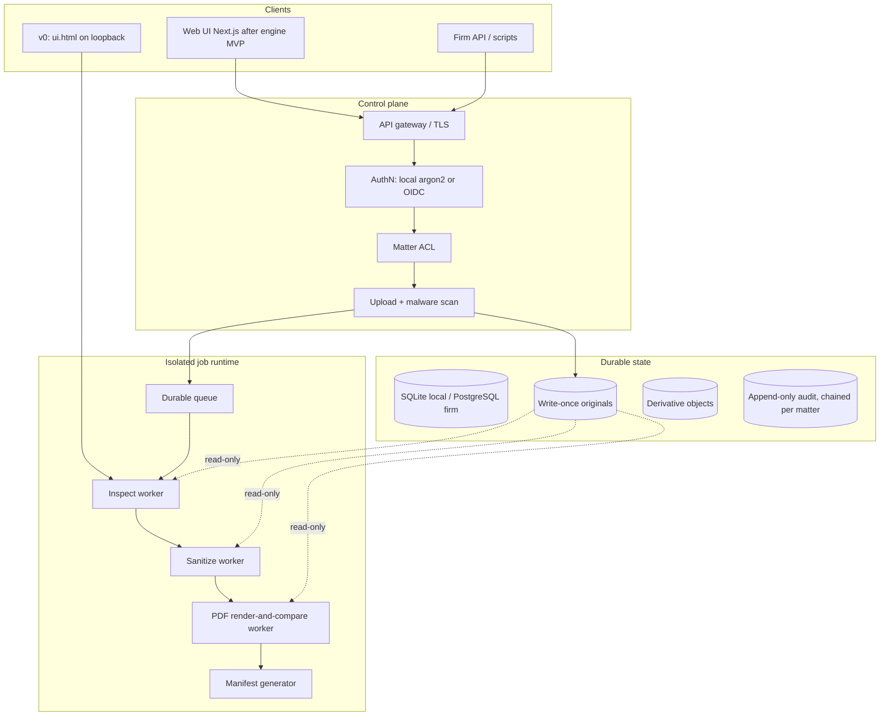
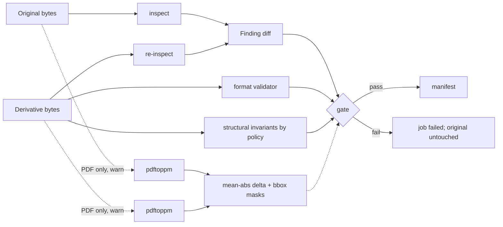

# CounselClear: Defensible Document Sanitization and Safe Sharing

| Field | Value |
| --- | --- |
| **Document** | Architecture and product design |
| **Author** | TBD (operator: transaction / tax counsel; outside GC) |
| **Date** | 2026-08-21 |
| **Revised** | 2026-08-21 |
| **Status** | Draft |
| **Audience** | Senior engineers, security, and the lawyer-operator taking this from a local prototype to a firm/product offering |
| **Prototype** | `/Users/naderalsheikh/watermarks-remover` (fork of [guillaumemeyer/watermarks-remover](https://github.com/guillaumemeyer/watermarks-remover), MIT) |
| **Working name** | CounselClear |

---

## Overview

Lawyers routinely leak privilege, identity, and work-product through file metadata, comments, tracked changes, hidden sheets, speaker notes, embedded objects, GPS EXIF, C2PA credentials, and invisible Unicode. The existing local prototype — a loopback HTTP service at `127.0.0.1:8765` (`service/scripts/server.py`) with format-aware inspect/clean in `format_dispatch.py`, `container_meta.py`, `image_meta.py`, and `text_unicode.py` — already proves that lossless metadata sanitation is tractable without a cloud model. It is not yet a defensible legal product: it overwrites conceptually, returns unstructured finding strings, has no matter ACL, no immutable original, no chain of custody, and is marketed in its upstream form as a watermark remover.

CounselClear is a **document-sanitization and safe-sharing platform** that identifies hidden information, **preserves the original immutably**, produces a **separate clean derivative** under an explicit policy, **verifies** that the derivative is actually clean and that body legal language did not change, and **documents every action** as a hash-chained audit record. Watermark removal (visible overlays, C2PA, statistical text, pixel-domain marks) is a gated, high-risk add-on — never the product spine, never a completeness claim, and never the default legal engine.

The inspect/clean core stays. The product grows around it: policy, custody, isolation, verification, and audit. Single-operator local use and later firm multi-tenant use share the same engine contract so the legal-document pipeline is not rewritten at the first paying client.

---

## Background & Motivation

### Why this change is needed

Outside general counsel and transaction/tax practices live on documents that must leave the laptop: client-facing drafts, deal-room uploads, production sets, tax filings, and opposing-counsel productions. The failure modes are well known:

- Word `dc:creator` / `cp:lastModifiedBy` and Excel named-author properties identifying the lawyer or firm.
- Tracked changes, comments, and speaker notes that contain privilege or negotiation strategy.
- Hidden sheets, hidden slides, white-on-white / `w:vanish` text, and customXml parts that survive “Print to PDF.”
- PDF incremental updates that leave prior `/Info`, annotations, and form values recoverable after a naïve metadata strip.
- EXIF GPS on site-visit photos; C2PA / Content Credentials that bind a draft to a generator.
- Zero-width Unicode and bidi overrides that alter copy-paste, search, or (in adversarial settings) the apparent meaning of a clause.

A general-purpose “make provenance disappear” tool is the wrong product for this operator. It is legally and reputationally dangerous, and it is technically indefensible for statistical and pixel watermarks. A **hygiene + custody** product is both more valuable to a firm and safer to sell. That is also the wedge against Document Inspector and DMS-native scrubbers, which already strip comments and revisions but do not keep a WORM original, a policy-versioned action list, or a verified hash-chained bundle.

### Current state of the prototype

The fork is a stdlib Python service (Python 3.10+) with optional system tools. Relevant surface:

| Layer | Module | Role today |
| --- | --- | --- |
| HTTP | `service/scripts/server.py` | `ThreadingHTTPServer` on loopback `:8765`. Endpoints: `GET /`, `/health`, `/capabilities`, `/openapi.json`; `POST /inspect`, `/detect`, `/clean` and `/batch` variants. Optional `WATERMARKS_SERVER_API_KEY`. UI: `service/scripts/ui.html` (`<h1>Watermarks remover</h1>`; Clean button label is **“Clean (lossless)”**; `setFile` posts `{ detect: true }`). |
| Router | `format_dispatch.py` | **Single** extension/magic table: `classify` / `classify_bytes` → `text` \| `image` \| `container` \| `av` \| `unknown`. Unknown is never auto-cleaned (`clean_file` exit 2; `/clean` 400). `inspect_file.py`, `clean_file.py`, and `server.py` duplicate *orchestration* (temp files, option plumbing, JSON wrapping), not the classifier. |
| Text Layer A | `text_unicode.py` | `inspect_text` / `clean_text`. Invisible Unicode, bidi, tag chars, spaces; conservative preservation of load-bearing invisibles (emoji ZWJ, script joiners, flag tags). |
| Office/PDF/HTML | `container_meta.py` | `inspect_container` / `clean_container`. DOCX/XLSX/PPTX: `docProps/*`, `customXml/`, embedded media, Layer A on `w:t` / `<t>` / `a:t` **in every matching part under `word/` / `xl/` / `ppt/`** (comments, headers, footers, notes slides included — not classified as such). PDF: `exiftool -all=` then `qpdf --linearize` (`_pdf_structural_rewrite`); three degraded modes if tools are missing (see PDF section). Zip-bomb cap: `container_meta.MAX_ZIP_DECOMPRESSED_BYTES` = 128 MiB. `_is_docx_meta_part` is only `docProps/` + `customXml/`. |
| Images | `image_meta.py` | PNG/JPEG/WebP/AVIF/HEIC/BMP/GIF/TIFF C2PA/EXIF/XMP-oriented strip. `inspect_jpeg` scans APP segments for AI/C2PA hints only — **JPEG GPS (EXIF IFD 0x8825 / tag 34853) is not a first-class finding.** GPS IFD 34853 is parsed on TIFF. Optional CtrlRegen / MarkDiffusion / SynthID — **not default legal engine**. |
| Meaning lock | `rewrite_text.py` | Separate CLI, **not** on `/clean`. Default `--strength preserve` (`legal` aliases `preserve`). `meaning_lock_violations` locks length 0.85–1.20, numbers, modals, section cites, quoted phrases. If every preserve candidate fails the lock, `rewrite()` **returns the original text** (`mode: "unchanged"`) — it does not abort the caller. Strength `code` exists and is **not** in `MEANING_CHANGING_STRENGTHS`. |
| Hardening | `common.py` | `MAX_INPUT_BYTES` default 256 MiB; `looks_binary` / `guard_binary`; `safe_write_*`; `subprocess_preexec_fn` RLIMIT_AS 4 GiB / RLIMIT_FSIZE 2 GiB; `safe_arg`. Zip budget is **not** here. |
| Tests | `tests/` | 42 test modules, ~575 `test_*` functions. Treat `tests/test_pdf_structural_rewrite.py`, `tests/test_ooxml_xlsx_pptx.py`, `tests/test_security_hardening.py`, `tests/test_rewrite_text.py`, `tests/test_http_server.py`, `tests/test_format_dispatch.py` as engine regression. |
| Optional heavy | `Dockerfile.ctrlregen`, `Dockerfile.markllm`, `Dockerfile.synthid`, `Dockerfile.markdiffusion` | Separate images. Upstream licenses are **not** MIT. `compose.yaml` keeps them on `harness` / `heavy` profiles. |

The UI lede already tells the operator the right story: *“Clean strips hidden Unicode and metadata only — it does not rewrite legal language.”* That sentence is the product, not a footnote.

HTML and Markdown are **`container`** in `CONTAINER_EXTS`, not `text`. Finding `format` must come from `detect_container_format`, not from `classify_bytes` kind.

`detect_container_format` sniffs zip members: presence of `word/document.xml` returns `"docx"` regardless of `.docm`. Same for `xl/workbook.xml` → `"xlsx"` and `.xlsm`. v1 must not inherit that coercion (see format refuse list).

### Pain points the prototype does not solve

1. **No original is kept.** `/clean` returns base64 of the derivative and discards the source (`_clean_payload`). CLI `--in-place` writes a `.bak` then overwrites (`clean_file.py`). For evidence and privilege this is inverted: the original must be immutable and the derivative optional.
2. **Findings are strings, not a review object.** `ContainerInspectReport.findings: list[str]` and `ImageInspectReport.findings: list[str]` cannot drive a policy UI or an audit that names *category / location / field / whether visible content changes*.
3. **Office/PDF legal artifacts are not first-class findings, but Layer A already mutates their text.** `_is_docx_meta_part` only treats `docProps/` and `customXml/`. Comments, tracked changes, hidden text, headers/footers as a class, hidden sheets, external links, speaker notes, hidden slides, named ranges, PDF `/Annots`, `/JS`, `/EmbeddedFiles`, AcroForms, incremental-update residue, digital signatures, and macros are **not first-class findings**. However `_scrub_ooxml_zip` already runs `_scrub_docx_text` on **every** `word/*.xml` (including `word/comments.xml`, `word/header*.xml`, `word/footer*.xml`, `word/footnotes.xml`) and `_scrub_pptx_text` on `ppt/notesSlides/`. A “lossless” clean today can change comment-pane / header / note Unicode without listing those artifacts. v1 inspectors must classify those Layer A hits under the correct part (`embedded_content` vs body `invisible_text`) and policies must decide whether Layer A runs on non-body parts.
4. **No chain of custody.** No SHA-256 of source or output, no processor version pin, no operator identity, no policy id.
5. **No isolation suitable for hostile files.** The service writes request bytes into a temp dir in-process. Docker core image is unprivileged and read-only (`service/Dockerfile`, uid 10001), which is the right *shape*, but there is no per-job microVM, no malware scan, no network-off worker.
6. **Layer B / pixel backends can exfiltrate.** `rewrite_text.py` default-denies non-loopback endpoints (`_check_remote`) and refuses redirects (`_NoRedirect`). That is correct and must remain. The product must go further: **no silent cloud LLM**.
7. **No visual proof of “nothing visible changed.”** Residual C2PA is flagged (`still_has_c2pa`). There is no render-and-compare.
8. **Positioning risk.** `ui.html` title is “Watermarks remover.”
9. **Signed files and macros are invisible.** `qpdf --linearize` and OOXML zip rebuild invalidate PDF certification/approval signatures and OOXML XML-DSig. `.docm` / `.xlsm` / `.pptm` can be sniffed as docx/xlsx/pptx and cleaned while leaving `word/vbaProject.bin`.
10. **JPEG GPS is not inspected as GPS.** Sharing-path `exiftool -all=` will drop it; `privacy_only` + today’s `keep_non_ai_metadata` would **keep GPS**.

---

## Goals & Non-Goals

### Goals (v1 engine / metadata-hygiene MVP)

- Ship a **local or customer-controlled** sanitization workflow for **PDF, DOCX, XLSX, PPTX, PNG, JPEG, WebP, TXT, Markdown, HTML** only.
- **Inspect before mutate.** Structured findings with recommended action, severity, and whether removal changes visible content.
- **Never overwrite the original.** Store it write-once with SHA-256. Emit a separate derivative. Product CLI has **no** `--in-place`.
- **Policy, not a generic “Clean” button.** Four named default policies (`external_sharing`, `privacy_only`, `production`, `evidence_preservation`) plus optional org/matter overlays with the same subtype keys.
- **Verify the derivative:** re-inspect, format-validate, hash; PDF page-raster compare as **warn-only** until the gate is flipped. Office visual compare is **not** a v1 gate.
- **Human + machine audit record** (manifest JSON + HTML report). Bundle default = derivative + reports, not the original.
- Keep the existing engine modules as the processing core; grow product concerns around them.
- Any enabled text rewrite uses `preserve`/`legal` only. Locks that exist today (modals, numbers, section cites, quoted phrases, length band) must hold; **unquoted defined terms are not locked** unless the operator supplies a term list. Product rewrite failure **fails the job** (new behavior; the current CLI returns the original unchanged).

### Non-goals (v1)

- Guaranteed removal of statistical or pixel-domain watermarks.
- Visible watermark inpainting as a default capability.
- Cloud-hosted LLM rewrite.
- Shipping CtrlRegen / noai-watermark, reverse-SynthID, MarkLLM, or MarkDiffusion as the default legal engine.
- Full e-discovery platform, DMS replacement, or email ingestion.
- Cleaning **legacy CFBF** (`.doc` / `.xls` / `.ppt`), **macro-enabled OOXML** (`.docm` / `.xlsm` / `.pptm` / `.dotm` / `.xltm`), **AV**, **ODT**, **EPUB**, **SVG**, **AVIF/HEIC/BMP/GIF/TIFF**, **encrypted/password PDFs**, or **encrypted OOXML** (`EncryptedPackage` / `EncryptionInfo`). Inspect may report `unsupported`; clean refuses.
- Silently breaking digital signatures and still labeling the output “clean.”
- Flattening or clearing PDF AcroForm field values by default (tax/closing binders).
- Office (DOCX/XLSX/PPTX) visual-compare as a hard gate.
- Indexing document contents for search.
- Multi-region active-active.
- Next.js, OIDC, CMK, Object Lock — those are product-shell / production, not the engine MVP.

---

## Proposed Design

### Positioning spine

> A defensible document-sanitization and safe-sharing platform that identifies hidden information, preserves originals, creates controlled clean derivatives, and documents every change.

Do not market as a watermark remover. The MIT upstream is a **technical starting point**. It is not the product.

### Hidden-information taxonomy

The engine classifies findings into these categories. Policy maps **category + subtype** → action; a single `embedded_content → strip` cell is not implementable.

| Category id | Examples | v1 handling (see subtype table) |
| --- | --- | --- |
| `file_metadata` | Author, company, EXIF GPS, creator software, PDF `/Info` | Strip or replace per policy; GPS is always strip on sharing **and** privacy_only |
| `embedded_content` | Comments, notes, hidden structure, embeddings, customXml, PDF annots/attachments/forms | **Subtype-specific** (comments strip on sharing; headers/footers and hidden sheets **flag-only** in v1) |
| `revision_history` | Word tracked changes; PDF incremental updates | Sharing: **Accept All** for Word markup; **rebuild** for PDF incrementals |
| `digital_signature` | PDF `/Sig`, OOXML XML-DSig, signed `/Perms` | **Refuse derivative** unless operator attests that breaking the signature is intended |
| `active_content` | VBA/`vbaProject.bin`, PDF `/JS` `/OpenAction` `/AA` | Macros: unsupported, refuse clean. PDF JS: strip on sharing/production |
| `visual_watermark` | “Draft,” firm branding overlays | **Gated.** Not v1 default |
| `provenance_metadata` | C2PA, XMP content credentials | Strip only under sharing/production (authorized). **`privacy_only` keeps C2PA** |
| `invisible_text` | Zero-width Unicode, bidi, font-color-hidden / `w:vanish` / white-on-white | Sanitize with reviewer-facing diff; non-body parts follow the part’s policy |
| `statistical_watermark` | Token-sampling / pixel statistical signals | Off by default; never a completeness claim |

### v1 format matrix

| Input | `classify_bytes` kind today | Product inspect | Product clean |
| --- | --- | --- | --- |
| `.pdf` (unencrypted) | container | yes | yes, iff `exiftool` **and** qpdf structural rewrite succeed |
| `.docx` / `.xlsx` / `.pptx` | container | yes | yes, if no signature and no VBA |
| `.txt` | text | yes | yes (Layer A) |
| `.md` / `.html` / `.htm` | **container** | yes | yes (existing `inspect_markdown` / `inspect_html` + Layer A) |
| `.png` / `.jpeg` / `.jpg` / `.webp` | image | yes | yes (metadata; GPS-aware) |
| `.docm` `.xlsm` `.pptm` `.dotm` `.xltm` | container (sniffed as docx/xlsx/pptx) | **unsupported-macro-office** | **refuse** |
| Any zip containing `vbaProject.bin` / `_vba_project.bin` / `word/macros/` | container | `active_content` finding | **refuse** |
| `.doc` `.xls` `.ppt` (CFBF) | unknown / binary | `unsupported-legacy-office` | refuse |
| Encrypted / password PDF | container | `unsupported-encrypted-pdf` | refuse |
| Encrypted OOXML (`EncryptedPackage` / `EncryptionInfo` in the zip; often no `word/document.xml`) | unknown or container | `unsupported-encrypted-office` | refuse (do not parse) |
| AV, ODT, EPUB, SVG, AVIF, HEIC, BMP, GIF, TIFF | av / container / image | `unsupported-v1-format` (inspect-as-unsupported) | refuse |
| Unknown | unknown | report unknown | refuse |

`detect_container_format` must gain an extension-and-member check **before** the `word/document.xml` sniff: `.docm` never returns `"docx"`. Finding `format` is the `detect_container_format` / `detect_format` string, not the kind.

### Engine vs product shell (the growth invariant)

```
┌──────────────────────────────────────────────────────────────────────────┐
│ Product shell (evolves: local → single-tenant → multi-tenant)            │
│ AuthN/Z, matters, policies, object store, queue, audit, UI, integrations │
├──────────────────────────────────────────────────────────────────────────┤
│ Stable processing contract  (library, no HTTP, no DB, no network)        │
│   inspect_bytes(data, name, caps) -> InspectResult                       │
│   plan_actions(result, policy, decisions) -> ActionPlan                  │
│   apply_actions(data, plan) -> (bytes, list[ActionRecord])               │
│   verify_derivative(original, derivative, plan) -> VerifyResult          │
│   emit_manifest(...) -> Manifest                                         │
├──────────────────────────────────────────────────────────────────────────┤
│ Existing engine (in-place evolution of service/scripts/)                 │
│   format_dispatch.classify_bytes                                         │
│   text_unicode.inspect_text / clean_text                                 │
│   container_meta.inspect_container / clean_container                     │
│   image_meta.inspect_image / clean_image                                 │
│   rewrite_text.meaning_lock_*   (gated; never default for legal files)   │
│   common.MAX_INPUT_BYTES, looks_binary, safe_write_*                     │
│   container_meta.MAX_ZIP_DECOMPRESSED_BYTES                              │
└──────────────────────────────────────────────────────────────────────────┘
```

PR 1 extracts today’s orchestration as `inspect_bytes` / `clean_bytes` (byte-identical to CLI). PR 11 (`plan_actions` / `apply_actions`) **replaces** generic `clean_bytes` on the product path. Prototype `server.py` `/clean` may keep calling `clean_bytes` until the product API takes over.

CLI `--in-place` remains in the *prototype* scripts for backward compatibility of existing tests; the **product CLI and product API omit it**. No env gate.

### Target architecture



**Stack:**

- **Frontend:** v0 keeps `ui.html`. Next.js is product-shell (after engine MVP).
- **Control plane:** FastAPI for `/v1`. Stdlib `server.py` stays as a prototype adapter.
- **Workers (production):** one short-lived container per job, non-root, no egress, pinned `service/Dockerfile` (uid 10001, `exiftool`, `qpdf`, `c2patool` 0.27.15). Engine MVP may still parse in-process on loopback.
- **Store:** local encrypted volume with application-level write-once (MVP) → S3-compatible + Object Lock (production).
- **DB:** SQLite (local) or Postgres (firm), same Alembic models; JSON column is JSONB on Postgres and JSON on SQLite.
- **Search:** filename + matter + hash + tags. No content index.

### Key workflow

```mermaid
sequenceDiagram
  actor U as Operator
  participant API as Control plane
  participant Store as Original store
  participant W as Isolated worker
  participant D as Derivative store
  participant A as Audit log

  U->>API: Upload source (matter_id, filename)
  API->>API: Size/page/archive caps; optional malware scan
  API->>Store: PUT original write-once, SHA-256
  API->>W: Job inspect (read-only original)
  W-->>API: Structured findings JSON
  API-->>U: Findings report
  U->>API: Select policy + per-finding decisions + attestations
  API->>W: Job sanitize (never writes original)
  W->>D: PUT derivative
  W->>W: Re-inspect + format check
  W->>W: PDF raster compare (warn)
  W-->>API: VerifyResult + hashes
  API->>A: Append audit (per-matter hash chain)
  API-->>U: Bundle: derivative, report, manifest (original opt-in)
```

1. **Upload / ingest.** Multipart, streamed to object storage. Prototype `MAX_BODY_BYTES` exists because `/clean` inlines the file.
2. **Store original write-once.** Key layout (local and S3, one scheme):

   `{root}/{org}/matters/{matter}/docs/{doc}/original`

   Local MVP: create with `O_EXCL`, then `chmod 0444`; application refuses overwrite/delete except via retention. POSIX is **not** S3 Object Lock; Object Lock is production-only.
3. **Hash original (SHA-256 only in v1).** No blake3 in the engine (would add a non-stdlib dependency). Control plane may add a faster hash later without putting it on the engine contract. Store `bytes`, `mime`, `kind` from `classify_bytes`, `format` from `detect_*`.
4. **Inspect before mutate.** `inspect_bytes` including legal inspectors, signatures, macros, JPEG GPS.
5. **Findings report.** Schema below.
6. **Policy + decisions.** See `plan_actions` missing-decision rules: omitted `approve` ⇒ `keep` (recorded); omitted signature attestation on a `digital_signature` finding ⇒ the job cannot start.
7. **Separate derivative.** `apply_actions` never points `dest` at the original key.
8. **Re-inspect** the resulting bytes. PDF sharing/production **hard-fail** unless clean mode is `{exiftool, structural_rewrite: true}`. Scan post-qpdf bytes, not the pre-rewrite buffer.
9. **Audit / manifest** via `emit_manifest`.
10. **Download bundle.** Default: derivative + `report.html` + `report.json` + `manifest.json`. Original is **not** in the zip unless `download_original` ACL and `include_original=true`.

### Where the prototype fits, file by file

**Keep and evolve:**

- `format_dispatch.py` — single classifier. Do not add a second extension table. Product **refuse list** is applied *after* classify, using extension + members.
- `text_unicode.py` — Layer A + reviewer-facing Unicode diff (`CharHit.samples` offsets).
- `container_meta.py` — keep zip-budget, qpdf path, entity-aware `_decode_xml_entities`, quote-tolerant `_prune_dangling_relationships` (`Target` single or double quotes, #130). Extend inspectors; **do not** claim comment/revision removal is “already how `_scrub_ooxml_zip` works.”
- `image_meta.py` — lossless strip. Add JPEG GPS (APP1 Exif IFD 0x8825). Pixel backends stay out of the legal image.
- `common.py` — caps, binary guard, safe writes, rlimits, `classify_finding_confidence`.
- `rewrite_text.py` — **gated, not in `/clean`.** Prototype lock-fail returns original (`mode: "unchanged"`, `tests/test_rewrite_text.py`). **Product behavior is new:** if a job has rewrite enabled and no candidate passes the lock, `apply_actions` fails the job; original untouched. Product refuses strength `code`.
- `server.py` — prototype adapter until `/v1` exists.

**Do not ship as default legal engine:** CtrlRegen, MarkDiffusion, SynthID scorer, MarkLLM, KGW/Gumbel as “this file is now unmarked.”

**Reuse with caution:** `audit_lib.py` (folder scan, not custody). `extract_ooxml_plaintext` is stylometry-only.

### Structured findings

Canonical Finding (JSON Schema lives in `engine/schemas/finding.schema.json`; fields below are the contract):

```json
{
  "finding_id": "f_9c2e",
  "category": "file_metadata",
  "subtype": "authoring_props",
  "format": "docx",
  "location": {
    "part": "docProps/core.xml",
    "xpath_or_field": "dc:creator",
    "page": null,
    "sheet": null,
    "slide": null,
    "offset": null,
    "bbox": null,
    "pane": "body"
  },
  "field": "dc:creator",
  "value_redacted": "present (12 chars)",
  "action_recommended": "strip",
  "action_allowed_by_policy": ["strip", "replace", "keep"],
  "content_visible": false,
  "risk_level": "high",
  "confidence": "confirmed",
  "removal_changes_visible_content": false,
  "requires_approval": false,
  "requires_attestation": false,
  "notes": "Authoring identity; maps to current DOCX_SCRUB_FIELDS"
}
```

Enums:

- `risk_level`: `critical` | `high` | `medium` | `low` | `info`
- `confidence`: `confirmed` | `probable` | `informational` | `likely_false_positive` (`common.CONFIDENCE_LEVELS`)
- `action`: `keep` | `strip` | `replace` | `rebuild` | `sanitize` | `refuse` | `accept_all` | `flag`
- `pane`: `body` | `comment` | `note` | `header` | `footer` | `footnote` | `markup` | `hidden` | `metadata` | `other`
- `location.bbox`: optional `[x0, y0, x1, y1]` in PDF page space (PDF-only v1). Produced by the cleaner/inspector when it knows a page rect (e.g. `/Annots` rect). Null for Office in v1.

Adapter mapping:

| Existing / new signal | Category | subtype | `content_visible` | `pane` |
| --- | --- | --- | --- | --- |
| `DOCX_SCRUB_FIELDS` | `file_metadata` | `authoring_props` | false | metadata |
| JPEG/TIFF GPS IFD 34853 | `file_metadata` | `jpeg_gps` | false | metadata |
| `customXml/` | `embedded_content` | `custom_xml` | false | metadata |
| `has_c2pa` | `provenance_metadata` | `c2pa` | false | metadata |
| Layer A in `word/document.xml` / `xl/sharedStrings` / `ppt/slides/` | `invisible_text` | `layer_a_body` | false except `space`/`confusable` | body |
| Layer A in comments/headers/footers/notes | `invisible_text` | `layer_a_non_body` | **true** (comment pane / header / notes page) | comment/header/footer/note |
| `word/comments.xml`, `commentsExtended.xml`, `commentsIds.xml`, `commentsExtensible.xml`, `people.xml`; `w:commentRangeStart` | `embedded_content` | `comments_and_notes` | true | comment |
| `w:ins` / `w:del` / `w:moveFrom` / `w:moveTo` | `revision_history` | `tracked_changes` | true if markup shown | markup |
| `w:vanish`, `w:highlight`, `w:color="FFFFFF"` | `embedded_content` | `hidden_text` | false until revealed | hidden |
| `word/header*.xml`, `footer*.xml` | `embedded_content` | `headers_footers` | true | header/footer |
| `sheetState`, hidden rows/cols, hidden slides | `embedded_content` | `hidden_structure` | false until unhidden | hidden |
| `word/embeddings/`, OLE | `embedded_content` | `embeddings_ole` | varies | other |
| DOCX/XLSX external rels / `xl/externalLinks/` | `embedded_content` | `external_links` | false | metadata |
| PDF `/JS` `/OpenAction` `/AA` | `active_content` | `pdf_js_actions` | false | other |
| PDF `/AcroForm` values | `embedded_content` | `pdf_acroform` | true (form fields) | body |
| PDF `/Annots` | `embedded_content` | `pdf_annots` | often true | comment |
| PDF `/EmbeddedFiles` | `embedded_content` | `pdf_attachments` | false | other |
| PDF `/Sig`, OOXML signatures | `digital_signature` | `cms_or_xml_dsig` | false | other |
| `vbaProject.bin` | `active_content` | `macros_vba` | false | other |
| Stylometry `score >= 0.65` | informational only | — | n/a | — |

Keep `findings: list[str]` as a derived view so current tests pass.

### Policies

A `Policy` is versioned JSON: global flags + `subtypes[subtype] = ActionSpec`.

```json
{
  "id": "external_sharing",
  "version": 1,
  "allow_text_rewrite": false,
  "pdf_requires_exiftool_and_qpdf": true,
  "metadata_replacement": { "dc:creator": "", "Company": "" },
  "defined_terms": [],
  "subtypes": {
    "authoring_props": "strip",
    "jpeg_gps": "strip",
    "comments_and_notes": "strip",
    "headers_footers": "flag",
    "hidden_structure": "flag",
    "hidden_text": "flag",
    "embeddings_ole": "strip",
    "custom_xml": "strip",
    "external_links": "strip",
    "pdf_js_actions": "strip",
    "pdf_acroform": "flag",
    "pdf_attachments": "strip",
    "pdf_annots": "strip",
    "tracked_changes": "accept_all",
    "pdf_incremental": "rebuild",
    "c2pa": "strip",
    "layer_a_body": "sanitize",
    "layer_a_non_body": "keep",
    "cms_or_xml_dsig": "refuse",
    "macros_vba": "refuse",
    "visual_watermark": "refuse",
    "statistical_watermark": "refuse"
  }
}
```

`flag` = inspect finding only; do not mutate that artifact; job may still succeed. `refuse` = do not emit a derivative labeled clean (inspect-only) unless a typed attestation is on the job.

**Layer A composition (single rule, not a fifth action enum):** Layer A runs on a package part only when that part’s subtype action on the plan is `strip` or `accept_all`. It never runs under `privacy_only` on non-body parts. Consequence for v1 sharing: `headers_footers` / footnotes are `flag`/`keep` ⇒ **no Layer A** there (privilege legends and page numbers stay byte-identical except Accept All markup resolution below). Comments/notes are `strip` ⇒ Layer A is a no-op because the part is dropped. Body Layer A (`layer_a_body`) still runs.

**Accept All vs kept parts:** `tracked_changes: accept_all` **does** walk header, footer, and footnote XML: unwrap/drop revision wrappers inside those parts, but **does not delete the part**. The two subtypes do not fight.

**`plan_actions` when the POST omits a Decision or attestation:**

| Policy cell | Request omitted | Result |
| --- | --- | --- |
| `approve` | no `Decision` for that finding/subtype | treat as **`keep`**, record `action: keep`, `reason: no_decision` on the plan; do **not** infer strip |
| `refuse` (`cms_or_xml_dsig`) | no `signature_break_attestation` | **`plan_actions` raises**; job cannot start |
| `refuse` (`macros_vba`) | n/a (unsupported format) | already refused at inspect/classify |
| `flag` / `keep` / `strip` / `accept_all` / `sanitize` | n/a | apply the policy default |

`ActionPlan.signature_attestation` is a bool (attestation present). The typed checkbox text lives on the **job row**, not on the plan.

**Overlays:** org and matter `PUT .../policies` are the same schema as the four defaults (`id` may be `custom` or a matter-scoped name). Unknown subtype keys are rejected. Overlay may not weaken `macros_vba` or `cms_or_xml_dsig` to `strip`/`sanitize` without a signature-break attestation on the *job*; policy JSON that sets those to `strip` is a 400 at save time.

Frozen v1 defaults (four named policies; overlays optional):

| Subtype | external_sharing | privacy_only | production | evidence_preservation |
| --- | --- | --- | --- | --- |
| `authoring_props` | strip (empty, or `metadata_replacement`) | strip **listed PII fields only** (below) | strip | keep |
| `jpeg_gps` | strip | **strip** (GPS-only path; not `strip_all_metadata`) | strip | keep |
| `comments_and_notes` | strip | keep | approve | keep |
| `headers_footers` | **flag** | keep | flag | keep |
| `hidden_structure` | **flag** | keep | approve | keep |
| `hidden_text` | **flag** | keep | approve | keep |
| `embeddings_ole` | strip | keep | approve | keep |
| `custom_xml` | strip | keep | strip | keep |
| `external_links` | strip | keep | approve | keep |
| `pdf_js_actions` | strip | keep | strip | keep |
| `pdf_acroform` | **flag** | keep | approve | keep |
| `pdf_attachments` | strip | keep | approve | keep |
| `pdf_annots` | strip | keep | approve | keep |
| `tracked_changes` | **accept_all** | keep | approve | keep |
| `pdf_incremental` | rebuild | keep | rebuild | keep |
| `c2pa` | strip (authorized) | **keep** | strip if authorized | keep |
| `layer_a_body` | sanitize | sanitize | sanitize | keep |
| `layer_a_non_body` | **keep** (composition: Layer A only if that part’s action is `strip`/`accept_all`) | **keep** | approve | keep |
| `cms_or_xml_dsig` | refuse unless attest | keep | refuse unless attest | keep |
| `macros_vba` | refuse | refuse | refuse | inspect-only |

`privacy_only` `authoring_props` field list (only these, plus GPS via `jpeg_gps`): `dc:creator`, `cp:lastModifiedBy`, `Company`, `Manager`, PDF `/Author`. Leave `Application`, `AppVersion`, `dc:title`, `dc:subject`, `cp:keywords`, `cp:category`, `dc:description` unless a value matches a PII regex (email, phone, or a configured staff-name list). Prototype `DOCX_SCRUB_FIELDS` is **wider** than this list; `privacy_only` must not reuse it wholesale.

`privacy_only` is the no-visible-body-change path. Enforcement in v1 is **not** a pixel metric: re-inspect + body unicode/plaintext diff + **strict** structural invariants (page count, image dimensions, visible sheet/slide count must match). Sharing/production do **not** fail on page-count drift when the plan contains `accept_all` (see Verification). Pixel compare is warn-only and PDF-only.

`evidence_preservation` never calls `apply_actions`.

`replace` requires `metadata_replacement` on the policy (string map). Default replacements are empty strings, not the firm name.

### Format-specific v1 handling

#### PDF

Today: `inspect_pdf` = `_blob_hits(_pdf_structured_blob)` + XMP + `c2patool`. `_pdf_structured_blob` strips stream payloads to avoid false `AIGC` hits. `clean_pdf` has **three** outcomes:

| Tools present | `meta["mode"]` | Residue |
| --- | --- | --- |
| exiftool + qpdf success | `exiftool`, `structural_rewrite: true` | intended clean path |
| exiftool, qpdf missing or non-0/3 | `exiftool`, `structural_rewrite: false` | incremental `/Info` recoverable |
| no exiftool, XMP packets found | `stdlib-xmp`, `degraded: True` | offsets may break |
| no exiftool, no XMP | `copy`, `degraded: True` | **copied as-is** |

Sharing/production **hard-fail** unless mode is `exiftool` **and** `structural_rewrite is true`. Missing qpdf **or** missing exiftool is a failed job, not a warning. (`service/Dockerfile` already installs both; a worker without them is not a legal engine.)

**Post-qpdf `/Info` (required; otherwise PR 13 re-inspect fails):** prototype order is `exiftool -all=` then `qpdf --linearize`. qpdf writes a **new** `/Producer` (and often `/Creator`) into a fresh Info dict. Do **not** run `exiftool -all=` again after qpdf (that re-introduces incremental updates). After a successful linearize:

1. Run a second **non-incremental** Info pass with qpdf only, e.g. `qpdf --linearize --set-info=Author= --set-info=Creator= --set-info=Title= --set-info=Subject= --set-info=Keywords=` on the already-rewritten file (exact flags pinned in PR 5 against the image’s qpdf version). Goal: drop identity keys without an exiftool incremental xref.
2. Re-inspect **allowlists** `/Producer` whose value is a prefix/version match of `ProcessorInfo.tools["qpdf"]` (the sanitizer identifying itself). Fail the job on residual `/Author`, `/Creator` (unless `metadata_replacement` set that key), company-class identity, or the **original** producer/creator substring.
3. Fixture (PR 5 + PR 13): derivative bytes do not contain the original `/Producer` payload; no `dc:creator`-class identity; if `/Producer` remains it is only the qpdf stamp. Document that a qpdf producer string is **allowed**; a leftover author is not.

v1 inspectors (new, `pdf_legal.py` or `container_meta.py`):

- `/EmbeddedFiles`, `/FileAttachment` → `pdf_attachments`
- `/Annots` (with `Rect` → `location.bbox` when present) → `pdf_annots`
- `/AcroForm` field values → `pdf_acroform` (**flag** on sharing; clear only with approval; **never flatten** unless asked)
- `/JS`, `/JavaScript`, `/OpenAction`, `/AA` → `pdf_js_actions` (strip on sharing/production; never execute)
- `/Sig` / signature dictionaries → `digital_signature` (refuse derivative unless attestation)
- Incremental residue: count `startxref` / `%%EOF` on **`_pdf_structured_blob`**, not raw bytes (raw count false-positives inside streams). After qpdf, re-scan structured blob; `qpdf --check`; fixture greps original `/Producer` (or `/Info` payload) out of derivative bytes.

#### DOCX

Today: drop `customXml/`, drop `docProps/custom.xml`, empty `DOCX_SCRUB_FIELDS`, Layer A on every `word/*.xml` `w:t`. Tracked-change accept/reject is **not** implemented.

v1 artifacts:

| Artifact | Parts / XML | Subtype | Sharing |
| --- | --- | --- | --- |
| Comments | `word/comments.xml`, `commentsExtended.xml`, `commentsIds.xml`, `commentsExtensible.xml`, `people.xml`, commentRange* | `comments_and_notes` | strip |
| Tracked changes | `w:ins`, `w:del`, `w:moveFrom`, `w:moveTo`, `w:rPrChange`, `w:pPrChange`, `w:sectPrChange`, `w:tblPrChange` | `tracked_changes` | **Accept All** |
| Hidden text | `w:vanish`, `w:highlight`, `w:color` white | `hidden_text` | flag |
| Headers/footers | `word/header*.xml`, `footer*.xml` | `headers_footers` | flag (do not auto-strip) |
| Footnotes/endnotes | `word/footnotes.xml`, `endnotes.xml` | inspect; Layer A as non-body | keep unless custom |
| Embeddings | `word/embeddings/`, OLE | `embeddings_ole` | strip |
| Hyperlinks / external rels | `TargetMode="External"` | `external_links` | strip |
| Signatures | `origin.sigs`, XML-DSig parts | `cms_or_xml_dsig` | refuse |
| VBA | `word/vbaProject.bin`, `word/macros/` | `macros_vba` | refuse (unsupported format) |

**Accept All algorithm (new; not `_scrub_ooxml_zip`):** XML-aware walk with **stdlib `xml.etree`** (keep the core Dockerfile dependency-free; add lxml only if a fixture proves `etree` insufficient). Apply to **every document part that contains revision markup**, including kept `word/header*.xml` / `footer*.xml` / `footnotes.xml` / `endnotes.xml` (resolve markup; do not delete those parts):

1. Unwrap `w:ins` and `w:moveTo`: keep children in place, drop the wrapper.
2. Drop `w:del` and `w:moveFrom` subtrees entirely (deleted text gone).
3. Drop `w:rPrChange` / `w:pPrChange` / `w:sectPrChange` / `w:tblPrChange`: keep current properties, discard previous.
4. Drop leftover `w:delText`.
5. Prune `[Content_Types].xml` overrides and `.rels` with the **same quote-tolerant** matchers as `_prune_dangling_relationships` / `_target_attr` (single or double quotes). Do not copy the customXml-only double-quote `PartName="..."` regex.

This **is content-altering relative to “show markup”** and **is the displayed-final-text path** Word’s Accept All uses. It is the only default. **Reject All** (keep `w:del`, drop `w:ins`) is never a default; production may offer it as an explicit per-finding action. `privacy_only` / `evidence_preservation` leave markup.

After Accept All, require body unicode/plaintext diff (insertions that were already in the body should remain; deleted text should disappear) and PDF-raster warn if the operator later exports to PDF. Do not claim zip rebuild equals revision accept.

#### XLSX

- Hidden / very-hidden sheets, hidden rows/cols → `hidden_structure`, **flag-only** on sharing (do not auto-unhide).
- Comments: `xl/comments*`, `xl/threadedComments/`, `xl/persons/` → strip on sharing.
- Defined names pointing at hidden ranges → flag.
- `xl/externalLinks/` → strip on sharing.
- VBA (`xl/vbaProject.bin`) → refuse.

#### PPTX

- Speaker notes `ppt/notesSlides/` → strip on sharing (`comments_and_notes`).
- Hidden slides (`p:sld` show attr) → `hidden_structure`, **flag-only** (do not delete).
- Comments: `ppt/comments/` **and** modern `ppt/commentAuthors.xml`, threaded comment parts → strip on sharing.
- VBA → refuse.

#### Images (PNG / JPEG / WebP)

Sharing: `strip_all_metadata=True` (today’s path, drops GPS via rebuild + `exiftool -all=`).

`privacy_only`: **do not** use `keep_non_ai_metadata` (that keeps JPEG GPS). GPS-only path: inspect APP1 Exif IFD GPS (0x8825) / TIFF tag 34853 as findings; strip with **`exiftool -gps:all=`** (already in the worker image) rather than hand-editing JPEG offsets. Leave non-PII metadata. C2PA stays. Re-inspect must show GPS gone and non-GPS EXIF still present.

No `remove_pixel`.

#### TXT / Markdown / HTML

Layer A + existing frontmatter/generator scrub. `format` is `markdown` / `html` from `detect_container_format`.

### Verification workers

A derivative is not “clean” because `clean_pdf` returned.

1. **Re-inspect** `inspect_bytes` on the derivative. Targeted subtypes that were `strip` / `accept_all` / `rebuild` / `sanitize` must be gone, **except** the qpdf `/Producer` allowlist (PDF section). New identity findings fail the job.
2. **Format validator:** `qpdf --check`; OOXML zip + Content_Types; image magic + dimensions.
3. **Structural invariants (policy-scoped):**
   - `privacy_only` / `evidence_preservation` (if a derivative were ever produced): page count, visible sheet/slide count, and image width/height **must match**. Drift fails the job.
   - Sharing/production: visible sheet/slide counts and image dimensions must match. **Page-count delta is expected** when the plan contains `accept_all` (or PDF annot/comment strip that the operator should treat as pagination-changing). Record `page_count_original`, `page_count_derivative`, `page_count_delta_expected: true` on `VerifyResult`; do **not** fail the job on page-count drift alone. Unicode/plaintext diff remains the Accept All oracle.
4. **PDF render-and-compare (warn-only in v1):** rasterize with `pdftoppm` or pdfium at 150 dpi. Metric: mean absolute per-channel pixel delta after a 1px box blur (anti-aliasing), computed per page, **ignoring** `location.bbox` masks from annots/form rects the plan stripped. Threshold: page fails warn if mean abs delta > 3/255 on >0.5% of unmasked pixels. Cap: first 10 pages + last 5 + up to 15 uniformly sampled (`Caps.max_verify_pages`, default 30). Store **on-demand JPEG/WebP thumbnails**, not durable full-page PNG. `ff.visual_compare_gate` stays **off** until bbox masks and the threshold are calibrated; even then, **Office visual compare is deferred** (LibreOffice ≠ Word layout, missing firm fonts would fail any `delta = 0` rule on real DOCX).
5. **Unicode / plaintext diff** of body extraction. Under `privacy_only` and sharing-without-Accept-All, only Layer A body codepoints should change. After Accept All, the diff must match the accept-all expectation (deletions gone, insertions kept).
6. **Hashes** of original, derivative, report, processor image digest.

`privacy_only` **does not** wait on pixel compare.



### Local → firm

| Profile | Control plane | Store | Queue | Engine |
| --- | --- | --- | --- | --- |
| **Prototype (now)** | `server.py`, loopback, optional bearer | none | none | current modules |
| **Engine MVP (this small-team cut)** | library + `ui.html` + custody dir | write-once local files + SQLite optional | in-process | same library |
| **Product MVP (single tenant)** | FastAPI, local argon2 user | encrypted volume | in-process or Redis | same library |
| **Production** | FastAPI + OIDC, matter ACL, CMK | S3 + Object Lock + Postgres | per-job microVM | **same library**, digest on every job |
| **Advanced** | DMS, e-discovery, desktop agent | residency, legal hold | GPU sidecar if watermark gate | same core |

Library fixtures that pass on a laptop must pass in the worker image.

### Meaning lock (legal operative language)

Layer B is **off** unless `allow_text_rewrite=true` (no v1 default policy sets this) **and** the org flag is on **and** the worker image actually contains a loopback backend.

If enabled:

1. Strength `preserve` only (`legal` alias). Product **refuses** `paraphrase`, `humanize`, `backtranslate`, `structural`, and **`code`**.
2. Candidate must pass `meaning_lock_violations` (length, `_NUMBER_RE`, `_MODAL_RE`, `_SECTION_RE`, `_QUOTED_RE`). Optional `policy.defined_terms`: each term’s occurrence count must match (operator-supplied; not inferred from `w:rStyle`).
3. **New product behavior:** if no candidate passes, `apply_actions` raises / returns job failure. Do **not** write a derivative. This is **not** what `rewrite()` does today (`mode: "unchanged"` returns original text to the CLI caller).
4. Remote endpoints remain default-deny. No product flag enables remote LLM. `/inspect` `{ detect: true }` is not the UI default.

---

## API / Interface Changes

### Prototype adapter (unchanged paths)

```
POST /inspect   { file: b64, name, detect? }   # detect default false in product UI
POST /clean     { file: b64, name, options }
POST /detect    { file: b64, name }
```

No `policy_id` on this surface (410 pointing at `/v1` if sent).

### Product API (`/v1`)

Auth: local profile = session cookie after verifying an argon2id hash stored in a `0600` file (`{data_root}/auth/local.hash`) on loopback only. Firm = OIDC + bearer service accounts.

**Every job route is matter-scoped.** UUID opacity is not an ACL.

```
POST   /v1/matters
GET    /v1/matters/{id}

POST   /v1/matters/{id}/documents
GET    /v1/matters/{id}/documents/{doc_id}

POST   /v1/matters/{id}/documents/{doc_id}/inspect-jobs
POST   /v1/matters/{id}/documents/{doc_id}/sanitize-jobs
       body: { policy_id, finding_decisions?: [...], reason,
               signature_break_attestation?: { typed: true, text: "..." } }

GET    /v1/matters/{id}/jobs/{job_id}
GET    /v1/matters/{id}/jobs/{job_id}/manifest
GET    /v1/matters/{id}/jobs/{job_id}/bundle
       # default zip: derivative + reports + manifest
       # include_original=true requires perm download_original; audited

GET    /v1/orgs/{id}/policies
PUT    /v1/orgs/{id}/policies/{policy_id}
GET    /v1/matters/{id}/policies
PUT    /v1/matters/{id}/policies/{policy_id}    # overlay; same collection shape

# 403 unless org.watermark_tools_enabled and cryptographic attestation
POST   /v1/matters/{id}/documents/{doc_id}/watermark-jobs
```

Sharing “I am authorized to sanitize this copy” is a **typed checkbox** stored on the job (`attestation_kind: checkbox`). Watermark jobs require a **signed** payload (`attestation_kind: signed`). Do not reuse one field for both.

### Library contract (`engine/api.py`)

JSON Schema files: `finding.schema.json`, `policy.schema.json`, `action_plan.schema.json`, `verify_result.schema.json`, `manifest.schema.json`.

```python
@dataclass(frozen=True)
class Caps:
    max_input_bytes: int = 256 << 20          # common.MAX_INPUT_BYTES
    max_zip_decompressed_bytes: int = 128 << 20  # container_meta
    max_archive_depth: int = 2
    inspect_timeout_s: int = 120
    apply_timeout_s: int = 180
    verify_timeout_s: int = 300
    max_verify_pages: int = 30

@dataclass(frozen=True)
class ProcessorInfo:
    git_sha: str
    image_digest: str | None
    tools: dict[str, str]  # from capabilities() version probes

@dataclass(frozen=True)
class InspectResult:
    kind: Literal["text", "image", "container", "av", "unknown"]
    format: str                 # detect_container_format / detect_format
    findings: list[Finding]
    processor: ProcessorInfo
    source_sha256: str
    unsupported_reason: str | None = None

@dataclass(frozen=True)
class Decision:
    finding_id: str
    action: Literal["keep","strip","replace","rebuild","sanitize","refuse","accept_all","flag"]
    replacement: str | None = None

@dataclass(frozen=True)
class PlannedAction:
    finding_id: str | None  # None for policy-wide actions (e.g. accept_all on all revision parts)
    subtype: str
    action: Literal["keep","strip","replace","rebuild","sanitize","refuse","accept_all","flag"]
    replacement: str | None = None
    reason: str | None = None  # e.g. "no_decision"

@dataclass(frozen=True)
class ActionPlan:
    policy_id: str
    policy_version: int
    source_sha256: str
    actions: list[PlannedAction]
    require_exiftool_qpdf: bool
    signature_attestation: bool  # True iff job row carries signature_break_attestation; text stays on the job

@dataclass(frozen=True)
class ActionRecord:
    finding_id: str
    subtype: str
    action: str
    content_visible: bool
    bytes_or_count_delta: int | None = None

@dataclass(frozen=True)
class VerifyResult:
    reinspect_clean: bool
    residual_finding_ids: list[str]
    format_ok: bool
    structural_ok: bool
    page_count_original: int | None
    page_count_derivative: int | None
    page_count_delta_expected: bool
    visual_status: Literal["skipped","warn","pass","fail"]
    visual_unexpected_pages: list[int]
    unicode_diff_summary: dict
    pdf_clean_mode: dict | None  # {mode, structural_rewrite}
    allowlisted_processor_info_keys: list[str]  # e.g. ["/Producer=qpdf 11.x"]

def inspect_bytes(data: bytes, name: str, caps: Caps) -> InspectResult: ...
def plan_actions(result: InspectResult, policy: Policy, decisions: list[Decision]) -> ActionPlan: ...
def apply_actions(data: bytes, plan: ActionPlan) -> tuple[bytes, list[ActionRecord]]: ...
def verify_derivative(original: bytes, derivative: bytes, plan: ActionPlan, caps: Caps) -> VerifyResult: ...
def emit_manifest(*, result, plan, records, verify, processor, operator_id, matter_id) -> dict: ...

# Internal, PR 1 only — today’s CLI behavior:
def clean_bytes(data: bytes, name: str, options: dict) -> tuple[bytes, dict]: ...
```

`apply_actions` does not take a policy object; the plan is the frozen intent. **First instruction:** SHA-256 `data` and raise `SourceMismatch` if it differs from `plan.source_sha256`. Do not apply a plan to the wrong bytes.

### CLI exit-code compatibility

| Entry | 0 | 1 | 2 | 3 |
| --- | --- | --- | --- | --- |
| `inspect_file.py` | no findings, **or unknown format** (today: unknown is exit 0) | findings / C2PA / Layer A | not a file, oversize | — |
| `clean_file.py` | wrote output, no residual C2PA/AI | residual `still_has_c2pa` / `still_has_ai_metadata` | usage, unknown format, binary-as-text | — |
| `inspect_text.py` / `clean_text.py` | as today | as today | binary refused | — |
| audit CLIs | clean | findings | usage | `EXIT_PARTIAL` |

Product CLI (`counselclear`) uses a different matrix (unknown/unsupported = 2 on both inspect and clean) and **must not** change the prototype scripts’ codes. Wrappers keep `inspect_file.main` / `clean_file.main` behavior so `make test` stays the engine net.

---

## Data Model Changes

### Relational

```
orgs(id, name, residency_region, cmk_arn, watermark_tools_enabled, created_at)
users(id, org_id, email, role)
matters(id, org_id, name, client_ref, status, retention_class)
matter_acl(matter_id, user_id, perm)
  -- read | upload | inspect | sanitize | download_original | admin
policies(id, org_id, matter_id nullable, body json/jsonb, version)
documents(id, matter_id, filename, mime, bytes, kind, format,
          original_sha256, original_object_key, created_by, created_at)
jobs(id, matter_id, document_id, type, policy_id, policy_version, status,
     processor_digest, error_code, attestation_kind, created_by, ...)
findings(id, job_id, payload json/jsonb)
derivatives(id, job_id, object_key, sha256, bytes, verify_status)
audit_events(id, matter_id, actor_id, action, payload json/jsonb,
             prev_hash, row_hash, at)
```

`documents.filename` is stored for the UI. Logs emit **extension only**, not the basename.

Alembic: `sa.JSON().with_variant(JSONB(), "postgresql")`.

**Audit hash chain is per `matter_id`**, not per org. Postgres: `SELECT ... FOR UPDATE` on `matter_audit_head`. SQLite (local profile): **serialized writers** — `BEGIN IMMEDIATE` on the connection that appends the event (SQLite has no `FOR UPDATE`). One writer at a time per DB file is enough for the single-operator profile. `row_hash = sha256(prev_hash || canonical_json(payload_without_secrets))`.

### Object keys (one layout)

```
{root}/{org}/matters/{matter}/docs/{doc}/original
{root}/{org}/matters/{matter}/docs/{doc}/jobs/{job}/derivative
{root}/{org}/matters/{matter}/docs/{doc}/jobs/{job}/report.json
{root}/{org}/matters/{matter}/docs/{doc}/jobs/{job}/preview/{page}.jpg
```

`{root}` is a local directory or `s3://{bucket}`. Production original: Object Lock. Local: `O_EXCL` + 0444 + app refuse-overwrite.

### Manifest

```json
{
  "manifest_version": 1,
  "product": "counselclear",
  "original": { "filename": "SPA_v3.docx", "sha256": "...", "bytes": 182331 },
  "derivative": { "filename": "SPA_v3.external.docx", "sha256": "...", "bytes": 176002 },
  "policy": { "id": "external_sharing", "version": 4 },
  "operator": { "id": "user_…", "email_hash": "sha256:…" },
  "matter": { "id": "…", "label_redacted": true },
  "processor": { "image_digest": "sha256:…", "git_sha": "…", "tools": {} },
  "actions": [],
  "verification": {},
  "timestamps": {},
  "attestation_kind": "checkbox"
}
```

Downloaded manifests **omit `matters.name`** (often a client code name). Operators who need the name already have matter ACL in the UI.

### Support bundles (metadata-only)

Allowlisted: job ids, hashes, formats, finding categories/subtypes, processor digest, error codes, timings, policy id/version, tool versions from `capabilities()`. Forbidden: file bytes, extracted text, author values, GPS coordinates, matter names, filenames beyond extension, API keys.

### Migration

No production data. `--in-place` is **absent** from the product CLI (not env-gated). Prototype scripts may keep it for tests.

---

## Alternatives Considered

### 1. Ship the prototype unchanged as a “legal watermark remover”

Fastest. Wrong liability, no custody, Office legal artifacts not first-class, degraded PDF copy-as-is. **Rejected.**

### 2. Rewrite the engine in Go / a commercial PDF SDK

Throws away a working stdlib engine, zip-bomb guards, qpdf tests, OOXML entity-decode, and **42 test modules (~575 tests)**. **Rejected for v1.**

### 3. SaaS-only with cloud LLM “smart redaction”

Fatal for privilege. **Rejected as default.**

### 4. Embed inside iManage / NetDocuments as the v1 surface

Blocks on vendor partnership; still needs engine, policy, audit. **Deferred to Advanced.** Standalone + API first.

### 5. Match Microsoft Document Inspector / Workshare Protect / DocsCorp cleanse / DMS-native scrub / Adobe redaction — without custody

**Approach:** Implement the same “Inspect Document” checklist (comments, revisions, hidden text, properties, headers, XML, ink) and stop there. Firms already own these tools.

**Trade-offs:** Faster feature-complete comments/revisions; zero differentiation. Those products typically overwrite or emit a copy **without** a WORM original, a SHA-256 pair, a versioned policy, per-finding attestations, re-inspect, or a hash-chained manifest a GC can attach to a production log. CounselClear’s wedge is **defensibility**: prove what was found, what was authorized, what changed, and that the original still exists. We should *align semantics* with Document Inspector where it helps (Accept All, comments, hidden slides flagged) rather than inventing a rival checklist — and we should not be a DMS plugin in v1.

**Rejected as the whole product; adopted as a semantics source for Office artifacts.**

### Chosen

Python engine library + (later) FastAPI shell + isolated workers + policy + write-once originals. Optional watermark tools out of band.

---

## Security & Privacy Considerations

Privilege is the threat model. Treat every uploaded file as hostile *and* confidential.

| Threat | Severity | Mitigation |
| --- | --- | --- |
| Parser exploit | Critical | Per-job unprivileged worker (production); rlimits; `MAX_ZIP_DECOMPRESSED_BYTES` 128 MiB in `container_meta`; `MAX_INPUT_BYTES` 256 MiB; optional gVisor (`COUNSELCLEAR_WORKER_RUNTIME=runsc`, PR 21) |
| Privilege in logs / support | Critical | Categories only; support-bundle allowlist above; `log_message` stays request-line only |
| Silent cloud LLM | Critical | No outbound model; Detect not implicit; rewrite URL from env only |
| Overwrite of evidence | Critical | Write-once original; no product `--in-place`; `evidence_preservation` cannot apply |
| Incremental PDF sold as clean | High | Hard-fail unless exiftool **and** qpdf rewrite; structured-blob EOF count; `/Producer` fixture |
| Dirty PDF copied as-is (no exiftool) | High | Same hard-fail; `mode == copy` is not a sharing success |
| Signed file rewrite | High | `digital_signature` → refuse unless attestation; do not label “clean” |
| Macro packages sniffed as docx | High | Extension + `vbaProject.bin` refuse; ClamAV is **defense-in-depth**, not the macro control |
| Zip/XML bombs, nested OLE | High | Existing `ZipBudgetExceeded`; archive-depth cap; time budget |
| Path traversal | High | `_safe_name` / `_tmp_path`; UUID object keys |
| Cross-matter access | High | Matter-nested job URLs + ACL on every GET |
| Insider original export | Medium | `download_original` perm; default bundle without original; audit |
| License contamination | High | Legal compose profile = core image only |
| Marketing overclaim | High | `guarantees: []`; no unmarked / human-written copy |

### Auth and tenancy

- Local: bind `127.0.0.1`; single argon2id hash in `0600` file; session cookie `HttpOnly`, `SameSite=Strict`. Optional “no password” only if bind is loopback **and** a config flag `local_open=true` (default false once FastAPI exists). Prototype `WATERMARKS_SERVER_API_KEY` remains for `server.py`.
- Firm: OIDC — **implemented (PR 21, 2026-08-23)**, see below; auditors see manifests/findings, not originals, unless granted.
- CMK in production; local uses OS keychain or a 0600 volume key. **Implemented (2026-08-24, `app/storage.py`)** — at-rest envelope encryption (AES-256-GCM, per-object data key) under a KMS CMK (`COUNSELCLEAR_CMK_ARN`) or a 0600 volume-key file (`COUNSELCLEAR_VOLUME_KEY_FILE`), on the local and S3 backends alike; opt-in, default unchanged.

### Malware

ClamAV (or equivalent) on upload: quarantine on hit, never parse. **Not** a substitute for the macro/signature refuse list. Many VBA project files will not be “malware.”

---

## Observability

### Logging

JSON: `ts`, `level`, `org_id`, `matter_id`, `job_id`, `document_id`, `event`, `duration_ms`, `processor_digest`, file **extension**. Never basename, author fields, GPS, extracted text, keys.

### Metrics

- `jobs_total{type,status,format,policy}`
- `job_duration_seconds{type,format}`
- `verify_fail_total{reason}` — `residual_finding`, `visual_delta`, `qpdf_missing`, `exiftool_missing`, `degraded_copy`, `format_invalid`, `signed_refused`, `macro_refused`
- `upload_reject_total{reason}`
- `queue_depth`, `worker_kill_total`

**SLOs:** engine/product MVP publishes an **inspect** SLO only: p95 < 5 s for ≤20 MB PDF/DOCX on the byte scanners. Sanitize p95 < 15 s is a *target* after qpdf+rebuild, not a gate. Verify has **no** p95 SLO until PDF-only raster is calibrated; 100-page 150 dpi LibreOffice renders will miss 45 s. Alert on `qpdf_missing` / `exiftool_missing` / `degraded_copy` under sharing/production immediately.

### Alerting

`qpdf_missing` or `exiftool_missing` on sharing/production; worker OOM/timeout; audit `row_hash` discontinuity per matter; any worker egress.

---

## Rollout Plan

**Team:** 1–2 engineers plus the lawyer-operator for fixtures and policy review.

**Metadata-hygiene MVP (engine, in-tree, PRs 1–13):** library, structured findings, legal PDF/Office inspectors, format refuse, signatures/macros, GPS, policies, write-once custody, re-inspect, `ui.html` rebrand. **Excludes:** Next.js, OIDC, CMK, Object Lock, visual-compare *gate*, watermark tools, malware scanner (stub ok), isolated microVMs.

### Phase 0 — Prototype (exists)

Rebrand copy; stop implicit `detect: true`. Operator packaging is already the v1 path: LaunchAgent `com.naderalsheikh.watermarks-remover` + `make serve` + browser at `http://127.0.0.1:8765/`.

### Phase 1 — Engine MVP (PRs 1–13)

Library + findings + legal inspectors + policies + custody + re-inspect. CLI is the test harness (`make test`).

#### Engine MVP implementation status (PRs 1–13 — complete)

All thirteen PRs are implemented and gated by the full suite (`775` tests). Actual landing points, including honest deviations from the outlines above:

| PR | Landed in |
| --- | --- |
| 1 engine contract | `engine_api.py` (`inspect_bytes`, `clean_bytes`, exit codes) |
| 2 rebrand | `server.py`, `ui.html` (CounselClear; no implicit detect) |
| 3 findings schema | `findings.py`, `schemas/finding.schema.json`, JPEG/TIFF GPS detection |
| 4 refuse list | `container_meta.container_clean_refusal` (macros, signatures, encrypted OOXML) |
| 5 PDF legal | `pdf_legal.py`, second `qpdf --remove-info` pass, producer allowlist |
| 6 DOCX legal | comments, Accept All via stdlib ET, embeddings, quote-tolerant Content_Types prune |
| 7 XLSX legal | hidden sheets flag-only, external links, named ranges, persons part |
| 8 PPTX legal | notes/comments strip, hidden slides flag-only |
| 9 reviewer diff | `text_unicode.diff_entries`, `ooxml_review_diff`, non-body Layer A switch (`layer_a_scope`) |
| 10 corpus | `tests/fixtures/legal/` generator + golden inspect snapshots + sharing-clean invariants |
| 11 policy engine | `policies.py`: four frozen policies, decision/attestation gating, `apply_actions` composition, privacy field list + PII regex |
| 12 custody | `custody.py` write-once (O_EXCL + 0444), `emit_manifest`, `clean_to_bundle` |
| 13 verification | `verify.py` (`verify_derivative`): targeted-subtype re-inspect gate, format sniffing, policy-scoped structural invariants, privacy body-diff; wired into `clean_to_bundle` before any write |

Deviations worth knowing:

- `verify_derivative` lives in its own module (spec sketch said `engine_api.verify_derivative`); `clean_to_bundle` runs plan → apply → **verify** → write-once, so a failed gate leaves the bundle untouched.
- Format validation is magic-byte + zip-integrity + `[Content_Types].xml` presence + header-parsed image dimensions — **plus `qpdf --check` for every PDF derivative** (`verify._qpdf_check`: exit 0/3 passes, 2 fails, degrades to magic-byte-only when qpdf is absent so a bare host doesn't fail every job). PDF render-and-compare also landed (PR 14, below) but stays warn-only and flag-off.
- Unimplemented PDF content strips (JS actions, annots, attachments, AcroForm fields) raise `PolicyError` instead of shipping a silently partial derivative.
- Product bundling has no `--in-place`; prototype `clean_file.py` keeps it for legacy tests, per the migration rule above.


### Phase 2 — Product MVP (PRs 15–18)

FastAPI, local auth, matter ACL, workers, malware, bundle download. Visual compare warn (PR 14) may land in parallel but stays flag-off — **it has landed (2026-08-23), still flag-off**; see the PR 14 status note.

#### Hardening pass (2026-08-22) — single-operator production-readiness

PRs 15–18 landed with a real gap: the isolated-worker design's own trust boundary was broken by its implementation. Found by review, fixed same day, before any real matter used this:

- **Critical — worker had a live DB session and the whole data root was mounted into its container.** A compromised parser (the exact threat model per-job isolation exists for) could read or corrupt every matter's files and the audit hash chain directly, in both `subprocess` and `docker` mode. Fixed: the worker (`app/worker.py`) is now a pure function over two explicit paths (`--input`, `--output-dir`) with **zero database imports**; it reports its outcome by writing `output_dir/result.json`, never by writing the `Job` row itself. `app/runner.py` (trusted parent, still has full DB access) stages a fresh `{data_root}/matters/{matter}/jobs/{job}/` directory containing only a copy of the one document being processed, and in `docker` mode mounts *only that directory* — not `cfg.data_root`, never the sqlite file. `sync_job` is now the sole writer of job status, reading `result.json` back; the old crash-backstop behavior is what runs when that file is absent (worker crashed/timed out before reporting). Regression: `tests/test_worker_isolation.py::test_docker_mount_is_scoped_to_one_job_not_the_whole_data_root`.
- **HTTP-layer upload size cap.** `main.py`'s upload route did `await file.read()` with no limit — a regression versus the prototype `server.py`'s `MAX_BODY_BYTES` check, and the engine's own `Caps.max_input_bytes` only applied later, inside the worker, after the whole body was already buffered. Fixed: `_read_capped` reads in 1 MiB chunks and raises 413 once the running total passes `common.MAX_INPUT_BYTES`, checked at call time (not a bound default) so it doesn't silently drift from the engine's own cap.
- **Alembic was dead code.** `migrate.py` called `Base.metadata.create_all()` — fine for a brand-new table, silently unable to `ALTER` an existing one, so a future schema change would never actually reach a data root that already existed. Fixed: `migrate.py` now drives real `alembic.command.upgrade(cfg, "head")` against the existing `alembic/` migration chain; `alembic` moved from dev-only into `requirements-app.txt` so the shipped image actually has it.
- **ClamAV never installed in the image it's supposed to run in.** `app/malware.py`'s real scan path silently no-op'd to archive-depth-only in every deployment, because `Dockerfile.counselclear` never installed `clamscan`. Fixed: image now installs `clamav`/`clamav-freshclam` and seeds a virus-definition snapshot at build time (`freshclam`) — still needs a real update mechanism (cron/sidecar) before that snapshot goes stale; this is a floor, not a finished answer.
- **Zero operational visibility.** No logging existed anywhere in `service/app/`, so an operator running outside `docker compose` (unisolated `subprocess` worker mode) or without ClamAV installed had no way to notice short of reading source. Fixed: a startup log line states the resolved `worker_mode` and warns explicitly when jobs are not isolated or when `clamscan` isn't on `PATH`. Also added: unauthenticated `GET /health`; `COUNSELCLEAR_DISABLE_DOCS=1` to turn off unauthenticated `/docs`+`/openapi.json` for any deployment reachable beyond loopback; the session cookie's `secure` flag now reflects the request's actual scheme instead of being silently absent.
- Closed named test gaps: cross-matter document/job access (`test_acl_audit.py`), a genuine (non-mocked) `subprocess.TimeoutExpired` through the real runner path (`test_worker_isolation.py`), oversized upload at the HTTP layer (`test_app.py`).

Deliberately **not** done in this pass (flagged, not silently deferred): defaulting `COUNSELCLEAR_WORKER_MODE` to `docker` — compose's `legal` profile defaulted it that way at the time this was written (`compose.yaml`), and flipping the bare-Python default would just break local dev/tests for no isolation gain, since a bare `docker run` of this image has no `docker` CLI or host socket access to actually execute docker-mode jobs anyway. Wiring up docker-outside-of-docker (installing the docker CLI + mounting `/var/run/docker.sock` into `cc-api`) is a distinct architecture decision — it trades "isolate the worker" for "give the long-lived API container host-root-equivalent socket access" — and deserves its own explicit sign-off rather than riding in as part of a bug-fix pass.

**Resolved — DooD rejected (operator decision, 2026-08-23):** docker-outside-of-docker was not implemented. `compose.yaml`'s `legal` profile default changed from `docker` to `subprocess` — the containerized `cc-api` never had a docker CLI/socket to begin with, so the old default was silently non-functional (every job would have failed trying to exec a missing `docker` binary). Real per-job docker/gVisor container isolation now requires running `cc-api` as a native host process instead of the containerized compose service, so it reaches the host's own Docker daemon without any socket-mounting trade-off; see `docs/COUNSELCLEAR_PRODUCTION.md` §3. A privilege-separated launcher (a minimal daemon that owns the docker socket and exposes a narrow job-launch RPC, never the raw socket, to containerized `cc-api` replicas) would recover both properties at once but is unscoped future work, not implemented here.

#### Production-readiness pass (2026-08-23) — single-tenant hardening

- **Orphaned-job sweep on boot.** With in-request job execution, a crash mid-job left the Job row `"running"` forever (its worker died with the old API process; `sync_job` would never run). `create_app` now sweeps queued/running rows to `failed` ("interrupted by an application restart") at startup, before the app can serve.
- **SQLite durability pragmas.** WAL journal mode (readers no longer block behind a writer's `BEGIN IMMEDIATE`), `busy_timeout=5000` (concurrent commits wait instead of failing instantly with "database is locked"), and `foreign_keys=ON` (the declared matters→documents→jobs graph is now actually enforced; SQLite leaves FKs off by default).
- **Login brute-force throttle.** Sliding-window per-peer-address failure counter (`COUNSELCLEAR_LOGIN_MAX_FAILURES/WINDOW_S/LOCKOUT_S`, defaults 5/300/300); once tripped, even correct passwords get 429 + Retry-After until lockout expiry. Keyed by socket peer, never X-Forwarded-For (spoofable).
- **Logout + session revocation.** `POST /v1/auth/logout` clears the cookie; `POST /v1/auth/revoke-sessions` rotates the cookie secret so every outstanding HMAC token dies server-side instantly (the honest revocation story for stateless tokens).
- **Deep health + compose healthcheck.** `GET /health/ready` executes `SELECT 1` against the DB (503 when unavailable); `cc-api` in compose gained a `healthcheck:` hitting it, so orchestrators can see a wedged instance. `GET /health` stays a dependency-free liveness check (see the 2026-08-24 review-fixes pass below — the DB check originally lived at `/health` itself, which is the wrong endpoint for a livenessProbe to restart on).
- **Fail-closed API docs.** `/docs`, `/redoc`, `/openapi.json` now exist only with `COUNSELCLEAR_ENABLE_DOCS=1` (they carry no auth check; the old disable-only flag still wins if both are set). Compose leaves them off.
- **Structured JSON logging + request IDs.** Every request logs one JSON line (`event`, `request_id`, method, path, status, duration_ms, client) via the app logger; responses carry `X-Request-ID` for correlation. Startup posture lines use the same funnel. `COUNSELCLEAR_ACCESS_LOG=0` silences per-request lines. Filenames/basenames are still never logged (path has no query string).
- **Live ClamAV definitions.** A `cc-freshclam` sidecar (legal profile) refreshes a shared `clamav-db` volume every 6 h; `cc-api` mounts it read-only and scans with `COUNSELCLEAR_CLAMAV_DB_DIR=/clamav-defs` instead of the build-time seed that goes stale the day the image was built.
- **Incomplete-bundle guard.** A truncated worker output (no `derivative/` tree) now answers `GET .../bundle` with 409 instead of an unhandled 500.
- **CI audits the shipped dependencies.** pip-audit now covers `service/requirements-app.txt` (FastAPI/uvicorn/SQLAlchemy/argon2/alembic/python-multipart) — previously only dev deps and the synthid scorer were audited, so the actual runtime pins were never scanned.
- **Alembic no longer hijacks logging.** `alembic/env.py` dropped `fileConfig()` (which replaced the host process's root handlers on every boot, silently breaking pytest's caplog and any structured logging config); alembic records now propagate through normal root-logger config.

#### Review-fixes pass (2026-08-24) — hardening-pass findings

Eight findings from reviewing the production-hardening pass above, fixed:

- **OIDC callback throttle.** `GET /v1/auth/oidc/callback` — the credential-establishing step for SSO, same role as `POST /v1/auth/login` for the local password — now shares the same per-peer `LoginThrottle` (429 + Retry-After after repeated failures). It previously had no rate limit at all, unlike the password path.
- **Liveness/readiness split.** `GET /health` is now a bare, dependency-free liveness check; the DB-checking behaviour moved to the new `GET /health/ready`. Tying container *liveness* to database availability meant an orchestrator's restart-on-failure probe would restart `cc-api` over a transient DB outage — a restart that can't fix the DB and just adds churn for as long as the outage lasts. Compose's own `healthcheck:` now targets `/health/ready`.
- **OIDC `sub` allowlist case-sensitivity.** `Config.oidc_allowed` used to lowercase every entry, including raw `sub` values — but `sub` is the OIDC spec's case-sensitive opaque identifier, so folding its case could match an allowlist entry against a different principal's sub at an IdP where subs aren't case-normalized. Only the `email` claim (conventionally case-insensitive) is folded now, via a separate `oidc_allowed_lower` set.
- **Deduplicated HMAC signing.** `app.oidc`'s CSRF-state signature hand-rolled its own `hmac.new(secret, ..., hashlib.sha256).hexdigest()` construction, duplicating `app.security`'s session-token signer. Both now call the one shared `security.sign_hmac_sha256()`.
- **Atomic cookie-secret rotation.** `revoke_all_sessions` used to `unlink()` the secret file then call `ensure_cookie_secret()` to recreate it, leaving a window with no secret file. A session issued by a concurrent request racing that window — or a second concurrent revoke — could get overwritten by whichever caller's recreate ran last, silently invalidating a session before its cookie reached the client. `Config.rotate_cookie_secret()` replaces both calls with one `os.replace()`: the secret file always exists and always holds one complete value.
- **Bulk orphan-job sweep.** The boot-time orphan sweep loaded every queued/running `Job` row and mutated each one individually (N ORM-tracked UPDATE statements before the app could serve a single request). It's now one bulk `UPDATE ... WHERE status IN (...)` statement.
- **Scoped audit-append retry.** `audit.append_event`'s Postgres seq-collision retry called a plain `s.rollback()`, which discards the *entire* session transaction — not just the audit insert. Callers routinely `s.add()` a Matter/Document/ACL row on the same session before calling `append_event`, expecting its commit to persist those too; a collision retry could silently drop that caller's already-staged work along with the failed insert. Each attempt now runs inside its own `SAVEPOINT` (`Session.begin_nested()`), so a collision unwinds only that attempt.
- **Unknown-peer throttle bucket, observably.** `_client_host` still collapses every request with no ASGI peer address (`request.client is None` — e.g. a Unix-socket bind) onto one literal `"unknown"` key, sharing one throttle bucket and one access-log `client` value across every caller on that deployment shape. Not attacker-triggerable over a normal TCP path (the ASGI server decides this, not the client), but it was a silent behavior change with real operational impact; it now logs a one-time warning instead.

#### Trust hardening pass (2026-08-25) — reviewer-UI gaps found after PR 19 landed

Findings surfaced by using the reviewer UI end-to-end after PR 19, each fixed at its root cause rather than papered over in the view layer:

- **Honest Production disclosure.** A Production sanitize job could report done/verification-passed while silently keeping approve-default findings (comments, tracked changes, etc.) that never got an operator decision — `apply_actions` simply produced no record for them. Fixed at the single choke point (`policies.py`'s `_approve_default_keep_records`, now covering all three approve-default paths: no decision made, operator explicitly kept, operator approved a subtype this policy has no strip action for). The UI backs this with a pre-submit acknowledgment gate and an unmissable "N findings kept without review" banner on the resulting job page.
- **Production per-finding review gate could be bypassed by a network failure.** `hasPerFindingReview` in `web/app/matters/view/page.tsx` was computed from `!loading` alone, so a *failed* inspect-detail fetch read identically to a successful empty load — both the real per-finding controls and the fallback acknowledgment gate silently disappeared, letting Production submit with no decision and no acknowledgment at all. Now requires genuinely loaded data (`!loading && !error && data`); extracted to `web/lib/productionReview.ts` as a pure function with the first unit tests in this repo (vitest, pure-logic only).
- **ACL last-admin lockout.** `acl.revoke()` now refuses to remove a matter's last admin grant unconditionally — granting admin requires the admin perm, so a matter that ever reached zero admins could never recover one through the API. Enforced inside the function itself, not just its one call site. Self-revocation of your own admin/read grant separately requires an explicit `confirm_self_revoke` flag (a deliberate-action gate, not a hard block — the Access panel confirms via dialog).
- **Embedded-image (JPEG-in-container) metadata and C2PA/JUMBF provenance reaching the structured `Finding` list and the sanitize manifest.** Previously detected internally but never surfaced to a reviewer or recorded as a manifest action for any policy, including `privacy_only` (whose own KD 16/18 promises — keep provenance, strip GPS — were unverifiable from the outside). `privacy_only` now selectively removes GPS/EXIF location from embedded PDF images via `exiftool -gps:all=` scoped per-image-XObject (byte-preserving splice + mandatory internal qpdf structural rewrite, `container_meta.strip_pdf_image_gps`), records an explicit `embedded_image_metadata: strip` action naming what was removed and disclosing that other EXIF and provenance were left untouched, or an honest `flag` action when exiftool is unavailable or the image's `/Length` is an indirect reference (skipped, not guessed at — see `docs/pdf-deep-image-metadata.md`).
- **Audit log as an evidentiary timeline, not just a change feed.** `job.inspect`/`job.sanitize` events (with `no_decision_count` in the sanitize payload) now enter the hash chain — previously only matter/document/ACL changes did, so the actual sanitize/inspect executions a reviewer most needs to account for were invisible in the chain. Audit rows carrying a `job_id` link straight to that job; timestamps show local zone plus explicit UTC.
- **Real offset pagination for matters/documents/jobs/audit**, replacing a "loaded first N of M" cap that was honestly disclosed but not enough for real use once a matter's history exceeds one page. `list_matters`/`list_documents`/`list_jobs`/`list_audit` all take `offset` now (server-capped `limit`, echoed back with `total`); audit chain verification still runs against the complete unpaginated row sequence — pagination slices only the returned event list, never what `verify_chain` checks. Frontend: `web/lib/usePaginatedList.ts`, an accumulating "Load more" hook kept deliberately separate from the existing `useApiData` to avoid regression risk to the many other pages built on it.

Verified live against the running API and browser UI throughout (not only unit tests) — see the individual commits for exact verification scope per fix.

### Phase 3 — Production (PR 21)

**Status: complete for v1's single-tenant scope (2026-08-24).** Postgres, OIDC, gVisor, CMK, residency, Object Lock all landed, tested, and reviewed (see PR 21 below and the review-fixes pass above) — Postgres backend and OIDC SSO (2026-08-23); gVisor worker isolation (`COUNSELCLEAR_WORKER_RUNTIME=runsc`, documented in `docs/COUNSELCLEAR_PRODUCTION.md`); S3 Object Lock, CMK envelope encryption, and the residency pin in `app/storage.py` (2026-08-24). Every piece is env-gated and defaults to the unchanged Phase 2 local/single-password profile.

Deliberately out of scope for v1, not blockers: per-org residency rows (single-tenant `COUNSELCLEAR_ORG` only — real multi-tenant residency needs a schema change, not a Phase 3 fix), KMS key-rotation policy, and operator-side IAM/bucket provisioning docs (these are deployment runbook content, not application code). Phase 4 is next.

### Phase 4 — Advanced

DMS, e-discovery, desktop agent, watermark gate (PR 20). **Signed Mac app** (if ever) lives here — not v1. **Started (2026-08-24):** PR 19 (Next.js reviewer UI) landed — see PR 19 below. PR 20 (gated watermark / Layer B) not started.

### Feature flags

```
ff.visual_compare_gate      default off; PDF-only even when on
                            (env: COUNSELCLEAR_VISUAL_COMPARE, verify_render.feature_enabled)
ff.watermark_tools          default off
ff.layer_b_rewrite          default off
ff.include_original_in_zip  default off (ACL-gated)
```

qpdf/exiftool requiredness is **policy data** (`pdf_requires_exiftool_and_qpdf`), not a feature flag. Comment-strip is policy subtype `comments_and_notes`, not `ff.office_comments_strip`.

### Rollback

Pin worker digest; policies versioned; originals untouched.

### Load sketch

- Operators: 1–20 concurrent.
- Typical file 0.5–20 MB; cap 256 MB.
- Matter batch 50–500 overnight.
- Storage: ~2× ingested bytes (original + derivative). Previews are on-demand JPEG/WebP, capped pages, not durable 150 dpi PNG (those can exceed the PDF).
- Workers: 2–4 CPU, 4 GB RAM.

---

## Open Questions

1. **Office renderer (later).** PDF v1 uses `pdftoppm` / pdfium. LibreOffice vs commercial rasterizer vs Word automation for a future Office visual gate — decide before ever flipping Office compare. Missing firm fonts will dominate false positives.
2. **Outside-counsel ethical wall.** Matter-level groups before any multi-client SaaS; single org is enough for the operator’s practice.
3. **Insurance / engagement-letter language** for an external offering.

**Resolved — packaging (operator decision, 2026-08-21):** v1 is LaunchAgent + `make serve` + browser on localhost (`http://127.0.0.1:8765/`). Existing plist label: `com.naderalsheikh.watermarks-remover`. Do not block on a signed Mac app; that is Phase 4 only.

Resolved and promoted to Key Decisions: header/footer default (flag); hidden sheets/rows (flag); `privacy_only` does not drop C2PA; `metadata_replacement` defaults empty; tracked-change Accept All; signed-file refuse; local packaging = LaunchAgent + loopback UI.

---

## Key Decisions

1. **Product is sanitization + custody, not watermark removal.** Upstream watermarks-remover is a library, not the brand.

2. **Stable engine contract; product shell grows around it.** One surface: `inspect_bytes` → `plan_actions(result, policy, decisions)` → `apply_actions` → `verify_derivative` → `emit_manifest`. PR 1 may wrap today’s `clean_*` as internal `clean_bytes`; product path stops using generic clean once policies exist.

3. **Originals are write-once; derivatives are separate objects.** Product CLI/API have **no** `--in-place`. SHA-256 only in v1. Local WORM is `O_EXCL` + 0444 + app refuse; Object Lock is production-only. One object-key layout (Data Model).

4. **Inspect is mandatory and structured before any mutate.** Finding schema includes `subtype`, `pane`, optional `bbox`.

5. **Four named default policies plus optional overlays, with frozen subtypes.** Comments/notes/external links/OLE/customXml **strip** on sharing. Headers/footers, hidden sheets/slides/rows, hidden-text, AcroForm **flag-only** in v1. `privacy_only` keeps C2PA. `evidence_preservation` is inspect-only. Overlays use the same keys; they cannot weaken `macros_vba` / `cms_or_xml_dsig` to `strip` at save time. Missing `approve` Decision ⇒ `keep`.

6. **PDF sharing/production requires `exiftool` and a successful qpdf structural rewrite.** Missing either, or `mode in {copy, stdlib-xmp}`, is a hard fail. Count `%%EOF` on `_pdf_structured_blob` (or qpdf JSON), not raw bytes. After linearize, clear identity Info keys **without** a second exiftool pass; re-inspect **allowlists** a qpdf `/Producer` stamp and still fails on author/company.

7. **Legal Office/PDF artifacts are first-class findings.** Layer A on a part runs only when that part’s plan action is `strip` or `accept_all`, and never on non-body parts under `privacy_only`. Sharing JSON stores `layer_a_non_body: keep`; composition supplies Layer A when comments are stripped.

8. **Tracked changes: Accept All is the only sharing default.** Promote `w:ins`/`w:moveTo` children; drop `w:del`/`w:moveFrom` subtrees; prune property-change wrappers. Runs **inside kept headers/footers/footnotes** without deleting those parts. Never Reject All unless the operator picks it. `privacy_only` / `evidence_preservation` leave markup. Stdlib `xml.etree`. This is new XML work, not `_scrub_ooxml_zip`. Page-count drift after Accept All is expected on sharing (KD 13).

9. **Signed files: refuse a “clean” derivative unless the operator attests that breaking the signature is intended.** Macro-enabled packages and `vbaProject.bin` are unsupported (never coerced from `.docm` → docx).

10. **Layer B and pixel tools are gated, off, out of the legal image.** Product rewrite lock-failure **fails the job** (new). Prototype CLI still returns original unchanged. Unquoted defined terms are **not** locked unless `policy.defined_terms` is set. Product refuses strength `code`.

11. **No silent cloud LLM; default deploy is local or customer-controlled.**

12. **Workers are isolated and version-pinned in production.** Engine MVP may still parse in-process on loopback.

13. **Verification is part of “clean.”** v1 hard gate = re-inspect + format + **policy-scoped** structural checks (`privacy_only` requires page-count match; sharing with `accept_all` records page-count delta and does not fail on it). PDF raster is warn-only; Office visual compare is deferred. `privacy_only` is enforced with unicode/plaintext + structure, not pixels.

14. **Do not index document contents.** Filenames live in the DB, not in logs (extension only).

15. **UI/reports must not claim unmarked / human-written / no-AI-left.**

16. **`privacy_only` may not drop C2PA.** Provenance removal is sharing/production only, with authorization.

17. **`metadata_replacement` is a policy string map; default empty `dc:creator` / `Company`, not a firm stamp.**

18. **GPS is a first-class finding.** `privacy_only` strips GPS with `exiftool -gps:all=` (not `strip_all_metadata`). `privacy_only` authoring PII is only `dc:creator`, `cp:lastModifiedBy`, `Company`, `Manager`, PDF `/Author`.

19. **Local operator packaging is LaunchAgent + loopback UI.** v1 ships as the existing LaunchAgent `com.naderalsheikh.watermarks-remover` (bind `127.0.0.1:8765`) plus `make serve` and the browser UI at `/`. No signed Mac app in v1 (Phase 4). Privilege stays on-box; no extra installer surface.

---

## Risks

| Risk | Severity | Mitigation |
| --- | --- | --- |
| Accidental drop of a signature block, defined term, or price | Critical | Accept All only when policy says; headers/footers and hidden structure flag-only; unicode/plaintext diff; `privacy_only` skips non-body Layer A |
| “Clean” PDF with recoverable incremental objects or copy-as-is | High | Hard-fail unless exiftool+qpdf rewrite; structured-blob EOF; `/Producer` fixture |
| Sharing wipe of tax AcroForms | High | AcroForm is flag-only; never flatten unless asked |
| Signed-file rewrite invalidates execution copies | Critical | Refuse unless attestation |
| `.docm` cleaned as docx, VBA remains | Critical | Refuse list + member scan; AV is not the control |
| Layer A silently edits comment/header text under privacy_only | High | Skip non-body Layer A unless that part is being stripped |
| Visual compare false positives | Medium | PDF-only, warn, bbox masks, no Office gate, no `privacy_only` pixel rule |
| Privilege in logs | Critical | Redaction + support-bundle allowlist |
| Regex OOXML vs real XML | Medium | XML-aware path for comments/revisions; quote-tolerant prune for every dropped part |
| Operator uses prototype `--in-place` on evidence | High | Product CLI omits it; docs |
| Scope creep to “remove every watermark” | High | Non-goals; gated 403 |

---

## References

- Prototype: `/Users/naderalsheikh/watermarks-remover`
  - HTTP: `service/scripts/server.py` (`_inspect_payload`, `_clean_payload`)
  - UI: `service/scripts/ui.html` (title, “Clean (lossless)”, `{ detect: true }` on select)
  - Dispatch: `service/scripts/format_dispatch.py`
  - Unicode: `service/scripts/text_unicode.py`
  - Containers: `service/scripts/container_meta.py` (`MAX_ZIP_DECOMPRESSED_BYTES`, `clean_pdf` modes, `_pdf_structural_rewrite`, `_pdf_structured_blob`, `_scrub_ooxml_zip`, `_is_docx_meta_part`, `_prune_dangling_relationships` quote-tolerant Target)
  - Images: `service/scripts/image_meta.py` (`inspect_jpeg` APP-only; TIFF tag 34853)
  - Meaning lock: `service/scripts/rewrite_text.py` (`meaning_lock_violations`, `mode: "unchanged"`, strength `code`)
  - Caps: `service/scripts/common.py` (`MAX_INPUT_BYTES`, rlimits — not zip budget)
  - Core image: `service/Dockerfile`, `compose.yaml`
- Tests: 65 modules (incl. `tests/test_postgres_support.py`, `tests/test_oidc.py`, `tests/test_prod_hardening.py`, `tests/test_worker_isolation.py`); especially `tests/test_pdf_structural_rewrite.py`, `tests/test_ooxml_xlsx_pptx.py`, `tests/test_security_hardening.py`, `tests/test_rewrite_text.py` (`test_preserve_returns_original_when_lock_fails`, `test_parser_default_strength_is_preserve`)
- Upstream idea (partially superseded): `docs/plans/ideas/deployment-docker-cli-api.md` — keep Phase 0 extraction; do **not** adopt “all capabilities in v1”
- Ethics: `skills/remove-ai-marks/references/ethics.md`
- Production deployment: `docs/COUNSELCLEAR_PRODUCTION.md` — topology, digest pinning, gVisor worker sandboxing, managed Postgres, OIDC setup, S3 Object Lock + CMK + residency guidance, operations checklist
- Product strategy doctrine: `docs/counselclear-strategy.md` — the defensibility wedge, upstream-as-reference-only (never a parent branch to sync/rebase/cherry-pick from), the airlock/integration product horizon, the engine-boundary invariant (and the tests that enforce it), evidence-bound product language, and the one-writer handoff protocol
- Release-control evidence thesis: `docs/release-control-evidence-thesis.md` — the 2026-08-26 refinement of the defensibility wedge: the forced-buy trigger is recurring compliance attestation (OCGs, malpractice/cyber underwriting, procurement, regulated-client audit), not litigation; a precise accounting of what the current hash chain does and does not prove; external-anchoring options (TSA timestamp, transparency log, customer-controlled WORM, signed daily digest, attestation partner); and the claims ("unforgeable," "independently verifiable," "unimpeachable," "court-proof") that must not be made until an anchor is actually implemented
- Release packet verification and anchoring (proposal, not yet implemented): `docs/release-packet-verification-and-anchoring-proposal.md` — a canonical `release_packet.json` spec (content hashes, audit-row references, an `anchor` block reserved but unpopulated), an offline CLI verifier design that recomputes hashes and always states plainly when a packet is not externally anchored, and the same forbidden-claims discipline applied to this new surface specifically
- Semantics source (not a vendor dependency): Microsoft Word Inspect Document / Accept All; Workshare Protect; DocsCorp cleanse
- Tools: [qpdf](https://qpdf.sourceforge.io/), [exiftool](https://exiftool.org/), [c2patool](https://github.com/contentauth/c2pa-rs)

---

## PR Plan

Engine PRs (1–13) are the **small-team metadata-hygiene MVP**, independently mergeable, in-tree, `make test` green. Product-shell PRs (15–21) may live in a sibling tree that depends on the engine package. **Cut line: after PR 13 the operator has inspect/policy/custody/re-inspect without Next.js, OIDC, CMK, or a visual gate.**

PR 14 (PDF raster warn) is optional-parallel after 13 and is **not** required to call the engine MVP done. **Status: landed (2026-08-23)** — see the PR 14 section below.

### PR 1 — Extract a pure engine library without behavior change

- **Files/components:** `service/scripts/engine_api.py`; wrappers in `inspect_file.py`, `clean_file.py`, `server.py`; tests
- **Depends on:** none
- **Changes:** `inspect_bytes` / internal `clean_bytes` calling existing `classify_bytes` + inspect/clean helpers. Orchestration only; do not replace `format_dispatch`. CLI argv stays in mains. Byte-identical outputs. Types for `Caps` / `ProcessorInfo` land as stubs.

### PR 2 — Rebrand local UI and disable implicit detector calls

- **Files/components:** `service/scripts/ui.html`; `server.py` OpenAPI title
- **Depends on:** none (parallel with PR 1)
- **Changes:** Title/lede: sanitization and safe sharing. **Keep the Clean button label “Clean (lossless)”** (current file). Stop posting `{ detect: true }` on select. UI remains **localhost** (`http://127.0.0.1:8765/`, served by `server.py` under LaunchAgent `com.naderalsheikh.watermarks-remover`). **No Mac-app PR in v1.**

### PR 3 — Structured Finding schema + adapter + JPEG GPS

- **Files/components:** `engine/schemas/finding.schema.json`; `service/scripts/findings.py`; `image_meta.inspect_jpeg` GPS IFD 0x8825; tests
- **Depends on:** PR 1
- **Changes:** Canonical Finding (`category`, `subtype`, `pane`, `location`, `risk_level`, `confidence`). Map current reports; classify existing Layer A hits by part (`layer_a_body` vs `layer_a_non_body`). GPS finding. Keep `findings: list[str]` derived view.

### PR 4 — v1 format refuse list, signatures, macros

- **Files/components:** `format_dispatch.py`; `container_meta.detect_container_format`; new inspectors for `/Sig`, XML-DSig, `vbaProject.bin`, `EncryptedPackage` / `EncryptionInfo`; tests/fixtures including `.docm` sniff
- **Depends on:** PR 3
- **Changes:** `.docm/.xlsm/.pptm` never coerce to docx/xlsx/pptx. AV/ODT/EPUB/SVG/AVIF/HEIC/BMP/GIF/TIFF/CFBF/encrypted-PDF/`unsupported-encrypted-office` inspect-as-unsupported, clean refuses. `digital_signature` / `macros_vba` findings. No clean derivative for those without attestation (attestation wired in PR 11).

### PR 5 — PDF legal inspectors + exiftool/qpdf hard-fail hook

- **Files/components:** `container_meta.py` / `pdf_legal.py`; `tests/test_pdf_structural_rewrite.py`; `tests/test_pdf_legal.py`
- **Depends on:** PR 3
- **Changes:** Annots, JS, EmbeddedFiles, AcroForm (flag), incremental count on `_pdf_structured_blob`. After `qpdf --linearize`, second qpdf Info-clear (no second exiftool). Re-inspect allowlists qpdf `/Producer`; fails on `/Author` and original producer bytes. Fixture: original `/Producer` gone, no creator identity, qpdf stamp allowed. Do **not** yet change default `/clean` to hard-fail (that is policy, PR 11). Add APIs that return `mode` / `structural_rewrite` clearly.

### PR 6 — DOCX comments, Accept All revisions, embeddings, quote-tolerant prune

- **Files/components:** `container_meta.py`; stdlib `xml.etree` accept-all; `tests/test_docx_legal.py`; `tests/fixtures/legal/`
- **Depends on:** PR 3
- **Changes:** Enumerate comment parts (`comments.xml`, `commentsExtended.xml`, `commentsIds.xml`, `commentsExtensible.xml`, `people.xml`). Accept All algorithm as specified, **including inside kept headers/footers/footnotes**. Flag `w:vanish` / white `w:color` / highlight. Strip embeddings on an explicit API flag (policy later). Reuse quote-tolerant relationship **and** Content_Types prune for every dropped part (not the double-quote-only customXml regex). **Do not** describe this as existing `_scrub_ooxml_zip` behavior.

### PR 7 — XLSX hidden sheets, comments, external links, named ranges

- **Files/components:** `container_meta.py`; `tests/test_xlsx_legal.py`
- **Depends on:** PR 3
- **Changes:** Findings for `sheetState`, `xl/comments*`, `xl/threadedComments/`, `xl/persons/`, `xl/externalLinks/`, defined names, hidden rows/cols. Clean helpers: strip comments + external links when asked; **do not** auto-unhide.

### PR 8 — PPTX speaker notes, hidden slides, comments

- **Files/components:** `container_meta.py`; `tests/test_pptx_legal.py`
- **Depends on:** PR 3
- **Changes:** Notes, modern comment parts, hidden-slide flag. Strip notes/comments when asked; **do not** delete hidden slides.

### PR 9 — Reviewer-facing Unicode diff + non-body Layer A switch

- **Files/components:** `text_unicode.py`; report renderer; `ui.html`; tests
- **Depends on:** PR 3
- **Changes:** Human diff (codepoint, label, offset, part, keep/strip). API to skip Layer A on comments/notes/headers unless those parts are being stripped.

### PR 10 — Legal document fixtures and regression corpus

- **Files/components:** `tests/fixtures/legal/` (synthetic SPA with `shall` / `Section 8.3`, DOCX comments+revisions, signed-PDF stub, `.docm` with `vbaProject.bin`, XLSX hidden sheet + external link, incremental PDF + `/Info`, JPEG with GPS). No real client files.
- **Depends on:** PRs 4–8
- **Changes:** Golden inspect JSON (redacted). Sharing clean does not alter body `w:t` except Layer A and Accept All.

### PR 11 — Policy engine (`plan_actions` / `apply_actions`)

- **Files/components:** `service/scripts/policies.py`; schemas; `engine_api.py`; tests for each default policy
- **Depends on:** PRs 3–10
- **Changes:** Encode the frozen subtype table (`layer_a_non_body: keep` on sharing; composition rule for Layer A). `evidence_preservation` cannot mutate. Sharing/production fail if PDF clean is not `{exiftool, structural_rewrite: true}`. Missing `approve` Decision ⇒ `keep`. Missing signature attestation ⇒ `plan_actions` raises. `privacy_only` GPS via `exiftool -gps:all=`; C2PA kept; listed PII fields only. `apply_actions` hashes `data` vs `plan.source_sha256`. Replaces product-path `clean_bytes`.

### PR 12 — Write-once custody + SHA-256 + `emit_manifest`

- **Files/components:** `service/scripts/custody.py`; `engine_api.emit_manifest`; product CLI (no `--in-place`); tests
- **Depends on:** PR 1, PR 11
- **Changes:** Persist original under the Data Model key layout; `O_EXCL`; SHA-256; sidecar/manifest with source hash, output hash, tool versions. **Delete `--in-place` from the product CLI** (leave it on prototype `clean_file.py` for existing tests).

### PR 13 — Re-inspect + format validation (engine MVP cut)

- **Files/components:** `engine_api.verify_derivative` (without raster); tests
- **Depends on:** PR 11, PR 12, PRs 5–8
- **Changes:** Every successful apply re-inspects; residual targeted subtypes fail except allowlisted qpdf `/Producer`. Policy-scoped structural checks (page-count match required only when the plan has no `accept_all`). `qpdf --check`. **This is the metadata-hygiene MVP.**

### PR 14 — PDF-only render-and-compare (warn, not a gate)

- **Files/components:** `service/scripts/verify_render.py`; poppler; tests with tiny PDFs
- **Depends on:** PR 13, PR 5 (bboxes for annots)
- **Changes:** `pdftoppm`/pdfium; mean-abs delta after 1px blur; ignore annot bboxes; page cap; JPEG thumbnails on demand. `ff.visual_compare_gate` off. No LibreOffice. No Office compare.

**Status — landed (2026-08-23).** `verify_render.py` rasterizes original and derivative page-by-page with `pdftoppm` at 150 dpi, applies a separable 1px box blur (anti-aliasing tolerance), and computes mean absolute per-channel delta plus fraction-over-threshold on the unmasked pixel population (annot/acroform bboxes from the original report are masked with a 2px blur-spread pad; pure-stdlib PPM math — no numpy/Pillow). Page selection: first 10 + last 5 + uniform middle sample, cap 30 (`Caps.max_verify_pages` shape). Thresholds: warn when mean-abs > 3/255 on >0.5% of compared pixels. Renderer absence degrades to `{"available": false}`; a page-count mismatch or render error warns but never fails the job. Wired into `clean_to_bundle` (engine_api) behind `COUNSELCLEAR_VISUAL_COMPARE` (default off); the result lands in the manifest under `verification.visual_compare` for operator review. Tests: `tests/test_verify_render.py` (parser round-trip, blur identity/spread, mask denominator semantics, page caps, flag default-off, live-poppler end-to-end asserting no visual warn on an incremental-update clean). JPEG thumbnail storage was dropped from scope — the manifest carries metrics only, previews stay on-demand elsewhere.

---

*Product shell (not in the small-team engine MVP):*

### PR 15 — FastAPI product control plane (single-tenant)

- **Files/components:** `service/app/`; matter-nested `/v1` routes; Alembic SQLite; local argon2 hash
- **Depends on:** PR 12, PR 13
- **Changes:** Multipart upload; job table; default bundle **without** original. `server.py` remains. In-process workers still OK. Malware hook is an interface (stub).

### PR 16 — Matter ACL, per-matter audit hash chain, download permissions

- **Files/components:** models `matter_acl`, `audit_events`; middleware; tests
- **Depends on:** PR 15
- **Changes:** Perms including `download_original`. Serialize audit append per matter. Manifest omits matter name.

### PR 17 — Isolated per-job workers (compose legal profile)

- **Files/components:** worker entrypoint; `compose.yaml` legal profile (core only)
- **Depends on:** PR 15
- **Changes:** API no longer parses untrusted bytes. `--network none`, tmpfs, image digest on the job. No harness/heavy services.

### PR 18 — Malware scan, archive-depth, time budgets

- **Files/components:** upload path; zip reader; `tests/test_security_hardening.py`
- **Depends on:** PR 15, PR 17
- **Changes:** Scan before inspect (defense-in-depth). Nested embedding cap. Time budgets from `Caps`. Macros still refused by PR 4.

### PR 19 — Next.js reviewer UI

- **Files/components:** `web/`
- **Depends on:** PR 15, PR 11 (policy picker), PR 9 (unicode diff), PR 16 (ACL)
- **Changes:** Category-grouped findings, policy picker, reports, bundle download. `ui.html` remains for engine-only use.
- **Status (2026-08-24): landed.** Same-origin static export (`web/README.md` has the architecture — no Next.js server in production; nginx serves `web/out` at `/` and proxies `/v1/*` to `cc-api`, per the updated `deploy/nginx-counselclear.conf.example`). Pages: login (password or OIDC redirect, driven by the new `GET /v1/auth/config`), matters list + create, matter detail (upload, per-document inspect/sanitize with the policy picker from the new `GET /v1/policies`), job detail — category-grouped findings for inspect jobs, the sanitize manifest's actions/findings-before/verification checks for sanitize jobs (different shapes: `apply_actions` has already resolved every finding into an action by the time a sanitize job exists, so there's no structured `Finding[]` left to group). Matter/job detail pages take their id via `?id=` query params, not `[id]` route segments, since static export can't pre-render pages for ids that don't exist at build time. Auth is a client-side gate: every page fetches its own data on mount and a 401 bounces to `/login`. Landing this also surfaced and fixed two backend gaps: the API had no `GET` list endpoints for matters/documents/jobs (only single-resource routes existed), and the OIDC callback returned raw JSON instead of redirecting the browser back into the app. Verified end-to-end against the real API in a browser (login, matter create, upload, inspect, sanitize, findings, bundle download, logout); `next build` produces a working static export.

### PR 20 — Gated watermark / Layer B module (off by default)

- **Files/components:** `rewrite_text.py`; attestation API (signed); org flag
- **Depends on:** PR 16, PR 17, PR 14
- **Changes:** 403 unless flag + **signed** attestation + content-altering label. Job **fails** on meaning-lock miss (new). License/security review in the PR. Heavy images stay out of the legal worker.
- **Status (2026-08-24):** implemented and merged (`da0d78b`). `COUNSELCLEAR_WATERMARK_TOOLS` (default off) gates `POST /v1/attestations` (server-HMAC-signed, doc-bound sha256, 10-min TTL, single-use jti, strengths product-pinned to preserve/paraphrase per KD 10) and the `layer_b` sanitize-job body. The worker runs the rewrite between apply_actions and verify_derivative with product-hard semantics: meaning-lock miss / no-op / provider failure / refused non-loopback endpoint → CustodyError → failed job (never the CLI's best-effort fallback). `Job.layer_b` JSON column (alembic 0004), `attest.issued`/`attest.used` audit events, manifest `layer_b` block. Docker Layer B jobs join `COUNSELCLEAR_REWRITE_NETWORK` and receive only the `WATERMARKS_REWRITE_*` env. **Deferred:** license/ToS sign-off (control is the default-off flag + signed single-use doc-bound attestation in the hash-chained audit trail); multi-worker jti TOCTOU hardening (DB expression index) for the PR 21 tenancy pass. Tests: 986+ passing incl. restart-replay and docker-argv regressions.

### PR 21 — Production tenancy: Postgres, OIDC, CMK, residency, Object Lock, retention

- **Files/components:** app config, IAM, bucket object-lock
- **Depends on:** PR 16, PR 17, PR 18
- **Changes:** Multi-tenant schema, OIDC, customer key, region pin, legal hold. No engine changes.
- **Status (2026-08-24):** Postgres backend, OIDC SSO, and gVisor worker isolation shipped and tested (2026-08-23). **Custody storage (2026-08-24):** `app/storage.py` adds a storage boundary for the original store with three backends/behaviours, all env-gated and defaulting to the unchanged local write-once path:
  - `S3Storage` (`COUNSELCLEAR_STORAGE=s3` + `COUNSELCLEAR_S3_BUCKET`): S3-compatible object storage, one key layout `{org}/matters/{matter}/docs/{doc}/original/{filename}`, write-once via `If-None-Match: *` (server-side O_EXCL) plus per-object Object Lock `COMPLIANCE` retention (`COUNSELCLEAR_RETENTION_DAYS`, default 365).
  - CMK envelope encryption (AES-256-GCM, per-object data key): `COUNSELCLEAR_CMK_ARN` (AWS KMS) or `COUNSELCLEAR_VOLUME_KEY_FILE` (0600 file; exactly one may be set). Transparent wrapper around either backend; idempotency judged on plaintext; tamper detection via GCM tag + envelope key-id.
  - Residency pin (`COUNSELCLEAR_RESIDENCY_REGION`): the bucket's actual location is checked at startup and a mismatch refuses to boot.
  The API upload/staging/bundle paths read originals exclusively through the backend (`documents.storage_path` stays the reference: absolute path locally, object key on S3). Job staging and worker output remain local disk (PR 17 worker contract unchanged). Tests: `tests/test_storage.py` (22). Not done: per-org residency rows, KMS rotation/alias policy, IAM/bucket provisioning docs, S3 for derivative/bundle stores.

Each engine PR merges if its tests pass without the next PR. After PR 13 the local service is usable for the operator’s own matters. Shell PRs 15–21 do not rewrite `container_meta.py`.

#### Postgres backend — implemented (2026-08-23)

`COUNSELCLEAR_DATABASE_URL` (empty = embedded SQLite, unchanged default) selects the relational backend for engines and Alembic alike:

- `Config.db_url()` returns the configured URL or `sqlite:///{db_path}`; `make_engine` early-returns a plain pooled engine (`pool_pre_ping`) for non-SQLite URLs — no SQLite listeners (isolation_level, WAL/busy_timeout/FK pragmas, BEGIN IMMEDIATE) ever attach to a Postgres connection.
- JSON columns (`AuditEvent.payload`, `Job.result_json`, `Job.finding_decisions`) are `JSON().with_variant(JSONB(), "postgresql")` in models *and* in migrations 0001/0003, so fresh Postgres installs get indexable JSONB DDL. The two migrations are edited in place rather than followed by a "switch to JSONB" revision: every deployment that already ran them is SQLite, where both render identically — a follow-up would be a no-op everywhere except fresh PG installs, which start from scratch anyway.
- Audit chain serialization on Postgres: MVCC lets two processes read the same max(seq), so the unique `(matter_id, seq)` constraint rejects one at commit; `audit.append_event` now rolls back and retries (bounded) at winner_seq+1. SQLite keeps BEGIN IMMEDIATE serialization — the retry branch is simply unreachable there.
- Driver: `psycopg[binary]` pinned in requirements-app.txt and shipped in the image even for SQLite deployments (the URL scheme needs it importable).
- compose: optional bundled `cc-postgres` under a new `pg` profile (healthchecked, host-network-isolated, digest-pin before production); `cc-api` passes `COUNSELCLEAR_DATABASE_URL` through with an empty default and declares the dependency `required: false`, so SQLite-only bring-up stays dependency-free.
- Tests (`tests/test_postgres_support.py`) need no live server: lazy engine construction asserts dialect selection, Alembic offline `--sql` mode renders the whole migration chain against a postgres URL (proving JSONB DDL), and the audit retry path is exercised by simulating commit-time IntegrityError. A live end-to-end run happens at deployment time (compose pg profile), not in CI.

#### OIDC SSO — implemented (2026-08-23)

Setting `COUNSELCLEAR_OIDC_ISSUER` + `CLIENT_ID` + `CLIENT_SECRET` switches authentication from the shared local password to OpenID Connect (authorization-code flow); all three must be present (`Config.oidc_enabled`), otherwise behavior is byte-for-byte the historical local-password flow.

- **One principal model everywhere.** The auth dependency no longer returns "authenticated yes/no" — it resolves the session token to a *subject*: `"operator"` for local logins, `"oidc:" + sha256(sub)[:24]` for SSO (bounded, charset-checked, stable regardless of how long or odd the IdP's `sub` is). Every route's permission check (`has_perm`) and every audit `actor_id` keys on that subject, so OIDC principals are isolated from each other by exactly the matter ACL that already scoped the operator; matter creation bootstraps OWNER perms for the creating principal.
- **Stateless CSRF**: the `state` parameter is HMAC-signed with the cookie secret and carries nonce + timestamp (10 min TTL) — nothing stored between redirect and callback. The same nonce rides in the authorization request and is checked against the validated ID token's `nonce` claim.
- **ID-token verification** (PyJWT + JWKS client, cached per issuer): RS256 signature against the discovery document's `jwks_uri`, plus issuer, audience, expiry (30 s leeway) and nonce. Discovery/token/JWKS fetches go through stdlib urllib with https-only enforcement (http tolerated solely for loopback dev IdPs) — deliberately no new HTTP client dependency.
- **Fail-closed allowlist**: `COUNSELCLEAR_OIDC_ALLOWED` (comma-separated emails/subs, case-insensitive) gates who may sign in; empty denies everyone, and a startup warning says so. Non-allowlisted callbacks get a uniform 403 with no enumeration signal.
- **Local password retired when SSO is on**: `/v1/auth/login` answers 403, no hash file is created or required (compose's `:?required` guard moved into the app, which enforces it only when actually using password auth).
- Session subjects are now validated against `[A-Za-z0-9][A-Za-z0-9._:@-]{0,62}` before issuance and on every request — they populate ACL `user_id` (String(64)) and audit rows, so they're treated as data with a schema.
- Tests (`tests/test_oidc.py`) stub exactly the three IdP-boundary functions (`discover`, `exchange_code`, `validated_claims`) — main.py calls them through the module object so stubbing works — and separately exercise real RS256 verification with an in-process RSA keypair (signature, wrong-key, wrong-audience, wrong-nonce and expired tokens).

#### gVisor worker isolation — implemented (2026-08-23)

`COUNSELCLEAR_WORKER_RUNTIME` (empty = default runc, unchanged) passes `--runtime <value>` to every per-job `docker run` in `runner.py`'s `build_docker_cmd` — e.g. `runsc` puts gVisor's userspace kernel between a hostile parser and the host, on top of the existing `--network none` / scoped-mount isolation from the hardening pass. Purely additive to PR 17's container invocation; `subprocess` mode is unaffected (no container, no runtime to select). Requires the runtime registered in the Docker daemon (`docs/COUNSELCLEAR_PRODUCTION.md` §3 has the `daemon.json` snippet and a `docker inspect` verification step) — nothing in the app validates the runtime name exists before use, so a typo surfaces as a container-start failure on the first job, not at boot. Test: `tests/test_worker_isolation.py::test_docker_cmd_selects_hardened_runtime_when_configured`.

### PR 22 — Operator dashboard (`GET /v1/dashboard`) — implemented (2026-08-25)

The "loaded-so-far" honesty rule inverted on purpose: where `/v1/matters`
returns pages and the UI labels them as such, the dashboard is the one
global view — every number is a server-computed total over the *full*
ACL-visible corpus (`read` perm, same filter as `list_matters`), so the
frontend may present it as global truth for that principal. Response shape
(`web/lib/types.ts` `Dashboard`): `totals.{matters,documents,jobs.{queued,
running,done,failed,refused}}`; `attention[]` (ordered by severity);
`recent[]` (last 10 audit events across readable matters, with matter names).

Trust-critical queues, all server-derived (no client-side scanning):
1. **`unreviewed_findings`** — done sanitize jobs whose manifest `actions`
   contain the same `NO_DECISION_MARKER` the `job.sanitize` audit event
   counts (`no_decision_count`): derivatives shipped with findings kept
   without an operator decision, even under a "done" status. Proved end to
   end against real worker output (`tests/test_dashboard.py`).
2. **`refused` / `failed`** — jobs by status with the job's reason/error.
3. **`stale`** — matters with no audit event and no job for 7+ days
   (matter creation counts as activity, so a fresh untouched matter is not
   stale).

Not done: pagination for the attention list (complete by construction at
operator scale; revisit if a corpus ever outgrows it), per-type attention
counts separate from the items, and any claim of cross-principal totals.

UI: `/dashboard` route (root redirect now lands there; header gains
Overview/Matters nav). Totals cards, job-status chips, attention rows that
deep-link into the matter view (`?doc=` highlight), and humanized recent
activity. Frontend gates green (`tsc`, `eslint`, `vitest`, `next build`);
backend: 8 new tests, full suite green (1066 collected).

### PR 23 — Bulk inspect/sanitize (`POST /v1/matters/{id}/bulk-jobs`) — implemented (2026-08-25)

One request, one job per selected document — each job audited individually
(`job.inspect` / `job.sanitize` events with their own job id and status),
each outcome returned per document (`results[]` + `summary`), so a
refusal or failure is as visible as the successes. Deliberately narrow:

- **Request validation is all-or-nothing**: kind ∈ {inspect, sanitize},
  non-empty `document_ids`, ≤ 100, no duplicates, ACL (`inspect` or
  `sanitize` perm, checked before any rule disclosure), and every id must
  be a document of the matter — a bad request starts no jobs at all.
- **Sanitize is gated on `POLICIES[].bulk_safe`** (new flag, literal in
  main.py kept in sync with `scripts/policies.py` by
  `test_bulk_safe_flags_match_policy_engine`): bulk-safe ⟺ no
  approve-default subtype cells, so no per-finding decisions are required
  — `external_sharing` and `privacy_only` only. `production` (approve
  defaults) and `evidence_preservation` (no derivative) are rejected 400
  with the reason; the UI offers only bulk-safe policies. No
  attestation, no `finding_decisions`, no Layer B in bulk — those stay
  per-document workflows.
- **Refusal classes are disclosed pre-submit and surface per document**:
  macro-enabled files and digital signatures (attestation required) come
  back as individual `refused` results with the policy's reason, never a
  silent skip.

UI (matter view): per-row selection checkboxes + "select all loaded"
(honestly scoped to loaded documents — same loaded-so-far rule as the
search), a bulk bar with count, a pre-submit panel (count, policy choice
with description, known-refusal-class disclosure, shared optional
reason), and a per-document results table with status badges, reasons,
and job links. Tests: `tests/test_bulk_jobs.py` (8). Full suite green
(1074 collected); frontend gates green.

### PR 24 — Server-side search for matters and documents — implemented (2026-08-25)

Matters and per-matter documents were only ever searchable client-side,
over whatever page happened to be loaded — accurate while pagination was
new and corpora were small, but the exact honesty gap the "loaded-so-far"
disclosure exists to name once a real corpus outgrows one page: a matter
named something a reviewer typed could sit unloaded on page 3 and never
appear.

- **`GET /v1/matters` and `GET /v1/matters/{id}/documents` take a new `q`
  param** (`service/app/main.py`): case-insensitive substring match
  (`ilike`) against `Matter.name` / `Document.filename`, chained onto the
  *same* filtered query pagination and ACL-scoping already ran on — so
  search can never surface a matter outside what the principal could
  already list, and the narrowed `total` (echoed back alongside the
  results) is what offset/limit page over, not the unfiltered set. A new
  `_escape_like()` escapes literal `%`/`_`/`\` in the query so a name like
  "50% Settlement" is matched literally, not as a wildcard.
- **Frontend**: a new `useDebouncedValue` hook (`web/lib/useDebouncedValue.ts`,
  300ms) feeds the search text into the `key` `usePaginatedList` already
  resets on, so a changed search re-fetches page 1 of the new server-side
  result exactly like a matter-id change does — no new pagination
  machinery needed. The matters list and the matter-view document list
  both switched from client-side `.filter()` over loaded items to this;
  the document list's status filter (derived from job history, not a
  stored field) stays client-side/loaded-so-far, and its copy says so
  explicitly rather than letting two different scopes read as one.
- Tests: 4 new (`tests/test_app.py`) — search composes correctly with
  pagination across multiple pages of a narrowed result, wildcard
  characters are escaped, document search is scoped to its matter (not
  leaking a same-named file from another matter), and search never
  surfaces a matter outside ACL scope for a principal with no read grant.
  Full suite green (1078 collected); frontend gates green; verified live
  in the browser (debounced to one request per pause in typing, not one
  per keystroke; `50%` matched only the literal name).

### PR 25 — Dashboard drill-down and attention workflow — implemented (2026-08-25)

The dashboard's attention queue was informational only: every item linked
to the matter view regardless of type, `unreviewed_findings` items didn't
route to the job that actually carries the warning, and there was no way
to see just the refused jobs, or just the stale matters, without reading
past everything else. Pure frontend change — the `/v1/dashboard` response
shape (PR 22) already carried everything needed (`job_id`, `document_id`,
`matter_id`) to build precise per-type destinations; this pass is UI over
that data, not a new backend computation.

- **Precise deep links, per type** (`web/app/dashboard/page.tsx`):
  `unreviewed_findings` / `refused` / `failed` items (all carry a
  `job_id`) now land on `/matters/job?matter=…&job=…`; `stale` (no job)
  lands on the matter view. `unreviewed_findings` additionally appends
  `&highlight=unreviewed`, which the job page (`web/app/matters/job/page.tsx`)
  reads to scroll straight to the "N findings kept without review"
  warning (`id="unreviewed-findings"`) once the manifest has loaded — not
  just the top of a long job page.
- **Why it matters / what to do next**, per type: a fixed, non-decision-
  dependent copy lookup (`ATTENTION_META`) pairs with the backend's
  factual `detail` string rather than replacing it — "what happened" stays
  server-computed, "why it matters"/"what to do" is UI framing over the
  four known types.
- **Filter tabs** (All / Unreviewed / Refused / Failed / Stale, with live
  counts): pure client-side filter over `data.attention` — safe without a
  "loaded-so-far" caveat because that array is never paginated, the
  backend already computes it in full on every request.
- **Secondary actions per item** ("Open job"/"Open matter", "Open matter",
  "View audit" — never duplicated when the primary link already covers
  one), so a drill-down never traps the operator on a single page. All
  read-only navigation; no destructive one-click actions.
- Empty states: "nothing needs attention" (no items at all) is now
  distinct from "no `<type>` items right now" (a filter tab with zero
  matches) — the two mean different things and shouldn't read the same.

No backend or database change; existing dashboard tests (8) unaffected.
Frontend gates green (`tsc`, `eslint`, `vitest`, `next build`). Verified
live against seeded mixed attention data covering all four types (the
`failed` and `stale` cases seeded directly via the session factory, same
technique `tests/test_dashboard.py` uses, since there's no real API path
to force a worker crash or backdate a matter on demand): tab filtering,
every deep link's exact href, and the unreviewed-findings scroll-to
landing exactly on the warning section — all confirmed through the
running app, not just read from source.

### PR 26 — Audit and job CSV export for reviewer handoff — implemented (2026-08-25)

Neither the audit chain nor a matter's job history could be handed off
outside the app in any form — a reviewer sending a matter's custody
record to opposing counsel, a client, or an internal compliance file had
no export path at all, only the paginated UI list.

- **`GET /v1/matters/{id}/audit/export`** (`service/app/main.py`): the
  *complete* audit chain as CSV, deliberately ignoring `limit`/`offset`
  entirely — an export is "give me everything," and a partial chain-of-
  custody handoff isn't a real one. Same `admin` perm and the same
  `verify_chain()` call as the paginated route; the verdict rides in
  `X-Chain-Ok`/`X-Chain-Detail`/`X-Total-Events` response headers rather
  than being folded into the CSV body, so every row stays a real event
  and the file stays valid RFC4180 CSV a spreadsheet tool can open
  directly.
- **`GET /v1/matters/{id}/jobs/export`**: same idea for the job history —
  one row per job (job id, document, kind, policy, status, error,
  verification, timestamps), full set, `read` perm (matching the list
  route).
- **Registration-order bug caught before it shipped**: `jobs/export` was
  first added *after* the existing `GET .../jobs/{job_id}` route.
  FastAPI/Starlette match routes in registration order, so `{job_id}`
  would have silently swallowed the literal path segment `export` as a
  job id, and the export route would never have been reached — moved
  `export_jobs` to register before `get_job`, with a regression test
  (`test_jobs_export_returns_every_job_as_csv_and_the_route_is_not_shadowed`)
  asserting a real 200 CSV response, not the 404 "job not found" the bug
  would have produced.
- **UI**: plain `<a href>` download links (not the JSON `api` client —
  same pattern the existing bundle download already uses; same-origin
  session cookie rides along natively) — "Export CSV" on the audit page,
  "Export jobs CSV" on the matter view page.

Tests: 3 new (`tests/test_app.py`) — full unpaginated export content and
headers, admin-perm gating on the audit export, and the route-shadowing
regression above. Full suite green (1081 collected); frontend gates
green; verified live — both exports fetched directly against a running
backend, confirmed valid CSV with correct headers and complete row
counts, including the jobs export specifically returning 200 with real
rows rather than being shadowed.

### PR 27 — Mobile/accessibility pass across the six main routes — implemented (2026-08-25)

Audited `/dashboard`, `/matters`, `/matters/view`, `/matters/job`,
`/matters/audit`, `/matters/access` at a 375px viewport with real seeded
data (mixed job outcomes, an 8-event audit chain). Pure frontend, no
backend change. Found and fixed, route by route:

- **Dashboard**: the attention-item and recent-activity rows packed a
  badge, matter/document name, and timestamp onto one `flex justify-between`
  line with `truncate` — at phone width this left almost no room for the
  name, cutting "Accessibility Audit Matter" down to 2-3 unreadable
  characters. Fixed by stacking the timestamp below the title on narrow
  screens (`flex-col sm:flex-row`) and dropping `truncate` so the full
  name wraps instead of vanishing. Filter tabs gained `aria-pressed` (the
  active tab was color-only before, invisible to a screen reader) and
  slightly taller touch padding.
- **Matter view**: the top nav (← Matters / Access / Audit log / Export
  jobs CSV — 4 links) had no `flex-wrap`, so on a narrow viewport
  individual link text itself broke mid-phrase ("←" and "Matters" on
  separate lines) instead of each link wrapping as an intact unit — fixed
  with `flex-wrap` on the container and `whitespace-nowrap` on each link.
  The upload form's native `<input type="file">` has an unshrinkable
  intrinsic content width that plain `flex-1` doesn't shrink below
  (flex children default to `min-width: auto`), overflowing the page
  horizontally by ~30px below phone width — fixed with `min-w-0` on the
  input and `flex-wrap` on the form. Status filter buttons gained
  `aria-pressed` and taller padding, matching the dashboard tabs.
- **Audit log**: the real fix in this pass. The table had `w-full` inside
  its `overflow-x-auto` wrapper, which forces the table to the
  container's width instead of its natural content width — so instead of
  scrolling horizontally, every cell wrapped internally, and the WHEN
  column in particular (a breakable string competing against the
  payload column's `max-w-md` box) collapsed to ~80px and turned each
  timestamp into a 7-line unreadable stack. Fixed with `min-w-[1100px]`
  on the table (so the wrapper's `overflow-x-auto` actually engages) plus
  `whitespace-nowrap` on the WHEN cell specifically (auto table layout
  still squeezes breakable columns first even inside a wide enough
  table). Category filter buttons gained `aria-pressed`.
- **Matters list, job detail, access panel**: audited, no fixes needed —
  already responsive (job detail's top nav has only 2 links and never
  wrapped badly; access panel and matters list rows don't pack a badge +
  name + timestamp onto one line the way dashboard/audit did).
- **Inputs relying only on `placeholder`** (new-matter-name, matters
  search, document search) gained explicit `aria-label`s matching their
  placeholder text — the browser does fall back to placeholder as an
  accessible name when nothing else is present, but an explicit label
  doesn't depend on that fallback holding across browsers/screen readers.
- **Keyboard focus**: audited, no fix needed — verified live
  (`getComputedStyle` on a focused button) that this app never strips the
  browser's default focus outline; it was already visible everywhere
  tested (buttons, tabs, links).

Frontend gates green (`tsc`, `eslint`, `vitest`, `next build`). No
backend touched, so no backend suite run. Verified live at both a 375px
mobile viewport and an ~800px narrow-desktop viewport for every fix:
zero horizontal page overflow (`document.documentElement.scrollWidth -
clientWidth === 0`) on all six routes post-fix (the matter-view page
measured +31px of unwanted overflow before the upload-form fix), the
audit table's own container confirmed independently scrollable
(`scrollWidth > clientWidth`) while the page itself stays fixed-width,
and the dashboard/matter-view/audit-log truncation fixes screenshotted
before and after.

### PR 28 — Human-readable matter summary report — implemented (2026-08-25)

`GET /v1/matters/{id}/summary`: a self-contained HTML reviewer-handoff
report for one matter — documents count, job counts by status, the same
four trust-critical attention queues the dashboard shows (unreviewed
findings, refused, failed, stale) but scoped to this matter, and the
audit chain's verification verdict plus its most recent activity.
Deliberately HTML, not PDF: served `text/html` (not an attachment) so it
opens in a tab and the recipient can use their own browser's print
dialog to save a PDF, rather than this app taking on a PDF-generation
dependency for what the product brief explicitly asked to keep simple.

- **Shared computation, not a second copy**: the attention-queue logic
  that was inline in `dashboard()` is now `_attention_items(s, matter_ids,
  matter_names)`, called with every ACL-readable matter by the dashboard
  and with a single-element list by the summary route — one computation,
  two callers, so the two surfaces can never silently disagree about what
  "needs attention" means. Refactor verified behavior-preserving: all 8
  pre-existing dashboard tests still pass unchanged.
- **Not a certification**: an explicit disclaimer (top and bottom of the
  report, not boilerplate) states this summarizes CounselClear's own
  recorded state — document/job counts, attention items, chain
  integrity — and is not a legal certification or a claim that any
  document is "clean" beyond what the per-job manifest and hash-chained
  audit trail themselves support.
- **Honest about partial coverage**: recent audit activity shows the last
  10 events with an explicit "showing N of M" note when the matter has
  more than that, and points at the full CSV export
  (`/v1/matters/{id}/audit/export`, PR 26) rather than silently
  truncating without saying so. The chain verification verdict itself
  (`verify_chain()`) always covers every event, same as the audit routes
  — only the *displayed* activity list is capped.
- **XSS-safe**: every dynamic value (matter name, document filenames, job
  error strings) is `html.escape()`'d — this is a document meant to be
  opened in a browser and handed outside the app, so a matter or
  document named with markup can't inject into it.
- **Same `admin` perm as the audit routes** (`export_audit`,
  `GET .../audit`): the report discloses the same class of operational
  detail (chain status, refusal/failure reasons) those routes already
  gate behind admin, not `read`.
- UI: "Summary report" links (open in a new tab, `target="_blank"`) on
  the matter view and audit log pages, alongside the existing CSV export
  links.

Tests: 6 new (`tests/test_matter_summary.py`) — admin-perm gating, totals
and a verified-chain render against a real inspect flow, unreviewed-
findings and refused items both appearing (one via a real policy
refusal, one via the same direct-seed technique `test_dashboard.py` uses
for the no-decision-marker signal), the partial-coverage disclosure at
>10 events, HTML-escaping of a deliberately hostile matter name, and the
403 an unknown matter id gets (matching `GET /v1/matters/{id}` and the
rest of the API's existing `_require`-before-`_matter` ordering). Full
suite green (1087 collected); frontend gates green. Verified live: the
report fetched directly against a running backend (`curl` with a real
session cookie) and through the actual UI link — confirmed the rendered
`<title>`, totals, the refused-job attention item with its document/job
reference, and "Verified intact — N events intact" all matched the real
seeded state.

### PR 29 — Permission-aware UI, dashboard disclosure split, bulk cap disclosure — implemented (2026-08-25)

Follow-up to a gaps audit run after PR 28: the dashboard disclosed
admin-class detail (refused/failed reasons, cross-matter recent audit
events with actor IDs) to any `read`-scoped principal, while the
near-identical content on `GET .../audit` and `GET .../summary`
correctly required `admin` — an inconsistency the summary route's own
docstring argued against without the dashboard following its own logic.
Operator decision (2026-08-25): keep `/audit` and `/summary` admin-only;
split the dashboard by permission instead of loosening the others.

- **Per-matter permission surface**: `GET /v1/matters/{id}` and
  `POST /v1/matters` now return the calling principal's own `perms` on
  that matter (`service/app/acl.py`'s existing `perms_of()`, not a new
  computation) — `_matter_dict()` takes them as an optional param so
  `list_matters` (no per-row perms; would be an N+1 query for a value
  the matters-list UI doesn't need) is unaffected.
- **Dashboard disclosure split** (`_attention_items()` unchanged; the
  dashboard route filters its output): "stale" attention items and the
  `recent[]` audit-activity feed are audit-derived (staleness compares
  `AuditEvent` timestamps; `recent` *is* an audit-event feed) and now
  require `admin` on that specific matter, same gate as `GET .../audit`.
  `unreviewed_findings`/`refused`/`failed` stay at `read` scope — their
  detail (manifest actions, `job.error`) is already visible through
  read-gated per-job routes, so the dashboard isn't the first place it
  would leak. New `admin_matters` count in the response lets the UI
  explain *why* something is empty rather than rendering an
  indistinguishable "nothing here."
- **Frontend hides or disables every control the audit found could 403**:
  Access/Audit log/Summary report links hidden entirely when not admin
  (a link with no destination isn't worth showing disabled); Upload and
  per-document Inspect/Sanitize buttons stay visible but disabled with a
  `title` naming the missing permission; bulk inspect/sanitize buttons
  hidden per-kind when that perm is missing. Nothing renders as
  "available" before the matter fetch resolves — perms starts as an
  empty set, so a permission-gated control never flashes usable-then-
  hidden.
- **Bulk 100-document cap disclosed before submit, not after**: the
  pre-submit panel used to say nothing about the backend's hard cap, so
  "select all loaded" across 3+ pages could reach a raw 400 after the
  user had already confirmed. The bulk bar now disables "Bulk
  inspect"/"Bulk sanitize…" and shows the exact deselect count once
  selection exceeds 100; `BulkRunPanel` re-checks the same cap
  independently (defense in depth, since it's the actual pre-submit
  confirmation).

Tests: 5 new (`test_dashboard_shows_refused_failed_and_unreviewed_detail_to_read_only_principal`,
`test_bulk_inspect_and_sanitize_perms_are_independent` plus an inspect-
without-perm case added to the existing kind-perm test,
`test_matter_get_reports_only_the_calling_principals_own_perms`,
`test_jobs_export_is_read_gated_not_admin_gated`,
`test_summary_requires_admin_specifically_not_just_broad_perms`), plus
the existing `test_dashboard_scopes_everything_to_readable_matters`
rewritten for the new split (it previously locked in the leakier
behavior as intended). Full suite green (1092 collected); frontend gates
green. Verified live end-to-end as a real limited principal, not just
via the test suite: minted a genuine session token for `oidc:alice`
(read-only on one matter, admin on none), drove the actual running app
as her — confirmed Access/Audit log/Summary report links absent,
Upload/Inspect/Sanitize disabled with the right `title` text, no bulk
buttons offered, and the dashboard showing totals with the exact
disclosure copy explaining why stale/recent were empty — then compared
against the operator (full admin) seeing everything, including the
audit-event feed with actor IDs. The 100-document bulk cap was also
verified at the literal boundary: seeded 101 documents, loaded and
selected all of them, confirmed the exact "Deselect 1 to continue"
message and disabled buttons, then deselected one and confirmed they
re-enabled at exactly 100.

### PR 30 — Frontend regression coverage for the high-value UI logic — implemented (2026-08-26)

The frontend's product-critical decision logic (which controls a limited
principal sees, the dashboard's disclosure split, the bulk cap) had grown
across PRs 22-29 with a single pre-existing vitest file as the only
regression net. Extracted the pure, non-JSX logic out of three pages into
tested `web/lib/` modules — same pattern `productionReview.ts` already
established — rather than adding a component/browser test framework.

- **`web/lib/matterPermissions.ts`** (new): `hasMatterPerm()` and
  `permissionGate()` replace the `perms.has("x") ? undefined :
  "You don't have x permission..."`-shaped conditional that PR 29 had
  written out independently at every gated control across
  `matters/view/page.tsx` and `matters/job/page.tsx` — one place the
  exact wording and the "perms not loaded yet = no permissions" safe
  default live, instead of N copies that could quietly drift. Both pages
  now pass `perms` through as a plain `string[] | undefined` (dropping an
  unnecessary `Set` wrapper) and call the shared helpers.
- **`web/lib/dashboardAttention.ts`** (new): `attentionPrimaryHref()`/
  `attentionMatterHref()` (the deep-link contract), `filterAttentionByTab()`,
  `attentionTabCounts()`, and the three admin-scope disclosure-copy
  functions (`attentionScopeNote()`, `recentScopeNote()`,
  `recentEmptyStateText()`) moved out of `dashboard/page.tsx` largely
  unchanged, plus one real fix along the way: the tab-count loop was
  recomputing `attentionTabCounts()` from scratch on every one of the 5
  tabs (O(tabs × items) for no reason) -- now computed once.
- **`web/lib/bulkCap.ts`** (new): `BULK_MAX_DOCUMENTS`, `isOverBulkCap()`,
  `bulkCapOverflow()` -- the cap comparison and the "deselect N" arithmetic
  PR 29 had inlined at 6 call sites across the bulk bar and
  `BulkRunPanel`.
- **`productionReview.ts`** gained two tests for real gaps in the
  existing suite: multiple findings of the same approve-default subtype
  are counted, not just detected as present, and a finding with
  `requires_approval: true` but no `policy_subtype` is correctly excluded
  from the approve-decision map (the guard already existed in the code;
  it just had no test proving it doesn't crash or leak a phantom entry).
- **Evaluated and explicitly skipped**: `usePaginatedList` /
  `useDebouncedValue`'s key/reset logic. Both are real React hooks
  (`useState`/`useEffect`); calling a hook outside a component throws
  ("Invalid hook call") with no reconciler running, so testing them
  meaningfully needs `@testing-library/react`'s `renderHook` (jsdom) --
  exactly the "heavy test infra" this pass was told to avoid unless
  clearly justified. Their pagination/search behavior stays covered by
  live browser verification (PR 24, PR 29) instead.

37 new tests (6 → 43 in the vitest suite: 8 permission-gate tests, 19
dashboard-attention tests, 8 bulk-cap tests including the 99/100/101
boundary, 2 production-review gap-fills). Pure frontend, no backend
touched -- no full backend suite run for this pass. Frontend gates green
(`tsc`, `eslint`, `vitest`, `next build`). Verified live after the
refactor (not just the new unit tests): logged in as the operator,
confirmed Access/Audit log/Summary report links, per-document Inspect/
Sanitize, and the bulk bar all still render and enable correctly against
the now-shared permission helpers, and the dashboard still renders
correctly against the extracted `dashboardAttention` functions.

### PR 31 — Async bulk execution: Batch resource + in-process dispatcher — backend implemented (2026-08-26)

`POST /v1/matters/{id}/bulk-jobs` (PR 23) ran every child job synchronously
inside the request — fine for a handful of documents, but a 100-document
sanitize batch could hold the request (and an anyio worker thread) for the
sum of every job's runtime, with no way for a client to see progress or
partial results before the whole thing finished or timed out. This pass
adds an async counterpart without touching that endpoint's existing
behavior.

- **`Batch` model + `Job.batch_id`** (`app/models.py`, alembic `0006`):
  one `Batch` row per `POST .../batches` submission; children are
  ordinary `Job` rows carrying `batch_id`, so every existing job-detail,
  manifest, and bundle route works unchanged for a batch child. `NULL`
  for every job from the synchronous single-document routes and the
  still-live legacy `/bulk-jobs` endpoint.
- **`BatchDispatcher`** (`app/dispatcher.py`, new): a daemon-thread poll
  loop over a bounded `ThreadPoolExecutor`
  (`COUNSELCLEAR_BATCH_MAX_CONCURRENT`, default 4). The `jobs` table is
  the durable queue — no Redis/Celery/broker, per the approved proposal.
  Each child is claimed with a conditional `UPDATE jobs SET
  status='running' WHERE id=:id AND status='queued'` *before* calling the
  existing `run_job`/`sync_job` (which itself sets status
  unconditionally) — this is what actually prevents two racing claims
  from double-executing one job, and it holds correctly across processes
  sharing a database even though the *concurrency cap* is per-process
  only (documented in `docs/COUNSELCLEAR_PRODUCTION.md` §1). Batch
  completion is claimed the same way (conditional `UPDATE batches SET
  finished_utc=:now WHERE id=:id AND finished_utc IS NULL`) so two
  children finishing near-simultaneously can't both fire
  `batch.completed`.
- **Orphan sweep refined** (`_sweep_orphaned_jobs`): `running` still
  always fails on boot (whatever claimed it died with the old process).
  `queued` now only fails when `batch_id IS NULL` — a batch-child queued
  row is the durable queue itself and the new dispatcher resumes it on
  the next boot; a plain single-document queued row still has nothing
  that will ever pick it up, so it's swept exactly as before PR 31.
- **Routes** (`app/main.py`): `POST /v1/matters/{id}/batches` (same
  validation as `bulk_jobs` — kind, non-empty, 100-doc cap, no
  duplicates, ACL before rule disclosure, bulk-safe policy check,
  document-membership — all before any row is created), `GET
  .../batches/{batch_id}` (poll — same `results[]`/`summary` shape as
  the synchronous endpoint's response), `POST
  .../batches/{batch_id}/cancel` (queued-only, per the approved scope —
  v1 does not kill a running worker subprocess).
- **Audit**: `batch.created` at submission; each child still gets its own
  `job.inspect`/`job.sanitize` event (now carrying `batch_id`), appended
  from the dispatcher's completion path rather than a request handler;
  `batch.completed` with per-status counts once every child leaves
  queued/running.
- **Multi-replica**: explicitly documented, not solved — see
  `docs/COUNSELCLEAR_PRODUCTION.md` §1. Per-job execution is safe under N
  replicas; the concurrency cap is not (`N × max_concurrent`, not
  `max_concurrent`).

Backend only — frontend cutover (`BulkRunPanel`/`BulkResults` calling the
new endpoints and polling) is a separate, later commit; the old
synchronous `/bulk-jobs` endpoint stays live and unmodified until that
cutover is verified. Full backend suite green (1100 passed, 1 skipped —
scipy unavailable, pre-existing), `ruff check` clean. New:
`tests/test_batches.py` (create-returns-immediately, partial-mixed-result
polling, concurrency-cap enforcement, `batch_id`-carrying audit events
plus `batch.created`/`batch.completed`, ACL-before-children, 100-doc cap,
queued-only cancel) and a direct orphan-sweep unit test in
`tests/test_prod_hardening.py` for the batch-child queued-survives case.

#### PR 31 commit 2/3 — frontend cutover — implemented (2026-08-26)

`BulkRunPanel`'s submit now calls `POST .../batches` instead of the
synchronous `/bulk-jobs`, and `BulkResults` polls `GET
.../batches/{id}` every 2s until `finished_utc` is set — rendering
whatever partial mix (`queued`/`running`/`done`/`refused`/`failed`
counts, per-document rows) is loaded on each tick rather than waiting
for completion. A "Cancel remaining" button (visible only while the
batch is in flight) calls `POST .../batches/{id}/cancel`; a cancelled
child is labeled distinctly ("cancelled", not "failed") using a new
`web/lib/batchCancel.ts` helper that checks for the exact
`cancelled by operator` error string `cancel_batch` sets — mirrored,
not imported, same pattern as `bulkCap.ts`'s backend-cap mirror. The
old synchronous `/bulk-jobs` endpoint is untouched and still live
(commit 3/3 retires it only after this cutover is verified).

**Bug caught in live verification, fixed before landing:** the first
version reloaded the documents/jobs lists from inside `BulkResults`'
own "batch just finished" effect, guarded by a `useRef` local to that
component. Both lists live inside `{!docsQ.loading && ...}` in the
parent, so the reload's own `docsQ.loading = true` unmounted
`BulkResults` — taking its guard ref with it — and the freshly
remounted instance's effect fired the same reload again on mount,
forever: an unbounded request loop confirmed live (thousands of
`GET .../documents` and `.../jobs` calls in the network log, page stuck
on the loading skeleton). Fixed by moving the "reload exactly once per
finished batch" effect up to `MatterView`, keyed by `batch.id` in a ref
that lives at the page level and survives `BulkResults` mounting and
unmounting freely.

Frontend gates green (`tsc`, `eslint`, `vitest` — 46 passed, +3 for
`isCancelledResult` — `next build`); backend untouched, so the full
backend suite was not re-run (per-pass policy: only when backend
changes). Verified live end-to-end against a running backend: uploaded
a mixed set (macro-enabled + plain documents), ran bulk sanitize
through the new UI, observed a genuine in-flight snapshot (`0 done · 0
refused · 0 failed · 3 queued · 0 running`, Cancel button present)
before the batch progressed, and confirmed the final mixed result (6
done, 1 refused, correct per-document badges and error text, no console
errors, no runaway requests) after the fix. Confirmed the old
`/bulk-jobs` endpoint still answers correctly via a direct API call
against the same running backend, untouched by this frontend-only
change.

#### PR 31 commit 3/3 — retire the synchronous /bulk-jobs endpoint — implemented (2026-08-26)

Checked first that nothing still depended on it: grepped the repo for
`bulk-jobs`/`bulk_jobs` across Python, TypeScript, and docs. The
frontend cutover (commit 2) had already moved `BulkRunPanel`/
`BulkResults` off it; nothing in `docs/COUNSELCLEAR_PRODUCTION.md`,
`deploy/`, or `compose.yaml` referenced it as an integration point; the
only real dependents were its own test file and a handful of stale
comments. No compatibility concern (single-tenant internal product, no
external API consumers), so removed rather than just deprecating.

- **Removed** the `bulk_jobs` route (`POST
  /v1/matters/{id}/bulk-jobs`) from `service/app/main.py` — the whole
  function body, not just the decorator; `_create_job`, `_execute_job`,
  `BulkJobsBody` (still the request body for `POST .../batches`), and
  every single-document route are untouched, since they're shared with
  batch execution.
- **`tests/test_bulk_jobs.py` deleted.** Six of its eight tests were
  ported into `tests/test_batches.py` against `create_batch` instead —
  sanitize mixed outcomes (done + two refusal classes), the
  `privacy_only` no-decision-marker check, non-bulk-safe policy
  rejection, empty/duplicate/unknown-kind rejection, independent
  inspect/sanitize perms, and the `POLICIES.bulk_safe`-matches-the-
  policy-engine invariant. The other two (unknown-document rejection,
  a narrower version of the kind-perm check) were already covered by
  existing `test_batches.py` tests, so weren't duplicated.
- **Stale comments updated**, not just deleted: `service/app/main.py`
  (the orphan-sweep docstring, a `bulk_safe` policy comment),
  `service/app/models.py` (`Job.batch_id`'s docstring), and the
  frontend (`web/lib/bulkCap.ts`, `.test.ts`, `web/lib/types.ts`,
  the bulk-cap-disclosure comment in `matters/view/page.tsx`) now point
  at `create_batch`/`tests/test_batches.py` instead of the retired
  route, with a one-line "formerly bulk_jobs, retired in PR 31 commit
  3" note where the history is worth keeping. `web/lib/types.ts`'s
  now-redundant `BulkJobsResponse` type (its shape had already
  collapsed into `BatchResponse`) was folded away; `BulkJobResult`
  stays, still in live use for both `BatchResponse.results` and
  `batchCancel.ts`.

Full backend suite green (1097 passed, 1 skipped — scipy, pre-existing
— cross-checked against 1098 collected), `ruff check` clean. Frontend
gates green (`tsc`, `eslint`, `vitest` 46/46 unchanged, `next build`).
Live-verified against a fresh backend instance: `POST .../bulk-jobs`
now 404s, `POST .../batches` returns 200 with an immediate `queued`
state; a live browser bulk-sanitize run (macro-enabled + plain
document) again showed a genuine in-flight `queued` snapshot before
settling on the correct final split (1 done, 1 refused), with no
console errors in a fresh tab.

### PR 32 — Engine boundary hardening (both directions) + tracked strategy doctrine — implemented (2026-08-26)

Following the defensibility-wedge product review (`docs/counselclear-strategy.md`), pass one of three planned chunks: harden the Engine vs. Product Shell isolation boundary the doctrine's point 4 depends on, before the airlock/CLI work (planned chunk 3) starts calling into the engine from a second entrypoint. No feature work, no engine behavior changes — this only adds a test and two docs.

- **New test**, `tests/test_worker_isolation.py::test_engine_scripts_never_import_control_plane_or_orm_or_web_framework`: AST-based (not substring matching, so a docstring or local variable named `app` can't false-positive) scan of every file in `service/scripts/` for a top-level import of `app` (the control plane), `sqlalchemy`, `fastapi`, `starlette`, or `requests`. Passes cleanly today — confirmed by injecting a real violation into a scratch copy of `common.py` and watching the test catch it before reverting. This is the reverse direction of the existing `test_api_module_never_imports_parsers` (main.py must not import the engine's parsers); together the two tests enforce the boundary in both directions.
- **Deliberately not a blanket network ban.** The instruction that motivated this pass listed "requests/http clients... or other control-plane/network dependencies" as bannable, but several engine modules (`image_meta.run_synthid_score`'s `WATERMARKS_SYNTHID_SCORER_URL` HTTP sidecar, `rewrite_text`'s watermark-rewrite network from PR 20, the MarkLLM/KGW/website-audit detector workers) make real, intentional outbound calls via stdlib `urllib`/subprocess to their own optional, config-gated sidecars — every one degrading gracefully ("unconfigured" → `None`) rather than failing. Banning all network I/O would have meant either breaking pre-existing, tested, shipped functionality or reclassifying it as a violation, and both are product decisions, not boundary fixes — out of scope for a hardening pass with the explicit constraint "No engine behavior changes unless a boundary violation is discovered." No violation was discovered; nothing changed. The `requests` package specifically (a control-plane-style HTTP client, distinct from the stdlib sidecar pattern above) and the ORM/web-framework/control-plane names are still hard-banned.
- **`docs/counselclear-strategy.md`** (new, tracked): the seven-point strategy doctrine, now visible in `git log`/`git status`/to any collaborator — the identically-named root-level file the doctrine was originally dictated into is outside this repo's allowlisted `.gitignore` tree and was never tracked. Point 4 (engine purity) now names both isolation tests and states the network-I/O nuance above explicitly, so the next person reading the doctrine doesn't have to rediscover it.
- **`docs/COUNSELCLEAR_DESIGN.md`**'s References section now points at the strategy doc.

Full backend suite green (1100 passed, 1 pre-existing skip, cross-checked against 1101 collected — unchanged from the prior pass; this added exactly one test), `ruff check` clean. Docs/tests only — no frontend files touched, so frontend gates were not run.

### PR 33 — Per-job Custody Certificate — implemented (2026-08-26)

Second of the three defensibility-wedge chunks (`docs/counselclear-strategy.md`, point 3's "one-click handoff report"): a self-contained HTML artifact for one completed transaction — the thing a lawyer actually attaches to an email or files in a closing binder, distinct from the matter-level summary report (admin-gated, whole-chain) and the raw manifest (JSON, no narrative or limitations).

- **`GET /v1/matters/{id}/jobs/{job_id}/certificate`** (`service/app/main.py`): self-contained HTML (inline CSS, no external assets — same "printable to PDF from any browser's own print dialog" discipline as the existing summary report; no PDF-rendering dependency added). Content: matter/document/job identity, policy id/version/description (sanitize only), original and derivative SHA-256 (hashes only — **no original bytes**, per product decision), created/finished timestamps, manifest actions, findings-before, verification result/checks, and a **prominent, always-rendered limitations section** covering findings kept without review (`NO_DECISION_MARKER`), operator-reviewed keeps (`OPERATOR_KEPT_MARKER`, new hardcoded literal — same PR 17 not-importing-the-engine reason and sync test as `NO_DECISION_MARKER`), approve-resolved-to-no-op disclosures (`APPROVED_BUT_NO_OP_MARKER`, also new), refused/failed status and reason, and an explicit inspect-only/no-derivative disclosure so a green job status can never read as a cleanliness claim.
- **Read-gated, not admin-gated** — a deliberate, narrower design than the summary/audit routes: every fact shown is already visible through the existing read-gated job-detail and manifest routes. The "custody record" section doesn't call `verify_chain` over the matter's full audit log (that stays admin-only, via `.../audit` and `.../summary`); instead it's a narrow, job-scoped assertion — this job's own `job.inspect`/`job.sanitize` audit rows, each individually hash-recomputed (`audit.event_hash`) and compared against its stored `row_hash` — proving those specific rows haven't been tampered with since written, without walking or disclosing any other row.
- **`certificate.issued` is mandatory, every pull** — a repeated download appends a repeated event (product decision: "who has pulled a certificate for this job, and when" is itself part of the custody record). Payload: `job_id`, `document_id`, `kind`, `policy_id`, `status`.
- **Frontend**: `matters/job/page.tsx` gets an "Open custody certificate" link in the job header, next to the status badge — before any other control, for done/refused/failed jobs — opening the backend HTML route directly in a new tab (no React rendering of certificate content; the backend route is the single source of truth for what a certificate says). Link copy is deliberately neutral ("Open custody certificate," never "clean" or "verified") so it can't be read as a cleanliness claim.
- **Polish**: the summary report's attention-item list (`_render_matter_summary_html`) now links every job-bearing item straight to that job's certificate. The dashboard's "Unreviewed findings" attention rows (the one type that's exactly "a completed sanitize job whose manifest kept findings without review" — the case a certificate's limitations exist for) get an "Open certificate" secondary action; "Refused"/"Failed"/"Stale" rows deliberately don't, since they aren't completed-with-limitations transactions.

New `tests/test_certificate.py` (13 tests: permission behavior including read-only-can/admin-gated-routes-still-can't, 404 on unknown/cross-matter job, full content for a completed sanitize job, `NO_DECISION_MARKER`/`OPERATOR_KEPT_MARKER`/`APPROVED_BUT_NO_OP_MARKER` each visible inside the limitations block specifically, refused and failed job disclosure, HTML-escaping of matter names and job errors, `certificate.issued` appended on every one of 3 repeated pulls with exact payload match, original bytes never present in the response — checked both as an exact byte match and via the docx zip magic-header tripwire, and a static guard that the certificate route's own source never references the engine). Plus a new sync test for the two new marker literals (`test_worker_isolation.py`) and an extended assertion in `test_matter_summary.py` for the new certificate links.

Full backend suite green (1115 passed, 1 pre-existing skip, cross-checked against 1116 collected). Frontend gates green (`tsc`, `eslint`, `vitest` 46/46, `next build`). Live-verified end to end against a running backend: a `production`-policy sanitize with an undecided approve-default finding showed the no-decision limitation both via direct API pull and in the browser (job page and the linked certificate tab); a `macro.docm` refusal showed the refused-status limitation; three repeated pulls of one job's certificate produced three linked, hash-chain-verified `certificate.issued` audit events (confirmed via the audit log UI, "Chain verified — 9 events intact"); the dashboard's "Open certificate" link appeared only on the unreviewed-findings row and not the refused-job row, matching the intended scope.

### PR 34 — Airlock CLI (proof of concept) — implemented (2026-08-26)

Third of the three defensibility-wedge chunks: the first step off "must open a browser tab" (`docs/counselclear-strategy.md` point 3). Explicitly scoped as a proof of concept, not the integration itself — a folder-watcher and any email/VDR/iManage hook were deliberately left for a later pass.

- **`tools/counselclear_airlock.py`**: one command, one file in, a release-ready output folder out. Stdlib-only (no `requests` dependency, matching `tools/seed_eval_matter.py`'s own convention): `urllib.request` + `http.cookiejar` for the same `cc_session` cookie session the browser uses, `COUNSELCLEAR_API_URL`/`COUNSELCLEAR_LOCAL_PASSWORD` env vars reused from that same sibling script. Upload → sanitize → poll-to-terminal → download derivative + manifest (via the existing bundle-zip route) + custody certificate → write all four (plus `AIRLOCK_RESULT.json`) to a local directory.
- **HTTP client only, by design and by test** — the approved proposal was explicit: an HTTP client of the existing API, never a second engine/control-plane write path. This CLI makes zero engine calls, zero DB/storage/audit writes of its own; every custody guarantee (WORM original, hash chain, `certificate.issued`) comes from the API it's calling. `test_airlock_cli_never_imports_the_engine_or_app_internals` statically bans `engine_api`/`clean_to_bundle`/`inspect_bytes`/`policies`/`sqlalchemy`/`fastapi`/`app.*`/`requests` from the script's own source — the same doctrine-guard pattern PR 32 established for `service/scripts`, now extended to `tools/`.
- **Policy restricted to `external_sharing`/`privacy_only`** (rejected at the argument parser, before any network call) — both are decision-free (`POLICIES[*].bulk_safe`); `production` needs a per-finding approve/keep workflow this CLI has no interactive way to drive, so it's refused outright rather than silently defaulting every approve-default finding to an unreviewed keep.
- **Refused/failed jobs still get a full result**: no derivative or manifest (neither exists for a non-`done` job), but the certificate — which renders correctly for any status — and `AIRLOCK_RESULT.json` are always written, with the job's status and error surfaced as an explicit limitation. Exit code is `0` only for `done`; `2` for refused/failed, `1` for a hard error (bad args, timeout, network failure) — a caller can script against it without parsing output.
- **`AIRLOCK_RESULT.json`'s `limitations` list** mirrors the three certificate marker strings (`NO_DECISION_MARKER`/`OPERATOR_KEPT_MARKER`/`APPROVED_BUT_NO_OP_MARKER`) as a *third* literal-not-imported copy — deliberately, not an oversight: importing `service.app` for three string constants would mean pulling FastAPI/SQLAlchemy/the whole control plane into a script whose entire point is being independent of it. `certificate.html` (always downloaded) stays the authoritative disclosure; the summary list is a convenience index into it, not a replacement.

New `tests/test_airlock_cli.py` (7 tests): unit tests against a `FakeClient` (no network) for success, refused, failed, and timeout — including the "timeout leaves no partial `AIRLOCK_RESULT.json` behind" and "unsupported policy makes zero client calls" cases — the engine-import doctrine guard, and one real integration test that boots the actual FastAPI app under a real `uvicorn.Server` on a free local port in a background thread and drives the CLI's real `Client` class against it over actual HTTP (not mocked), tearing the server down afterward.

Full backend suite green (1122 passed, 1 pre-existing skip, cross-checked against 1123 collected — exactly +7 from this pass), `ruff check` clean (including `tools/`). No frontend files touched, so frontend gates were not run. Live-verified against a real running backend (not just the test suite's own uvicorn instance): a real `external_sharing` sanitize produced a real `.docx` derivative, `manifest.json`, `certificate.html`, and `AIRLOCK_RESULT.json` on disk (exit 0); a real `macro.docm` upload under the same policy produced a `refused` result with only the certificate and summary written, the refusal reason as the sole limitation, and exit code 2.

### PR 35 — Reports/exports navigation UX coherence pass — implemented (2026-08-26)

Prompted directly by hands-on product evaluation: the summary report was only reachable by ending up at a raw `/v1/matters/{id}/summary` URL, which "technically works but feels disconnected from the app." Scoped narrowly to navigation/labeling/wayfinding — no report content, custody logic, or backend semantics changed.

- **New "Reports & exports" section on the matter page** (`web/app/matters/view/page.tsx`): previously three unlabeled `→` links (Export jobs CSV, Summary report) were crammed into the same thin top nav row as ordinary in-app navigation (Access, Audit log), indistinguishable from each other. Now a dedicated, bordered, labeled block: **Summary report** ("— HTML, opens in a new tab"), **Jobs CSV** / **Audit CSV** ("— downloads immediately", the latter admin-gated, newly surfaced here — previously only reachable via the Audit log page), plus explanatory text pointing at where custody certificates actually live (per document/job, not per matter — there's no single certificate link for a whole matter). "Access" and "Audit log" stay in the top nav row: they're in-app pages, not reports/exports, so folding them into the new section would have muddied the exact distinction this pass exists to draw.
- **Standalone-export banner on both backend-rendered HTML pages** (`_render_matter_summary_html`, `_render_job_certificate_html`): a shared helper (`_standalone_banner_html`, `_STANDALONE_BANNER_CSS`) so the two can't drift into inconsistent styling. A visually distinct bar ("STANDALONE EXPORT — not the live CounselClear app…") plus a real "← Back to matter" / "← Back to job" link, using a **relative** path — correct both through the Next dev server's own same-origin proxy (`next.config.ts`'s dev-only rewrites, so the browser's location origin is already the Next app even though the content came from the API) and in production (nginx unifies both under one origin, `docs/COUNSELCLEAR_PRODUCTION.md` §1) — with no new backend-side "frontend URL" config needed.
- **`GET /v1` now returns a helpful JSON message** (product name, a short pointer, the well-known unauthenticated routes) instead of FastAPI's bare `{"detail":"Not Found"}` — unauthenticated by design, matching `/health`, for anyone sanity-checking `--base-url`/a deployment.

New tests: `test_v1_root_is_a_helpful_unauthenticated_message_not_a_bare_404` (`test_app.py`); both `test_matter_summary.py` and `test_certificate.py` gained an assertion that their respective standalone-export banner and correctly-scoped back-link are present.

Full backend suite green (1123 passed, 1 pre-existing skip, cross-checked against 1124 collected — exactly +2 from this pass), `ruff check` clean. Frontend gates green (`tsc`, `eslint`, `vitest` 46/46, `next build`). Live-verified: both standalone HTML pages checked directly against a running backend instance (isolated scratch data root, not the operator's own live eval instance — see note below) via the browser, confirming the banner text, its distinct styling, and the back-link's correct `href` in each case (`read_page`'s accessibility-tree inspection, since the pane's screenshot tool was intermittently unresponsive this session — text/DOM-level verification was used instead and is equally conclusive for this kind of check). The matter page's new section was verified via the passing `tsc`/`next build`/`eslint` gates and direct source review rather than an in-browser click-through: the operator's own local dev server was already running against their own live eval backend (discovered mid-verification — a stale/leftover process from an earlier session had bound the default port, not one this pass started), and Next's dev server refuses a second concurrent instance even on a different port, so reusing it would have meant either guessing at the operator's own login credentials or exercising click-throughs inside their in-progress eval data — both declined for that reason. Nothing of the operator's was read, modified, or touched.

### PR 36 — Release packet: the proof travels with the derivative by default — implemented (2026-08-26)

Reframing prompted directly by hands-on product evaluation: the certificate/report existed but was a hidden link the user had to know to click — the proof artifact was separate from the thing the user actually receives. Principle: **the derivative should travel with its proof by default, like a DocuSign certificate.** Explicitly not a dashboard-navigation pass (PR 35 already did that); this changes what the primary post-sanitize *artifact* is.

- **`job_bundle` is now the release packet** (`service/app/main.py`): every completed sanitize job's zip now contains `derivative/`, `manifest.json`, `report.json`, **`certificate.html`** (the exact same certificate `job_certificate` serves standalone — a shared `_build_certificate_html` helper, extracted from the PR 33 route, guarantees the two can never read differently for the same job), and **`README.txt`** naming every file. Downloading one now also fires `certificate.issued` (via a new shared `_append_certificate_issued` helper) alongside the existing `bundle.download` — a release packet embedding a certificate is just as much an issuance as pulling the certificate on its own. Filename changed from `{job}-bundle.zip` to `{job}-release-packet.zip`.
- **Job page**: "Download release packet" (unchanged accent-filled primary-button styling, now in a border-highlighted panel) replaces "Download bundle" as the one obvious action after a sanitize job. The standalone certificate link is demoted from the page header to a small secondary line inside that same panel ("Prefer to read the certificate first? Open it on its own") for a done sanitize job specifically — since the packet already embeds it, showing both as equally prominent "main" actions would just be two competing calls to action. The header-level certificate link stays prominent for every case with *no* packet to download: refused, failed, and a done inspect job (inspection never produces a derivative, so never a packet). `BundleContents` now itemizes `certificate.html` and `README.txt` alongside the existing manifest/derivative/report entries.
- **Airlock CLI** (`tools/counselclear_airlock.py`): adopts the same release-packet terminology and, more importantly, the same *source of truth* — `Client.get_bundle_zip` → `get_release_packet_zip`, and a done job's derivative/manifest.json/report.json/certificate.html are now all extracted from that one zip instead of three separate requests (a prior `get_manifest` call, a bundle call for the derivative only, and a separate certificate call). One HTTP call instead of three for the done case; incidentally also the only way to avoid double-firing `certificate.issued` now that the packet route emits it too. Refused/failed jobs (no packet exists server-side — 409) still use the standalone certificate route, unchanged.
- **PDF-embedded certificate page: evaluated, not implemented.** `docs/release-packet-pdf-append.md` is the required design note — recommendation is against it for now: `verify_derivative`'s structural checks would need to run before an append the recipient never sees or after one that structurally changed what they're checking, appending a real PDF page needs a rendering dependency the engine doctrine deliberately doesn't carry, and an appended page risks reading as "the proof is part of the document" when the actual guarantee is a separately-verifiable sibling file. `certificate.html` stays a sibling file for every derivative format, PDF included — the derivative itself is never altered to embed the certificate, for any format.

Existing bundle tests updated (`test_app.py`): `test_sanitize_job_privacy_bundle_excludes_original` now asserts `certificate.html`/`README.txt` are present with real content and the packet's `Content-Disposition` filename; `test_audit_chain_and_download_original_perm` now asserts `certificate.issued` appears in the matter's audit actions alongside `bundle.download`. Airlock CLI tests (`test_airlock_cli.py`) updated to match: `FakeClient.get_release_packet_zip` returns a zip with all four files, the success-path assertion drops the now-unused `get_manifest`/separate-certificate calls (down to one client call for the done case), and the real-server integration test gained a `report.json` assertion.

Full backend suite green (1123 passed, 1 pre-existing skip, cross-checked against 1124 collected — no new tests this pass, existing ones extended), `ruff check` clean. Frontend gates green (`tsc`, `eslint`, `vitest` 46/46, `next build`). Live-verified: a real sanitize job's release-packet download (isolated scratch backend, not the operator's live eval instance) confirmed all five files and correct README content by unzipping the real response; the matter's audit log showed both `bundle.download` and `certificate.issued`; the Airlock CLI run against the same backend wrote the same five files with `AIRLOCK_RESULT.json` matching, exit 0; the standalone certificate route (unchanged) still rendered correctly in the browser. The job page's new panel layout was verified via the passing `tsc`/`eslint`/`next build` gates and source review rather than an in-browser click-through, for the same reason as PR 35: the operator's own dev server was already live against their own eval backend for the whole of this pass, and Next's dev server still refuses a second concurrent instance.

### PR 37 — `release_packet.json` + offline verifier CLI — implemented (2026-08-26)

Implementation v1 of `docs/release-packet-verification-and-anchoring-proposal.md`, narrowly scoped exactly as that proposal specified: the spec and the verifier, no anchor mechanism.

- **`release_packet.json`** now travels in every release packet (`job_bundle`, `service/app/main.py`): `spec_version`, packet/matter/document/job ids, `policy.{id,version,digest:null}`, content hashes of every sibling file (derivative, `manifest.json`, `report.json`, `certificate.html`, `README.txt`), `audit_refs.{bundle_download_seq,certificate_issued_seq}` (real `seq` numbers — the two audit events are now appended *before* the packet is assembled, specifically so the packet can cite them), the same `limitations` list the certificate discloses, and `anchor: {"type": "none", ...}`. `_build_certificate_html`'s return signature grew a third value (`limitations`) so `job_bundle` doesn't re-derive them from scratch — one source, not two.
- **`tools/counselclear_verify_release_packet.py`** (new, stdlib-only, same no-dependency/no-network/no-engine-import discipline as the Airlock CLI): recomputes every declared hash against a zip or an already-extracted directory, validates the manifest's required fields, cross-checks a handful of ids/facts between `release_packet.json`, `manifest.json`, and `certificate.html`, and — the one line that matters most — always states plainly when `anchor.type` is `"none"`, never silently. Never prints "verified" as a bare claim, never prints the four forbidden words as affirmative claims (the disclaimer *names* them only to explicitly deny them, the same negation pattern the certificate's own disclaimer already uses for "clean"/"safe").
- **Airlock CLI**: `release_packet.json` and `README.txt` now extracted alongside the existing four files, so the CLI's own output directory is a complete, self-verifying packet on its own — not a partial one that would fail its own verifier.
- **Two real bugs caught by the end-to-end test, not by review** (see below): the CLI was re-serializing `manifest.json` through `json.dumps` before writing it to disk, which changes its bytes and therefore its hash — silently breaking verification for every CLI-produced packet. And the verifier assumed a directory's derivative always sits under `derivative/<name>` (the zip's own layout), which doesn't match the CLI's own deliberate flat-file convention from PR 34. Fixed by writing `manifest.json` verbatim (same fix already applied to `release_packet.json`) and by having the verifier try both the nested and flat locations for a directory input.

New `tests/test_release_packet_verifier.py` (10 tests): valid packet from both a zip and a directory, a missing file, a modified file (hash mismatch, and confirms every *other* file still reports independently), a missing `release_packet.json` itself, a mismatched `policy.id` between `release_packet.json` and `manifest.json`, a certificate that doesn't mention the packet's own `job_id` (simulating a swapped-in certificate from a different job), the unanchored notice always appearing, the forbidden-claims discipline (as affirmative claims specifically — not the words in negation), and the engine/app-import doctrine guard. `test_app.py`'s existing bundle test extended to assert `release_packet.json` is present and that a real download from the real route passes the real verifier — not a synthetic fixture. Airlock CLI tests updated to match (`FakeClient` now includes `release_packet.json`; the real-server integration test now runs the real verifier against the CLI's own extracted output directory).

Full backend suite green (1133 passed, 1 pre-existing skip, cross-checked against 1134 collected — exactly +11 from this pass), `ruff check` clean (including the new `tools/` file). Frontend gates green (`tsc`, `eslint`, `vitest` 46/46, `next build`). Job page copy: a new line naming `release_packet.json` as machine-verifiable and stating plainly "not externally anchored" — no claim beyond that. Live-verified against a real running backend (isolated scratch instance): an untouched packet's real download verified `VALID` with the anchoring notice; the same packet with one byte appended to `manifest.json` verified `INVALID` with the exact file named; a real Airlock CLI run's own output directory verified `VALID` on its own, unzipped-and-reopened round trip included.

### PR 38 — Airlock CLI batch/folder workflow — implemented (2026-08-27)

Chosen deliberately over `audit_refs`-anchoring or presentation work: the near-term wedge is habit formation (every outbound document gets a release packet), which needs a low-friction way to run the existing single-file workflow over many files before a hostile-verification problem (anchoring) is worth solving. Scoped narrowly: no folder watching, no engine calls, no `production` in batch mode, no anchoring/audit-export work.

- **`tools/counselclear_airlock.py`**: `--file` moved into a mutually-exclusive argparse group alongside two new modes — `--folder <dir>` (every regular file directly inside it, non-recursive) and `--files <f1> <f2> ...` (an explicit list). Single-file mode's code path (`run_airlock()`, `main()`'s `--file` branch) is untouched byte-for-byte.
- New `run_airlock_batch()`: loops `run_airlock()` per file, each in its own numbered subdirectory (`001-<stem>/`, `002-<stem>/`, ...) under `--output-dir`. One file's own `AirlockError` (a failed upload, a failed submit, a poll timeout) is caught and recorded as that file's status (`"error"`) rather than aborting the batch — the same honesty principle single-file mode already applies to a refused/failed job, extended to "the batch keeps going." Policy is validated once, up front, against the same `SUPPORTED_POLICIES` single-file mode already enforces, so `production` stays unreachable in batch mode without any new restriction logic.
- New `BatchResult`/`BatchItemResult` dataclasses write `<output-dir>/BATCH_RESULT.json`: per-file status/job id/document id/limitations/error plus batch-level counts, and an explicit `anchor_note` restating that these packets are not externally anchored — the same disclosure discipline as a single packet, not lost in the batch wrapper.
- Exit codes extend the single-file convention: `0` only if every file reached `"done"`, `2` if every file reached some terminal/error-but-handled outcome, `1` if the batch itself couldn't start (bad `--folder`/`--files`, unsupported policy, empty file list).

New tests in `tests/test_airlock_cli.py` (`FakeBatchClient`, keyed by filename so one fake instance can drive a mixed-outcome batch): done+refused mixed, failed alone, a poll timeout not aborting the next file, a hard upload failure not aborting the next file, one batch spanning all five outcomes at once (done/refused/failed/timeout/error), rejecting an unsupported policy before any file is touched, rejecting an empty file list, and `main()`-level argument validation (mutually-exclusive `--file`/`--folder`, missing folder, empty folder, a missing file in `--files`). The existing real-server integration test gained a batch sibling driving `main()` itself (not `run_airlock_batch()` directly) over a real folder with one clean file and one macro-enabled refusal, asserting the `"done"` item's own output directory passes the real offline verifier.

Full backend suite green (1151 collected, all passed except the one pre-existing scipy skip — one `test_dashboard.py` failure seen on a single run reproduced as a pre-existing order-dependent flake, unrelated to this change: passed in isolation and on every other full-suite run, and this pass never touches `service/app/*.py` or `test_dashboard.py`). `ruff check` clean. Live-verified: an isolated scratch backend (not the operator's own eval instance, which was running throughout), a real matter, a real folder with one clean `.docx` and one macro-enabled `.docm`, run through the actual `tools/counselclear_airlock.py --folder` CLI entry point end to end — wrote `001-clean_contract/` (a complete packet, verified `VALID` by the real offline verifier) and `002-risky_macro/` (certificate only, refusal reason recorded), a correct `BATCH_RESULT.json`, and exit code `2`.

### PR 39 — Release object: the business/custody event wrapping a Job — implemented (2026-08-27)

Implements the approved proposal directly: `Job` stays exactly what it always was — the execution mechanism, untouched, no engine changes. `Release` is new: the record that a release attempt happened and how it ended, always exactly one of "prepared for release" (a full release packet) or a refused/failed record with reasons — never neither. Release lives entirely in the control plane, wraps Job 1:1, and its events go into the existing per-matter audit chain, not a parallel one. Bounded per the approved scope: no watch mode, no desktop, no anchoring, no UI copy sweep this pass.

- **`releases` table** (`service/app/models.py`, migration `0007_releases.py`): `matter_id`/`document_id`/`batch_id` (nullable, same pattern `jobs.batch_id` already uses)/`job_id` (unique — always 1:1), `policy_id` + `profile_id` (display-facing selection, see below), `recipient_type` (controlled vocabulary) + `recipient_name` (free text — deliberately two separate fields, never conflated) + `purpose` (free text), `intended_external` (the operator's stated *intent*, never proof of actual transmission — see below), `requested_by`, `status` (exactly `Job.status`'s own vocabulary: queued/done/refused/failed, no separate mapping table to drift), `created_utc`/`finished_utc`.
- **Release profiles, not raw policies**: `RELEASE_PROFILES` (`main.py`) — `counterparty_deal_room` → `external_sharing`, `public_filing_anonymized` → `privacy_only`, `ediscovery_production` → `production` — is what the new Release routes accept (`profile_id`, required), never a raw `policy_id`. `POLICIES` and every existing route keyed on it (`/sanitize-jobs`, `/batches`) are completely untouched; profiles are a presentation-layer resolution on top, not a reinterpretation of what a policy does. New `GET /v1/release-profiles`.
- **Two new, additive routes**, neither touching what already existed: `POST /v1/matters/{id}/documents/{doc_id}/releases` (single document — wraps the exact same job-creation/execution path `sanitize_job` already uses) and `POST /v1/matters/{id}/releases` (batch — wraps `create_batch`'s exact same Batch/Job-creation path, one Release per document_id, rejecting a non-`bulk_safe` profile the same way `create_batch` already does for a raw policy). `GET .../releases/{id}` (detail) and `GET .../releases/{id}/result` (raw `release_result.json` bytes) round it out. `inspect` never gets a Release wrapper — it produces no derivative, so it can never resolve to "packet or refusal."
- **Audit semantics, no parallel chain**: `release.created` (at creation) and `release.terminal` (once, at whichever terminal status — one action name carrying `status`, mirroring how `job.sanitize` already reports all three outcomes through one name rather than three) both go through the exact same `append_event()`/per-matter `seq`/hash chain as everything else. `job.sanitize`/`job.inspect` fire exactly as they always have — a completed Release therefore leaves two independently-timestamped rows for the same fact, which is a feature for evidentiary purposes, not redundancy to eliminate. For a batch release, each child's `release.terminal` fires the moment *that job* finishes (`BatchDispatcher._sync_release`, hooked into the same per-job completion point `_append_child_audit` already uses) — never folded into `batch.completed`, which still fires exactly once for the whole batch: "batch completed" and "this one release completed" are deliberately different events.
- **Refused/failed symmetry**: `release_result.json` (`_build_release_result`, `main.py`) is produced for **every** terminal release, done included — for a refused/failed one it's the only structured artifact (no derivative, no zip), so "packet or refusal" never collapses into "packet, or nothing machine-checkable." Carries `release_id`/`job_id`/`document_id`/`status`/`policy_id`/refusal-or-failure `reason`/`original_sha256`/timestamps/`audit_refs`/`limitations`/`certificate_html_sha256`/`anchor`. Computing it also computes the certificate HTML (via the existing, side-effect-free `_build_certificate_html`) to get a real, hash-bindable `certificate_html_sha256` without forcing a `certificate.issued` event on every release creation — a caller who wants the actual bytes still fetches the standalone certificate route, which logs its own pull exactly as it always has.
- **Top-level `original_sha256`** added directly to `release_packet.json` (`job_bundle`) — binding original to derivative never requires opening `manifest.json`'s own nested copy first. `release_id` (nullable — absent for a legacy packet from the unwrapped `/sanitize-jobs` route) added the same way. Both additive; every existing consumer keyed on `packet_id`/the rest of the schema is untouched.
- **Verifier language downgrade** (`tools/counselclear_verify_release_packet.py`): a packet or result carrying `release_id` is reported `INTERNALLY CONSISTENT`/`INTERNALLY INCONSISTENT`, never `VALID`/`INVALID` — "valid" reads too easily as "verified authentic," which this tool has never claimed. A legacy packet with no `release_id` keeps the original wording, unchanged, so existing callers see no behavior change. New `verify_release_result()` / `ReleaseResultReport` verify the standalone artifact (schema fields, an optional sibling `certificate.html` hash-check — "missing" is informational, not a failure, since including it is optional). `main()` auto-detects which shape it was handed.
- **Certificate verification, hash-only**: the four HTML-substring "cross-checks" from PR 37 (grepping certificate.html's rendered prose for a `job_id`/`matter_id`/`document_id`/`status` substring) are removed. The `certificate_html_sha256` file check already proves the HTML is byte-identical to what was declared, which is strictly stronger than "this string appears somewhere in the page" — release_packet.json/release_result.json are the authoritative source of facts now; certificate.html is verified for integrity, not re-parsed for meaning. The two JSON-to-JSON cross-checks (`policy.id`, derivative sha256, both release_packet.json vs. manifest.json) are untouched.
- **Never overclaims transmission**: `Release.intended_external` and every certificate/packet/result field describes what the operator *intended* and what this system *produced* — never that a document was actually received anywhere. No code, comment, or generated artifact in this pass says "released to" or "sent to"; the accurate phrase throughout is "prepared for release."

New `tests/test_release_model.py` (12 tests): the release-profiles catalog, single-document release both outcomes (done: `release_packet.json` picks up `release_id`/`original_sha256`; refused: no bundle, but `release_result.json` still fetchable), profile/recipient-type validation, `GET` detail (found and 404-across-matters), batch release mixed outcome (each Release's own status independently reflects its own Job, verified via direct DB query after the batch finishes), batch rejecting a non-`bulk_safe` profile, empty `document_ids`, audit-chain placement (release.created precedes job.sanitize precedes release.terminal, one gapless per-matter seq, no parallel chain), and batch release firing `release.created`/`release.terminal` once per document rather than once per batch. `tests/test_release_packet_verifier.py` grew from 15 to 27 tests: `original_sha256` schema/cross-check coverage (present-and-matching, present-but-not-included, tampered), legacy-vs-Release-aware top-line wording, the certificate hash-only tradeoff made explicit (a self-consistent-but-content-swapped certificate now passes, documented as the deliberate behavior it is), and the new `verify_release_result()` path (standalone, with a sibling certificate, tampered sibling, missing required field, `main()` auto-detection).

Full backend suite green (1175 collected, all passed except the one pre-existing scipy skip). `ruff check` clean across `service/`, `tools/`, `tests/`. Live-verified end to end against a real, isolated scratch backend (never the operator's own eval instance): a single-document release to `done` (its `release_packet.json` carries `release_id` + `original_sha256` matching `release_result.json`), a single-document release to `refused` (409 on `.../bundle`, `release_result.json` fetchable with the refusal reason), and a batch release over one clean and one macro-enabled document (each `Release` completing to its own correct status independently). Both the real `done` packet and the real `refused` result verified `INTERNALLY CONSISTENT` — never `VALID` — through the actual offline verifier, unzipped/reopened round trip included for the packet.

### PR 40 — Release Gate UX adoption pass (frontend + job/batch payload discovery) — implemented (2026-08-27)

Makes PR 39's Release object visible and usable rather than only reachable via the API: the matter page's primary document action is now "Prepare Release Packet"/"Bulk release", not "Sanitize". Deliberately bounded to what was proposed and approved — no dashboard analytics, no anchoring, no watch mode, no desktop integration, no certificate copy sweep, and the Airlock CLI is untouched this pass (a design-note TODO only, see below).

- **Discovering a Job's Release, without a Release detail page**: `_job_dict()` (`service/app/main.py`) gains nullable `release_id`/`profile_id`, sourced from a Release lookup by `job_id` — a single-job lookup at the two single-job call sites (`get_job`, `create_release`'s own response, which already has the row in hand), a batched lookup at `list_matter_jobs` (many jobs, unknown mix, same pattern `_batch_dict`'s `doc_names` already used). `_batch_dict`'s per-result rows get the same two fields, batch-queried once. Both null for an inspect job or a job from the legacy `/sanitize-jobs`/`/batches` routes — no lookup even attempted there, by construction. This is the *only* new backend surface this pass adds: no new routes, no schema change, just two additive fields threaded onto payloads the frontend already fetches.
- **Single-document flow**: `SanitizePanel` (`web/app/matters/view/page.tsx`) becomes `ReleasePanel` — a release-profile dropdown (`GET /v1/release-profiles`) replaces the raw policy dropdown as the primary choice; the resolved `policy_id` moves into a collapsed "Technical details" disclosure. New required `recipient_type` (a labeled select over the backend's controlled vocabulary), optional `recipient_name`/`purpose` (one shared "Purpose / reason" input populates both `Release.purpose` and `Job.reason` — deliberately one field for two backend concerns rather than two near-duplicate text boxes), and an `intended_external` checkbox (default checked, worded as intent — "This release is intended to leave the organization" — never as a delivery claim). Submits to `POST .../documents/{id}/releases`; `/sanitize-jobs` itself is untouched. Production's existing per-finding approve/keep review logic is preserved, now keyed off the *resolved* policy from the selected profile rather than a directly-chosen policy id.
- **Matter-view pivot**: `documentNextStep()` gets a Release-aware branch (`latest.release_id` present → "Released under `<profile label>`" / "Release refused" / "Release failed") that sits *alongside*, never replacing, the exact original legacy wording ("Sanitized with `<policy>`" / "Inspected — not yet sanitized" / etc.) for a job with no `release_id`. Caught by live testing, not by review: the first pass only checked the single *most recent* job, so a later inspect run after a completed release silently fell back to legacy "Inspected again since last sanitize" wording — fixed by having that fallback branch also check whether the earlier done sanitize it's describing was itself Release-wrapped, and phrase it as "Inspected again since last release" when it was. Job history (the per-document job list) is now a collapsed `<details>` disclosure ("Show job history (N)"), not always-visible — implementation detail, not the primary signal.
- **Bulk flow**: `BulkRunPanel`'s `kind === "sanitize"` path submits to `POST .../releases` (the batch route) with the same profile/recipient fields as the single-document panel; `kind === "inspect"` is completely untouched, still `POST .../batches`. The offered profile list is derived from the same two already-fetched lists (`policiesQ`, `releaseProfilesQ`), filtered to profiles whose resolved policy is `bulk_safe` — not hardcoded, so it can never drift from `create_batch_release`'s own server-side check. `BulkResults`/the polling loop needed zero changes: a batch-release response's `.batch` field is the same `BatchResponse` shape the raw `/batches` route already returns, just with `release_id`/`profile_id` populated per result.
- **Job page**: gains one line, "Part of a release · Download release result (JSON)", visible whenever `job.release_id` is present, regardless of status — the *only* way this page discovers its Release, exactly per the approved constraint (no separate Release detail page, no separate lookup route). The existing "Download release packet"/"Open custody certificate" sections are untouched.
- **Airlock CLI**: not migrated. A design-note TODO added to its module docstring instead, explicitly naming it as arguably the *more* important adoption surface than the dashboard (unattended habit formation vs. a human clicking through a browser) and sketching the shape of the eventual change (`Client.release()`, `--profile`, `SUPPORTED_PROFILES`) for whoever picks it up next.

`lib/types.ts` gains `ReleaseProfile`/`ReleaseProfilesResponse`/`Release`/`ReleaseResult`/`ReleaseCreateResponse`/`BatchReleaseResponse`, and `Job`/`BulkJobResult` gain the two new nullable fields.

Backend: full suite green (1175 collected, unchanged count — no new backend tests needed beyond extending existing job/batch-dict assertions, since this pass adds fields, not behavior). Frontend: `tsc`, `eslint`, `vitest` (46/46), `next build` all clean.

Live-verified in a real browser against an isolated scratch backend + scratch frontend instance (the operator's own dev server, port 3000, was stopped for this — confirmed by PID/command before stopping, and only that one process — and never restarted by this pass; the operator's own backend on 8443 was never touched). Logged in, opened a seeded matter with one undecided document and one document already carrying a legacy (pre-PR-40) sanitize job, and confirmed: the single-document flow posts to `/releases` (not `/sanitize-jobs`) with the profile/recipient/purpose fields landing correctly on the created `Release` row; the primary CTA reads "Prepare Release Packet"; the release profile selector is the primary choice with `policy_id` demoted to a "Technical details" disclosure; the legacy document keeps rendering its exact original "Sanitized with external_sharing" wording untouched; the job page's "Download release result (JSON)" link resolves to a real, complete `release_result.json`; bulk release posts to `/releases` while bulk inspect still posts to `/batches`; and the matter-view badge bug above was caught and fixed in this same session. No console errors at any point.

### PR 41 — Multi-lane review synthesis: custody-sync bugfix, packet/dashboard completeness — implemented (2026-08-27)

A structured process, not a new feature: four independent read-only review lanes (UX, API/data-model, proof/packet, adoption/Airlock) audited everything PR 39/40 shipped; the lead pass below is the synthesis of their findings, verified independently before landing, bounded to what's genuinely small and load-bearing. The Airlock CLI migration lane's findings are reported separately (deferred, see below) rather than folded into this diff, since it's a distinct client with its own test/verification surface.

**Real bug, both from the API/data-model lane**: `cancel_batch` and boot-time `_sweep_orphaned_jobs` (`service/app/main.py`) both bulk-`UPDATE` Job rows directly, bypassing the dispatcher's normal per-job completion path entirely — so a Release-wrapped job cancelled or swept this way left its sibling `Release` stuck at `status="queued"` forever, with no `release.terminal` audit event ever firing. `BatchDispatcher._sync_release` (a method that never touched dispatcher state) is promoted to a free function, `sync_release()` in `service/app/dispatcher.py`, so both call sites — and the dispatcher's own normal completion path — share one implementation. Both fixes collect the affected job ids *before* their bulk `UPDATE` (the `UPDATE` itself can't hand back which rows it touched the way an ORM save would), then call `sync_release()` per job after committing.

**Completeness fixes, confirmed independently by two lanes** (API/data-model and proof/packet both flagged the same gap): `release_packet.json` (`job_bundle`) gains a `release` sub-object (`profile_id`/`recipient_type`/`recipient_name`/`purpose`/`intended_external`, null when no Release wraps the job) — previously only `release_result.json` carried this context, so a reviewer of the *full* packet had no way to see who it was for. `_attention_items` (shared by `GET /v1/dashboard` and the matter summary report) gains `release_id`/`profile_id` per item, one batched lookup, matching the pattern `_batch_dict`/`list_jobs` already established.

**Verifier transparency** (proof/packet lane): both `VerificationReport.to_text()` and `ReleaseResultReport.to_text()` (`tools/counselclear_verify_release_packet.py`) now explicitly state that `audit_refs`' seq numbers are declared, not independently checkable offline (no database access) — the same disclosure `original_sha256` already got when unchecked, extended to the one other declared-but-unverifiable field.

**Small copy fixes** (UX lane, all data-driven, none a blanket "sweep"): the job page's "the sanitized document and its proof, together" softened to "...and its verification manifest, together" (this tool never claims cryptographic proof); the job page's H1 now says "Release" instead of "Sanitize job" when `job.release_id` is present; the dashboard's `ACTION_LABEL` map and the audit page's `categoryOf()` both gained `release.created`/`release.terminal` entries (previously rendered as raw dotted action strings, or folded into the "Jobs" category — blurring exactly the Release/Job distinction PR 39 introduced).

**Deferred, named but not implemented** (judgment calls on what's genuinely bounded for one pass, not indefinite scope creep): the alembic `0007_releases` migration's redundant unique index (cosmetic on SQLite, a minor Postgres write-amplification concern, not a correctness bug); `export_jobs`' CSV export missing `release_id`/`profile_id` columns; the audit-page/dashboard filter-chip label lag noted by the UX lane; the Job/Release eventual-consistency window across separate transactions (documented, not changed); and the full Airlock CLI migration to Release routes (the adoption lane produced a complete, bounded proposal — `Client.release()` alongside the retained `Client.sanitize()`, `SUPPORTED_PROFILES` replacing `SUPPORTED_POLICIES`, `--profile`/`--recipient-type` flags — ready for its own pass, deliberately not bundled into this one).

New tests: `tests/test_prod_hardening.py::test_sweep_syncs_orphaned_jobs_sibling_release_to_failed`; `tests/test_release_model.py` gained `test_cancel_batch_syncs_cancelled_childs_release_to_failed`, `test_release_packet_json_carries_release_context`, `test_release_packet_json_release_is_null_for_legacy_job`, `test_attention_item_for_refused_release_carries_release_id`; `tests/test_release_packet_verifier.py::test_audit_refs_note_appears_for_both_report_types`.

Full backend suite green (1185 collected). Frontend gates green (`tsc`, `eslint`, `vitest` 46/46, `next build`). Live-verified in a real browser against an isolated scratch backend + scratch frontend (the operator's own backend on 8443 untouched throughout; port 3000 was already free from the prior pass, nothing needed stopping this time): a real Release's job page shows the "Release" heading and the softened packet-description wording; the dashboard's Recent Activity shows "Prepared a release"/"Release finished" instead of raw action strings; the audit log correctly categorizes `release.created`/`release.terminal` under a new "Releases" filter chip, chain-verified, separate from "Jobs".

### PR 42 — Deferred-item cleanup: export columns, boot reconciliation, chip wording — implemented (2026-08-27)

Closes three of the four items PR 41 named as deferred, before starting the Airlock CLI migration -- each was individually proposed, assessed, and approved first (no silent accumulation).

- **`export_jobs` CSV** (`service/app/main.py`) gains `release_id`/`profile_id` columns, one batched `Release` lookup across the exported job set -- the same pattern `_attention_items`/`_batch_dict`/`list_jobs` already use. Empty string (not omitted) for a legacy/inspect job.
- **Boot reconciliation, real gap closed**: PR 41's `cancel_batch`/`_sweep_orphaned_jobs` fix only covered a Release whose Job was still `running`/`queued` at boot. Traced the actual commit sequence in `_run_one_inner` (`dispatcher.py`) and confirmed a narrower, genuinely real (not theoretical) crash window: `sync_job` commits `Job.status="done"` first; if the process dies on the very next line, before `sync_release`'s own commit, the Job is already terminal -- invisible to a sweep that only targets non-terminal Jobs -- while its Release stays `queued`/`running` forever, with no path to ever notice. New `_reconcile_stale_releases(s)` (`main.py`) runs every boot, reconciling any Release whose status disagrees with its already-terminal Job's status via the same `sync_release()` used everywhere else. Wired in immediately after the existing sweep; `_log_startup_posture` gained a `stale_releases_reconciled` field so an operator can see it happened.
- **Status filter chip wording** (`web/app/matters/view/page.tsx`): `documentNextStep()` already returns the same `tone` for a done Release as a done legacy sanitize, so filtering by chip was never actually broken -- but `STATUS_TONE_LABEL`'s text ("Sanitized", "In progress / needs sanitize") implied only the legacy case. Reworded to `"Sanitized / Released"` / `"In progress / needs release"`.

**Alembic `0007_releases`'s redundant unique index on `job_id`: investigated, not fixed, deferred with this note** (per the explicit instruction to check before burying it). Confirmed empirically, not just by reading the migration: booted a scratch SQLite database to head and inspected the real schema -- `UNIQUE (job_id)` renders as a genuine separate table-level constraint alongside the named `CREATE UNIQUE INDEX ix_releases_job_id`, on SQLite too, not just Postgres. Removing only the redundant one requires either targeting an *unnamed* constraint (SQLite doesn't reliably expose a stable name for `drop_constraint` here) or a `batch_alter_table(..., recreate="always")` full table rebuild with every column hand-specified -- real complexity, and a mistake in a full-table-recreate migration risks actual data loss in anyone's existing `releases` rows, for a purely cosmetic/minor-efficiency gain on a still-small table. Meets the stated deferral threshold exactly. Left as accepted, documented debt; revisit if `releases` ever needs another migration anyway (the recreate cost is then marginal, not dedicated).

New tests: `tests/test_app.py::test_jobs_export_returns_every_job_as_csv_and_the_route_is_not_shadowed` extended for the two new columns; `tests/test_release_model.py` gained `test_jobs_export_csv_carries_release_id_and_profile_id`, `test_reconcile_stale_releases_syncs_release_whose_job_already_finished`, `test_reconcile_stale_releases_is_a_noop_when_nothing_stale`; `tests/test_prod_hardening.py::test_full_app_boot_reconciles_a_stale_release_on_an_already_done_job` (integration-level, boots a real `create_app` to confirm the new reconciliation is actually wired into startup, not just callable standalone).

Full backend suite green (1189 collected). Frontend gates green (`tsc`, `eslint`, `vitest` 46/46, `next build`). No live browser verification this pass -- no flow behavior changed, only CSV columns, boot-time reconciliation, and chip label text, per the agreed verification scope.

### PR 43 — Airlock CLI migrated to Release routes — implemented (2026-08-27)

The last item on PR 41's deferred list, and the more important adoption surface than the dashboard by the CLI's own long-standing TODO note: `tools/counselclear_airlock.py` now calls `POST .../releases` (via a new `Client.release()`), not the legacy `POST .../sanitize-jobs`. Bounded exactly as proposed and approved -- touches only `tools/counselclear_airlock.py` and `tests/test_airlock_cli.py`, no watch mode, no desktop, no anchoring, no frontend, no backend routes, no engine changes.

- **`Client.release()`** added alongside **`Client.sanitize()`, untouched** -- the legacy route stays reachable for anything else that needs it. `release()`'s response is `{release, job, release_result}` in one round trip; `release_result` is the server's own precomputed `release_result.json` content (limitations included), so `run_airlock()` no longer hand-derives a limitations list from a raw manifest's `actions[]` -- `_LIMITATION_MARKERS` and that whole scan are deleted as genuinely dead code, not just unused.
- **`--profile` replaces `--policy`** (`SUPPORTED_PROFILES = ("counterparty_deal_room", "public_filing_anonymized")`, the same two bulk-safe options as before under their new names); `ediscovery_production` stays excluded for the identical reason `production` always was -- no interactive way to supply per-finding decisions. **`--recipient-type` is required** (stricter than the backend's own `"other"` default) -- every release this tool prepares now forces a conscious recipient choice. Optional `--recipient-name`, `--purpose` (kept genuinely separate from `--reason`, a deliberate departure from the web `ReleasePanel`'s merged form field -- a CLI has no "too many form fields" pressure, so two backend fields get two flags), and `--intended-external`/`--internal-only` (default true, worded as intent per `Release.intended_external`'s own docstring, never a delivery claim).
- **Output**: `AirlockResult`/`BatchItemResult`/`BatchResult` gain `release_id`/`profile_id`/`recipient_type` (renamed from `policy_id`). **`release_result.json` is written verbatim for every terminal release, done included** -- the chosen interpretation of "the lightweight, always-present outcome record," matching PR 39's own framing rather than reintroducing a done/refused asymmetry. The full release packet (derivative, `manifest.json`, `report.json`, `certificate.html`, `release_packet.json`, `README.txt`) is still fetched and written only when `done`, exactly as before; `manifest.json` is now written without ever being parsed (nothing left that needs its contents client-side).
- **Backward compatibility: clean cutover, not a deprecated alias.** `--policy` is no longer a recognized argument -- argparse errors immediately and clearly on it. No internal dependency surfaced during this pass to warrant a grace-period shim.
- **Batch mechanics unchanged**: still the CLI's own sequential client-side loop (upload → release → poll → write, per file, numbered subdirectories, one file's failure never aborting the rest) -- never adopted the server's own async `POST .../matters/{id}/releases` batch route, which dispatches a different way. Every file in a batch shares one `--profile`/`--recipient-type`/etc.; no per-file overrides.
- **Stale-docs check** (before committing, as instructed): grepped for `--policy` usage examples tied to this CLI and for `SUPPORTED_POLICIES` mentions across the repo. Found none needing an update -- `tools/seed_eval_matter.py`'s own `--policy` flag is a separate, unrelated script calling the still-untouched `/sanitize-jobs` route directly; the only other hits are this design doc's own historical PR 38/41 changelog entries, correctly left as point-in-time record per this project's established convention (past entries are never rewritten when later work changes what they describe).

`tests/test_airlock_cli.py` rewritten to match: `FakeClient`/`FakeBatchClient` gain a `release()` method returning the real `{release, job, release_result}` shape (built from whatever the fake actually received, not hardcoded, so a test can verify e.g. `--internal-only` really flows end to end into the written `release_result.json`); every test call site renamed `policy_id` → `profile_id`/`recipient_type`; new tests for the required `--recipient-type` (argparse `SystemExit`), an unknown recipient type, `--policy` no longer being recognized, the `--intended-external`/`--internal-only` pair, and `release_result.json` landing on disk for both a `done` and a refused/failed outcome. Both existing live-server integration tests updated to drive the real new routes end to end; the batch one now also runs `verify_release_result()` against the refused item's `release_result.json`, not just `verify_release_packet()` against the done item's packet.

Full backend suite green (1193 collected). `ruff check` clean. Live-verified against a real, isolated scratch backend (never the operator's own): confirmed `--recipient-type` is genuinely required (a real argparse error, not just a unit-test assumption); a real single-document release wrote both `release_result.json` and the full packet for a `done` outcome; a real refused release with `--internal-only` wrote `release_result.json` with `intended_external: false` and the correct `recipient_type`, matched a real `POST .../releases` refusal; a real folder batch mixed both outcomes correctly. The real offline verifier ran against both real artifacts and reported `INTERNALLY CONSISTENT` for each -- the done packet and the refused `release_result.json` alike, `main()`'s auto-detection choosing the right entry point for each.

### PR 44 — Post-milestone coherence pass: cross-artifact verification, human-visible release context, entry-point copy — implemented (2026-08-27)

Follows directly from a milestone audit (five-point review across legacy language, product framing, cross-artifact agreement, refused/failed reviewability, and remaining correctness risk) that surfaced four small, bounded gaps -- none severe enough to block new feature work on its own, but each cheap enough to close before watch mode/desktop/anchoring/analytics make them more consequential. No schema changes, no engine changes, no upstream sync.

- **Verifier cross-check when both artifacts exist** (`tools/counselclear_verify_release_packet.py`): the audit's most concrete finding -- a done Airlock CLI release has written both `release_packet.json` and `release_result.json` to the same directory since PR 43, but the verifier's `main()` only ever auto-detected and validated *one*, silently ignoring the other. New `verify_release_packet_and_result()` runs both existing verifiers independently, then explicitly cross-checks `release_id`/`job_id`/`document_id`/`matter_id`/`status`/`policy_id`/`profile_id` (when present)/`original_sha256`/`limitations` between them -- `"unavailable"` (not a failure) when a field genuinely isn't present on both sides (e.g. `profile_id` on a legacy packet), a real `"mismatch"` (fails the whole report loudly) when both sides have the field and disagree. `main()`'s auto-detection gains a first-priority branch: a directory with both files goes through the combined check, never silently picking one.
- **Human-visible release context, in the two natural places it was missing**: the audit found `profile_id`/`recipient_type`/`recipient_name`/`purpose`/`intended_external` existed only in raw JSON (`release_packet.json`'s `release` sub-object, `release_result.json`) -- neither `certificate.html` nor the job page ever rendered any of it. `_render_job_certificate_html`/`_build_certificate_html` (`service/app/main.py`) gain a `release_context` parameter (`None` for a legacy job, exactly like `policy_html` is already absent for an inspect job) rendering a new "Release" section: profile label + id, recipient label + name, purpose, and an intent line -- "Prepared for release under profile ... / Recipient: ... / Intended to leave the organization" -- deliberately never "sent" or "delivered", since this system has no way to confirm a document actually reached anyone. The job page (`web/app/matters/job/page.tsx`) renders the same facts inline, fetched via the existing `GET .../releases/{id}` route (no new backend surface) alongside the existing "Download release result (JSON)" link.
- **Entry-point positioning copy**: `layout.tsx`'s metadata description and the login page's subtitle -- the two places identified as still scrubber-framed ("Legal-document sanitization with chain of custody" / "Legal-document sanitization & custody") despite everything downstream having moved to Release-first language across PR 40-43 -- both now read "Policy-governed document release with custody records". Conservative rewrite, not a rebrand: still describes exactly what the product does.
- **Stale comment cleanup**: the `SanitizePanel` reference in `job/page.tsx`'s `NoDecisionWarning` comment, plus a second instance the original audit missed in `web/lib/productionReview.ts` (its own extraction comment), both corrected to `ReleasePanel`. `docs/COUNSELCLEAR_DESIGN.md`'s own historical PR 40 entry, which also names `SanitizePanel`, is untouched -- it's an accurate past-tense record of the rename, not a stale reference to a still-current name.

New tests: `tests/test_release_packet_verifier.py` gained five (`test_verify_both_artifacts_agree_when_consistent`, two disagreement tests for `status`/`release_id`, one confirming `profile_id` reports `"unavailable"` rather than failing for a legacy packet, one confirming `main()`'s auto-detection routes to the combined check). `tests/test_certificate.py` gained three (`test_certificate_shows_release_context_for_a_release_wrapped_job`, `test_certificate_shows_internal_only_intent_when_not_external`, `test_certificate_has_no_release_section_for_a_legacy_job` -- including explicit assertions that "Sent to"/"Delivered to"/"was sent"/"was delivered" never appear).

Full backend suite green (1201 collected) on the clean, uncontended runs. Frontend gates green (`tsc`, `eslint`, `vitest` 46/46, `next build`). Flakiness noted for the record, investigated rather than dismissed, not caused by this pass: across several full-suite runs during this work, three different `tests/test_release_model.py` batch-release tests each failed once (one an explicit `TimeoutError` from `_wait_batch_done`'s 10s poll), always a different test each time, always passing cleanly both in isolation and on a subsequent full clean run. All three share the same mechanism -- `BatchDispatcher`'s background thread racing a fixed-timeout poll loop -- the same class of flake `test_dashboard.py` already has documented precedent for. None of this pass's changes touch the dispatcher's job-running path (the certificate/verifier changes are on entirely separate code paths), and a full clean run with nothing else contending for CPU passed with zero failures, so this reads as environmental (likely this session's own concurrent background processes competing for CPU with the test's dispatcher thread) rather than a regression -- worth a future look if it keeps recurring outside a loaded session, but not attributed to this change. No live browser verification this pass -- both port 3000 and 8443 were occupied by what was very likely the operator's own active session when this work started, and per the agreed scope ("not a flow migration") source review plus the full gate suite were accepted as sufficient; the operator's session was never touched or stopped.

### PR 45 -- Release Gate evaluation flow: sample-matter seeding, verifier discoverability, kept-finding legibility -- implemented (2026-08-27)

Follows a proposal-only pass (docs/counselclear-eval-runbook.md's rewrite is the runbook half of that same proposal) that identified the real adoption risk as not-yet-lacking-a-report but a first-time evaluator landing on an empty matters list with no framing for what a release packet is, no way to see a refusal or a kept finding without hand-picking a test file, and no discoverable path to the offline verifier. Bounded exactly as scoped: no watch mode, no desktop, no anchoring, no policy outcome summary, no analytics, no Layer B demos, no external integrations, no guided-overlay route.

- **`tools/seed_eval_matter.py` made Release-native**: rewritten to post through `POST .../documents/{id}/releases` (the same route the web UI's "Prepare Release Packet" and the Airlock CLI's `Client.release()` both use), never the legacy `/sanitize-jobs` path. Seeds three fixtures under one profile (`counterparty_deal_room`) for three real outcomes: `spa.docx` (done -- a comment strips, tracked changes Accept-All, and a hidden `w:vanish` "ATTORNEY WORK PRODUCT" paragraph survives flagged), `macro.docm` (refused -- `macros_vba: refuse` is unconditional, no attestation ambiguity), `hidden.xlsx` (done with a kept finding -- a comment and external link strip, but the hidden sheet is flag-only and survives). Fixture bytes are baked in inline (mirroring, not importing, `tests/fixtures/legal/generate.py`'s own construction) for the same reason the prior version of this script already did: production images don't ship `tests/`, and every `tools/` script stays stdlib-only, zero dependency on `service/app` or `service/scripts`, by established convention. A bare `word/header1.xml` part was tried first for the flag-behavior demo and dropped after live verification showed this engine's own docx inspector generates no finding for header-part presence alone (confirmed against `tests/fixtures/legal/golden/spa.docx.json`, which has no `headers_footers` finding either) -- `w:vanish` hidden text is the real, working mechanism. Idempotent by filename and by "does this document already have a release" the same way the prior version was idempotent by filename alone.
- **`POST /v1/matters/demo-seed`** (`service/app/main.py`): the same seeding, server-side, for the web UI's "Load sample matter" button -- creates or reuses one demo matter and runs a real release on each fixture through `_upload_document_bytes` (a new helper extracted from `upload_document`'s body, shared rather than duplicated) and `create_release` called directly as a plain function (an established pattern in this file -- FastAPI's route decorator returns the function unchanged). Local-password mode only: `cfg.oidc_enabled` gates it 403, mirrored in `GET /v1/auth/config`'s new `demo_seed_enabled` field so the frontend never shows a button that would 403.
- **`matters.is_demo`** (migration `0008`, boolean, default false): an explicit column, not a name-prefix convention -- the one deliberate exception it drives is `GET /v1/dashboard` excluding `is_demo` matters from cross-matter totals/attention/recent-activity aggregation (filtered once, at the top, where `matter_ids` is first computed, so every downstream query in that route is excluded for free). Everywhere else -- `list_matters`, matter view, audit, the matter summary report -- treats a demo matter exactly like any other: real data in the same tables, clearly labeled (a "Demo"/"DEMO MATTER" badge in the matters list and on the matter page itself), never hidden from the person who created it.
- **Verifier discoverability**: every job page's Release block (done, refused, and failed alike -- this is the block gated on `job.release_id` presence, not status) now shows a copy-paste command next to "Download release result (JSON)": `python3 tools/counselclear_verify_release_packet.py <downloaded-file-or-folder>`. This required a real, pre-existing bug fix, not just new copy -- `GET .../releases/{id}/result` had no `Content-Disposition` header, so a browser save inferred a filename from the URL's last path segment instead of the literal `release_result.json` the verifier's own auto-detection (`main()`'s `is_result` check) requires; the documented "download it and verify it offline" flow silently didn't work before this. Fixed with one header.
- **Refusal reads as an expected policy outcome**: the job page's refused-state heading changed from "Refused -- no derivative was produced" to "Refused by policy -- this is expected, not an error," with the body copy reframed to lead with what the policy decided rather than what didn't happen.
- **"What was found" vs. "Actions taken" legibility**: a one-line explainer now sits between the two lists on the job page -- an item present in the first but absent from the second was flagged for review or kept as-is by policy, not silently missed. Closes the one real gap the kept-finding demo surfaced: this product's `release_result.json.limitations` field is reserved for a narrower concept (no-decision/approve-default findings under a `production`-style policy) and deliberately does not fire for an ordinary `flag`-type finding like a hidden sheet or hidden text under `external_sharing` -- conflating the two would have blurred an existing, tested distinction, so this pass left that backend semantics alone and closed the legibility gap in the UI instead.
- **`ReleasePanel` explainer**: one sentence above the release-profile dropdown -- "A release packet is this system's record of what was checked, what changed, what was kept or refused, and what limitations remain" -- never a "safe to share" or court-proof claim, staying inside the same forbidden-claims list `docs/release-packet-verification-and-anchoring-proposal.md` §7 already enforces elsewhere.
- **`docs/counselclear-eval-runbook.md`** rewritten for the Release-native product: the button as the primary path, the CLI as the scriptable alternative, a table naming the three fixtures' real outcomes, and a walkthrough that ends at running the offline verifier rather than just downloading a bundle.

New tests: `tests/test_demo_seed.py` (7 tests) -- `auth_config`'s `demo_seed_enabled` bit in both modes, the route's 403 under OIDC (a real authenticated OIDC session minted via `issue_session`/`principal_for`, the same no-live-IdP approach `tests/test_oidc.py` already uses, not just an unauthenticated 401), the three real outcomes including explicit assertions that the flagged findings (hidden text, hidden sheet) appear in `findings_before` and never in `actions`, idempotency (a second seed call adds no new matter or releases), the `Content-Disposition` fix, and dashboard exclusion (a real second matter with real documents establishes non-zero baseline totals, then confirms the demo matter never moves them, plus confirms the demo matter stays fully visible in `list_matters`/matter detail -- dashboard is the one deliberate exception, not a general demo-matter cloak). `tests/test_app.py::test_auth_config_is_unauthenticated_and_reports_oidc_off` updated for the new response field.

Full backend suite green (1208 collected, up from 1201 -- the 7 new tests, zero regressions). Frontend gates green (`tsc`, `eslint`, `vitest` 46/46, `next build`). `ruff check service/ tools/` clean. Live-verified end to end against a real, isolated scratch backend + scratch frontend (ports 18443/3000, the operator's own 8443 session never touched or stopped): clean login on an empty instance shows "Load sample matter" next to the empty-matters state; clicking it lands directly on a populated, clearly-badged demo matter; the SPA document's job page shows `docx-hidden-text: vanish=1` under "What was found" and correctly absent from "Actions taken"; the macro document reads "Refused by policy -- this is expected, not an error" with the real refusal reason and the release context (recipient/purpose/intent, careful "prepared for release" language) rendered inline; the workbook document shows the hidden-sheet finding the same kept/not-stripped way; the verifier command snippet renders on all three; and `GET /v1/dashboard` shows all-zero totals despite the demo matter's real 3 documents / 2 done / 1 refused jobs. The offline verifier was run for real against a downloaded packet (`INTERNALLY CONSISTENT`, correct cross-checks) and a downloaded `release_result.json` (same, via the `Content-Disposition` fix) during fixture verification, not just asserted in tests.
